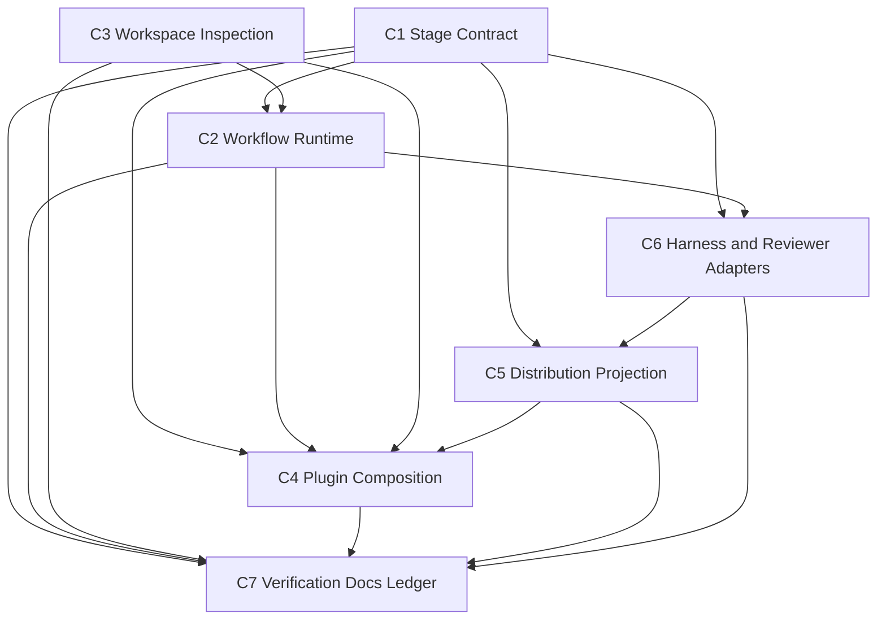

# Component Dependency — upstream-sync-230

> 上流入力(consumes 全数): `requirements.md`、`architecture.md`、`component-inventory.md`、`team-practices.md`。`stories.md` は本 scope で SKIP 済み。

## 依存マトリクス

行をprovider、列をconsumerとする。`○` はcompile/runtime供給、`V` はverification-only消費、`G` は生成入力/投影を示す。

| provider ↓ / consumer → | C1 Contract | C2 Runtime | C3 Inspect | C4 Compose | C5 Project | C6 Adapter | C7 Verify |
|---|---:|---:|---:|---:|---:|---:|---:|
| C1 Contract | — | ○ |  | ○ | ○ | ○ | V |
| C2 Runtime |  | — |  | ○ |  | ○ | V |
| C3 Inspect |  | ○ | — | ○ |  |  | V |
| C4 Compose |  |  |  | — |  |  | V |
| C5 Project |  |  |  | G | — |  | V |
| C6 Adapter |  |  |  |  | G | — | V |
| C7 Verify |  |  |  |  |  |  | — |

C5→C4 はpackage済みplugin bundleをcomposition workflowが消費する生成依存である。C5はC4 runtimeを呼ばず、C6のhost sourceとplugin sourceを投影するだけなので循環しない。C7は全providerをverification-onlyで消費し、provider側からC7へ逆依存はない。

## 依存グラフ

テキスト代替: C1がC2/C4/C5/C6の共通契約、C3がC2/C4のworkspace観測、C5がC4へhost plugin bundleを供給し、C7が全コンポーネントを検証する。一方向DAGである。

## 主要データフロー

### Plugin

package workflow: `plugins/<name>/` source + C6 host source → C5 manifest discovery → 6 host projection + `dist/plugins/` → C7 drift evidence。

host compose workflow: C5が生成したplugin bundle → C4 inspect/plan → temp host tree → C1/C2 compile/verify → atomic apply/drop → record/doctor → C7 integration evidence。

### Runtime correctness

state + audit + compiled graph(C1) + workspace scan(C3) → C2 pure decision/recovery → existing transaction → state/audit → C7 regression evidence。

### Harness

C6 canonical host source → C5 package projection → six `dist/<harness>` trees → four supported self-install trees → C7 drift/grep/fixture。

## 共有資源と競合制御

- stage/Unit vocabulary: C1の単一定義。C2/C4/C6はimportする。
- compiled graph/state/audit: C2所有。C4は公開compile seamだけを利用し、直接state編集しない。
- workspace filesystem: C3はread-only、C4はtransaction、C5はgenerator。所有モードを混在させない。
- `dist/`: C5だけが生成する。C4/C6/C7による手編集は禁止。
- ledger: C7だけがcompletion evidenceを集約して遷移を計画する。
