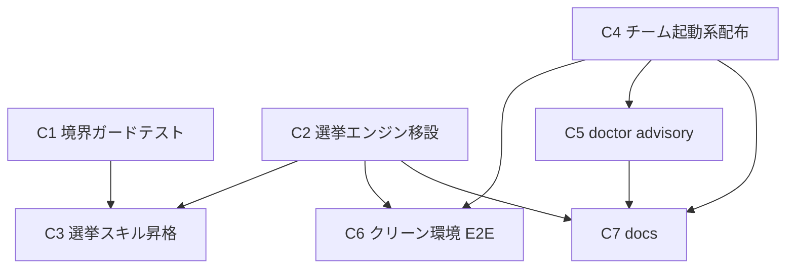

# Component Dependency — チーム機能のコア昇格

> 上流入力(consumes 全数): requirements.md、architecture.md、component-inventory.md、team-practices.md

## 依存グラフ

<!-- Text fallback: C1(境界ガード)は C3(スキル昇格)に先行する(落ちる実証の fixture が SKILL.md の scripts/ 参照のため)。C3 は C2(選挙移設)にも依存(参照先の実在)。C2 は C1 と独立(並行可)。C6(E2E)は C2 と C4(チーム起動配布)の両方に依存。C5(doctor)は C4 に依存(検査対象の確定)。C7(docs)は C2/C4/C5 の内容確定後。 -->

## 依存の根拠

| 辺 | 根拠 |
|---|---|
| C1 → C3 | FR-5b の落ちる実証順序: 落ちる実証の fixture は contrib SKILL.md の scripts/ 参照(C3 の変更対象)であり、ガード先行→C3 の書き換えで green が実証の前提。**C2 はこの実証経路に関与しない**(選挙5ファイル自体は配布ツリー内に scripts/ 参照を持たない — conductor 正本直読実測 2026-07-23: 5ファイルの import は node:/相互/norm-metrics のみで scripts/ 参照 0件)ため C1 と並行可 |
| C2 → C3 | スキルの新参照先(`{{HARNESS_DIR}}/tools/amadeus-election.ts`)は C2 の移設後にのみ実在 |
| C2, C4 → C6 | E2E の被検体(配布コピーの選挙 CLI+team-up.sh)が揃ってから |
| C4 → C5 | doctor が検査する prerequisite 集合(herdr/agmsg)と案内文言は C4 の検査実装と同一定義を参照(canonical 1定義 — Construction 原則) |
| C2/C4/C5 → C7 | docs は確定した配布パス・コマンド・doctor 出力を記載(早期断定の禁止 — nfr-design:c7 同型) |

## 並行可能性

- C2(+C3)系列と C4 系列は編集面がファイル単位で非交差(選挙5ファイル+skills vs team 3ファイル)— 並行実装可(cid:c6 の非交差判定は着手前に実 diff で再評価)
- C1 と C2 も並行可(C1 の落ちる実証は C3 の fixture にのみ依存)。C1→C3 のみ直列制約。C6/C7 は合流点(直列)
