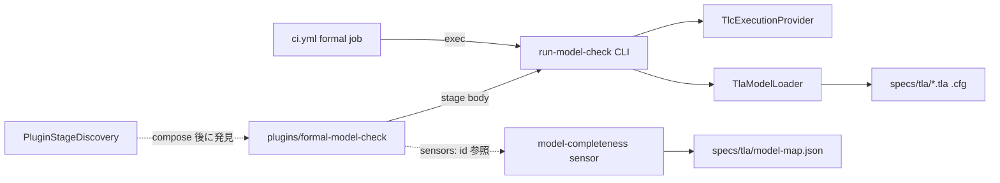

# Component Dependency — 260722-tla-plugin

上流入力(consumes 全数): requirements、architecture、component-inventory、team-practices

## 依存マトリクス

| 依存元 → 依存先 | C-1 discovery | C-2 CLI | C-3 provider | C-4 loader | C-5 specs/tla | C-6 sensor | C-7 ci.yml | C-8 plugin |
|---|---|---|---|---|---|---|---|---|
| C-1 discovery | — | | | | | | | 発見対象(compose 後のファイル) |
| C-2 CLI | | — | 使用 | 使用 | 読込 | | | |
| C-3 provider | | | — | | | | | |
| C-4 loader | | | | — | 読込 | | | |
| C-6 sensor | | | | | 読込(model-map.json) | — | | |
| C-7 ci.yml | | 実行 | (docker 経路を指定) | | | | — | |
| C-8 plugin | | ステージ本体が実行 | | | | frontmatter で id 参照 | | — |

循環依存なし(一方向: plugin/ci → CLI → provider/loader → specs)。

<!-- Text fallback: plugin と ci.yml が run-model-check CLI を実行し、CLI は provider(spawn)と loader(モデル読込)へ依存、loader は specs/tla を読む。sensor は model-map.json を読む。discovery は compose 済み plugin ステージを発見する。すべて一方向で循環なし。 -->

## データフロー

1. モデル更新フロー: 開発者が specs/tla/*.tla 編集 → updateModelMap で model-map.json 再記録 → sensor green
2. 検証フロー: run-model-check が .tla/.cfg bytes → identity 生成 → prepare(drift 検証)→ provider spawn → parseTlcOutput174 → normalize → exit code
3. 供給フロー: plugins/formal-model-check オーサリング → packager 投影 → compose → C-1 が compile で発見 → `--stage formal-model-check --single` 実行可能

## 共有資源

- specs/tla/(C-2/C-4/C-6 が読取共有 — 書込は開発者編集+updateModelMap のみ)
- 監査シャード(sensor verdict 行 — 既存 dispatcher 所有)
