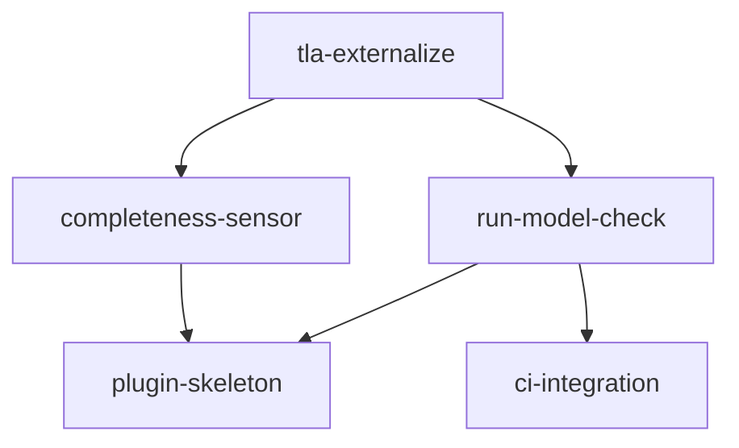

# Unit Dependency — 260722-tla-plugin

上流入力(consumes 全数): components、component-methods、services、component-dependency、decisions、requirements

## 依存グラフ(parseBoltDag 用 edge block)

```yaml
units:
  - name: tla-externalize
    depends_on: []
  - name: run-model-check
    depends_on: [tla-externalize]
  - name: plugin-skeleton
    depends_on: [run-model-check, completeness-sensor]
  - name: ci-integration
    depends_on: [run-model-check]
  - name: completeness-sensor
    depends_on: [tla-externalize]
```

## 依存の根拠

- run-model-check ← tla-externalize: CLI の入力(--model/--cfg)は外部化された specs/tla/ ファイル。外部化前は E2E 検証対象が存在しない
- plugin-skeleton ← run-model-check: plugin ステージ本体(stage body)が run-model-check CLI を実行するため、ステージ E2E は CLI の実在に依存(walk 拡張自体は独立だが、Unit の完了条件 = ステージ実行 E2E が CLI を要する)
- plugin-skeleton ← completeness-sensor(iteration 1 Major-2 是正で追加): plugin ステージ frontmatter は `sensors: [model-completeness]` を宣言し、graph compile は未知 sensor id を loud reject する(amadeus-graph.ts:719)。よって U2 の完了条件(compose→compile green)は sensor manifest の実在に真に依存する — component-dependency の C8→C6 参照は宣言的文字列だが、compile 段で build-order 制約になる
- ci-integration ← run-model-check: formal ジョブの実行対象が CLI
- completeness-sensor ← tla-externalize: model-map.json の登録簿は specs/tla/ 資産の存在が前提
- run-model-check と completeness-sensor は相互独立(並行可)。plugin-skeleton と ci-integration も相互独立(並行可)


<!-- Text fallback: tla-externalize が根。run-model-check と completeness-sensor が tla-externalize に依存。plugin-skeleton は run-model-check と completeness-sensor の両方に依存(sensor id の compile 検証)。ci-integration は run-model-check に依存。U3∥U5、U2∥U4 は並行可能。 -->

## walking skeleton との関係

walking skeleton の経路選定・Bolt 編成・ゲート配置はすべて delivery-planning(2.8)の経済判断へ委ねる(本ステージは実装順序を推奨しない — ステージ契約準拠)。本 DAG が示す事実は「U2 の compile 成立は U3 と U5 の両方に依存する」ことのみである。
