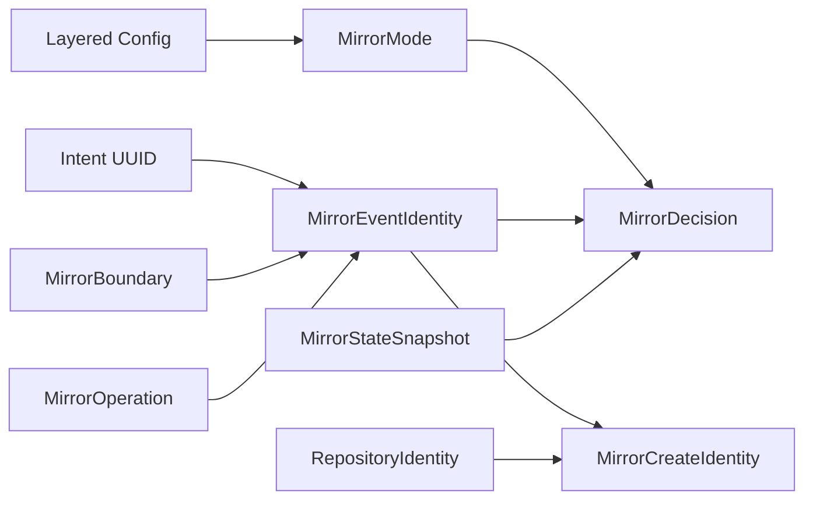

# Domain Entities — mirror-contract-policy

> 上流入力（consumes 全数）: `unit-of-work.md`、`unit-of-work-story-map.md`、`requirements.md`、`components.md`、`component-methods.md`、`services.md`

## Domain Boundary

`unit-of-work.md`のUnit 1は永続entityやremote adapterを所有しない。`unit-of-work-story-map.md`のAS-01／03／04／05、`requirements.md`のvalue object要件、`components.md`のC0〜C2、`component-methods.md`のdata shapes、`services.md`の入力境界に対応するimmutable value／decision entityだけを定義する。

## Value Objects

### MirrorMode

- Values: `off`、`prompt`、`auto`
- Lifecycle: config parse成功時に生成され、boundary evaluationごとに解決し直す
- Invariant: booleanやunknown stringから生成不可

### RepositoryIdentity

- Attributes: `owner`、`name`、canonical `owner/name`
- Lifecycle: workspace resolverが生成し、policyではopaque valueとして運ぶ
- Invariant: owner／nameは空でなく、canonicalと一致

### MirrorBoundary

- Variants: Intent Capture approved、phase verified、parked、workflow completed、manual
- Attributes: kind固有fieldと永続instance
- Invariant: instanceはengine receipt由来で、現在時刻から生成しない

### MirrorEventIdentity

- Attributes: Intent UUID、MirrorBoundary、MirrorOperation
- Identity: canonical serializationされた全attribute
- Invariant: 同じboundary instance／operationで安定
- Key encoding: versioned positional tupleのJSON／UTF-8／base64urlで`mirror-event:v1:` keyを生成

### MirrorCreateIdentity

- Attributes: schema、Intent UUID、Intent directory、RepositoryIdentity、operation ID、prepared timestamp
- Lifecycle: State Storeの成功したprepare transitionで成立
- Invariant: Issue番号を含まず、create前markerへ使用可能

## Decision Entities

### MirrorConfigOutcome

| Variant | Data | Meaning |
|---|---|---|
| `resolved` | mode、source paths | 全layerがvalid |
| `invalid` | 全config issues | remote operation禁止 |

### MirrorDecision

| Variant | Data | Meaning |
|---|---|---|
| `suppress` | off／not-applicable／skipped-for-event | operationなし |
| `prompt` | operation、event | 人間回答待ち |
| `execute` | operation、event | executorへ委譲可能 |

decisionはbusiness commandではなく、effectをまだ実行していない判断結果である。

### MirrorPolicyInput

| Variant | Required data | Mode semantics |
|---|---|---|
| `lifecycle` | resolved mode、生成済みevent、state | `off | prompt | auto`を適用 |
| `manual` | manual boundaryを持つ生成済みevent、state | modeを参照せず明示operationとして評価 |

C2 decisionは安全性の証明ではない。C6がownership／repository／landing／candidate outcomeを評価し、`pending | safety-blocked | completed`へ変換する。

### CompletionPolicyInput

- Attributes: Intent UUID、現在のworkflow completion boundary、state
- Behavior: create／sync／closeのcurrent-boundary event keyを生成し、そのreceiptだけを選択
- Invariant: phase、manual、別completion instanceのreceiptを参照しない

## Shared Contract Entities

C0は隣接Unitが共有する次のshapeも所有する。

| Contract | Producer | Consumer |
|---|---|---|
| Mirror state snapshot／receipt／warning | state-provenance | policy、operation-lifecycle |
| Marker／ownership／candidate outcome | state-provenance | operation-lifecycle |
| Gateway interface／outcome／remote Issue | GitHub Gateway | operation-lifecycle |
| Operation／boundary outcome | operation-lifecycle | orchestrator |
| Status context | config＋state＋provenance | runtime presentation |
| Repair plan／challenge | state-provenance／operation-lifecycle | manual CLI |

C0はこれらのruntime処理を実装せず、shapeと判別可能性だけを所有する。

## Relationships

テキスト表現: layered configからModeを得る。Intent、Boundary、OperationがEventを構成し、ModeとSnapshotを合わせてDecisionを作る。create時はEventとRepositoryからState StoreがCreateIdentityを確定する。

## Lifecycle Constraints

- Modeはboundaryごとにresolveされ、永続Mirror stateの属性ではない。
- Event identityはskip／promptのlifecycleを持つが、remote attempt lifecycleを持たない。
- Create identityはprepared receiptと同じlifecycleを持ち、Issue provenanceの一部になる。
- Decisionは一時値で、永続化対象はその結果を適用したreceipt／warningである。
- Shared DTOのschema versionが未知ならconsumerはfail-closedとし、duck typingで受理しない。
