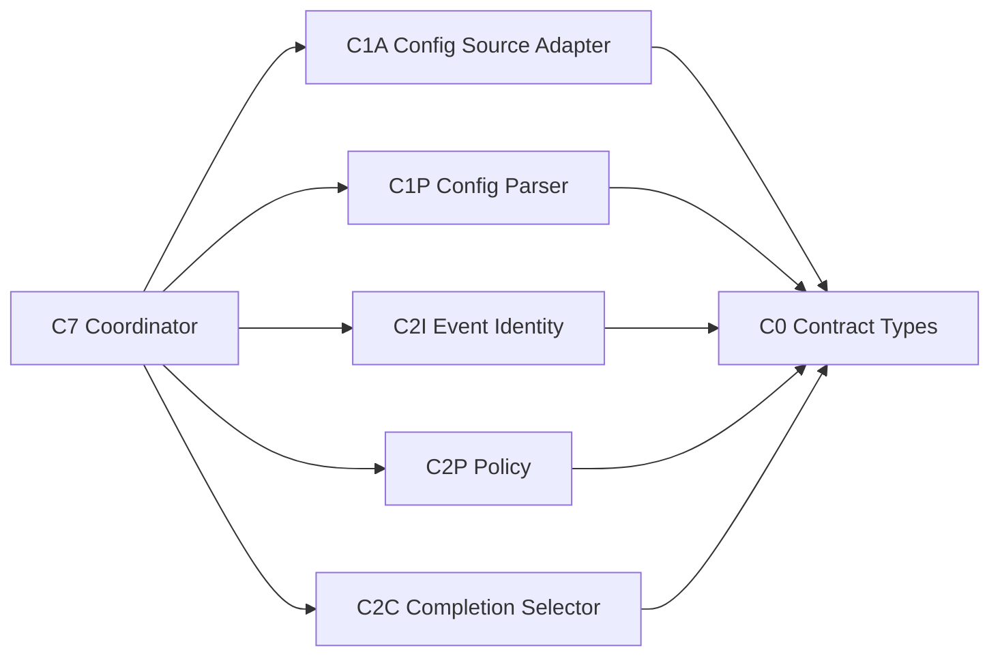

# Logical Components — mirror-contract-policy

> 上流入力: `performance-requirements.md`、`security-requirements.md`、`scalability-requirements.md`、`reliability-requirements.md`、`tech-stack-decisions.md`、`business-logic-model.md`

## Component Inventory

| ID | Component | Responsibility | State／I/O | Failure domain |
|---|---|---|---|---|
| C0 | Mirror Contract Types | closed unions、DTO、result types | none | compile／schema |
| C1A | Config Source Adapter | workspace select、3 layer read、file safety | filesystem read-only | selector／I/O |
| C1P | Config Parser | strict parse、all-issue collection、precedence | pure | invalid config |
| C2I | Event Identity Encoder | v1 tuple serialization | pure | encoding contract |
| C2P | Mirror Policy | applicability、mode、same-event skip decision | pure | decision contract |
| C2C | Completion Selector | current-instance create→sync→close selection | pure | ordering contract |
| C7 Port | Coordinator Contract | typed aggregation、exception boundary、handoff only | no persistence ownership | downstream mapping |

## Dependency Direction



C0はapplication moduleをimportしないleafである。C1Aだけが既存selectorと`node:fs` adapterをimportする。C1P、C2I、C2P、C2Cはfilesystem、process環境、GitHub、state storeをimportしない。C7 Portは本Unitが要求するhandoff shapeを示すだけで、coordinator実装を本Unitへ移さない。

## Public Contracts

| Component | Input | Output |
|---|---|---|
| C1A | workspace root、Space／Intent selector | `ConfigCollectOutcome` |
| C1P | `ConfigCollectOutcome` | `ConfigResolutionOutcome` |
| C2I | Intent UUID、boundary kind／instance、operation | `MirrorEventIdentity` |
| C2P | lifecycle／manual input、event、resolved mode、snapshot | `MirrorDecision` |
| C2C | `CompletionEvaluationInput` | `MirrorOperation | null` |
| C7 Port | config／decision／exception／operation result | `MirrorCoordinatorHandoff` |

全contractはTypeScript strictのdiscriminated unionで表し、generic `string`、optional fieldの組合せ、throw-only contractでinvalid stateを隠さない。

```text
ConfigCollectOutcome =
  | { kind: "collected"; layers: MirrorConfigLayerInput[];
      readIssues: [] }
  | { kind: "partial"; layers: MirrorConfigLayerInput[];
      readIssues: [ConfigReadIssue, ...ConfigReadIssue[]] }

ConfigResolutionOutcome =
  | { kind: "resolved"; mode; source }
  | { kind: "invalid";
      issues: (ConfigReadIssue | ConfigParseIssue)[] }

CompletionEvaluationInput = {
  intentUuid;
  boundary: { kind: "workflow-completion"; instance: string };
  receiptsByOperation: {
    create?: CurrentInstanceReceipt;
    sync?: CurrentInstanceReceipt;
    close?: CurrentInstanceReceipt;
  };
  issueLinked: boolean;
}
```

C1Aは3層を最後まで検査し、read成功layerと全read failureを同時に保持する。C1Pは`collected | partial`の両方を受け、読めた全layerのparseを続けてread issueとparse issueをlayer順に集約する。issueが1件でもあれば`invalid`を返し、C7はC2を呼ばず全issueをconfiguration warningへ写像する。issueが0件のときだけ`resolved`を返す。

`receiptsByOperation`はcoordinatorが`intentUuid + boundary.instance`で事前選択した最大3件のindexであり、C2Cは全receipt storeや別instanceを参照できない。C2Cがoperationを返した後、C2Iは同じintentUuid、boundary、operationからevent identityを生成する。

`validateCompletionSnapshot`は選択前に次の不変条件を検査し、違反を`invalid-runtime-state`へ渡す。

1. 各receiptのintent UUID、boundary instance、operationがcontainer keyと一致する。
2. `sync` receiptは`issueLinked=true`または`create.status=succeeded`の場合だけ存在できる。
3. `close` receiptは`sync.status=succeeded`の場合だけ存在できる。
4. `prepared | attempted | pending`は最大1件で、存在する場合は安全順序上の最初の未完operationであり、後続receiptは存在しない。
5. `skipped | failed | safety-blocked` receiptの後続operationは存在しない。
6. succeededの前段を欠いた後続receipt、同じoperationの複数receipt、別instance receiptはinvalidである。

## Isolation and Blast Radius

- C1A failureはconfig resolveだけを止め、state／GitHub／workflow stageを変更しない。
- C1P failureは全issueを返し、C2Pを呼ばない。
- C2I変更はevent identity versionとgolden vectorsに限定し、表示detail変更から隔離する。
- C2Pはmode／applicability／skip、C2Cはcompletion orderingだけを所有し、安全guardやremote executionを持たない。
- C0変更はfan-outが大きいため、union、fixture、distribution contractを同一review unitで更新する。

C7 Portの`MirrorCoordinatorHandoff` variant、必須field、dedup key、warning clear条件は`reliability-design.md`を正本とする。C7はC2のunknown union／corrupted snapshot例外を唯一のadapter boundaryで`invalid-runtime-state`へ変換し、operation 0件とworkflow継続warningを保証する。

## Runtime Topology

常駐service、AWS resource、database、queue、cacheは追加しない。logical componentは既存Bun CLI processへlibraryとしてlinkされ、1 boundaryのcall graph内で生成・破棄される。external failure isolationはGateway Unit、durabilityはState Provenance Unit、lifecycle retryはOperation Lifecycle Unitが所有する。

## Verification Boundaries

1. C1A filesystem integration testはin-memory／temporary workspace fixtureを使い、C1P以降をreal filesystemから隔離する。
2. C1P、C2I、C2P、C2Cはunit／property／golden testでI/Oなしに検証する。
3. import graph ruleでC0／C1P／C2からforbidden dependencyを検出する。
4. C7 contract testでmanual／lifecycle、configuration warning、audit context、downstream safety guard handoffを検証する。

## Traceability Matrix

| NFR | Logical owner | Test owner |
|---|---|---|
| PERF-CP-01／01A／07 | C1A | filesystem integration benchmark |
| PERF-CP-02／03／05／06 | C1P、C2I、C2P、C2C | import／property／pure benchmark |
| PERF-CP-04 | C2C | completion table |
| PERF-CP-08 | C7 entry CLI | built subprocess benchmark |
| SEC-CP-01〜10 | C1A、C1P、C2I、C0、C7 Port | traversal、schema、secret、dependency、safety tests |
| SCL-CP-01〜14 | C0、call-local inputs、C2C | Cartesian、parallel、chain、drift tests |
| REL-CP-01〜03 | C2I／C2P | repeated、golden、resume tests |
| REL-CP-04／05 | C1A／C1P | multi-invalid、failure injection |
| REL-CP-06〜08 | C2C | current-instance state table |
| REL-CP-09 | C0 exhaustive boundary＋C7 Port | corrupted-input integration |
| observability | C7 Port | handoff／dedup／warning-clear fixture |
