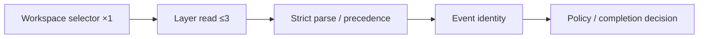

# Performance Design — mirror-contract-policy

> 上流入力: `performance-requirements.md`、`security-requirements.md`、`scalability-requirements.md`、`reliability-requirements.md`、`tech-stack-decisions.md`、`business-logic-model.md`

## Design Decisions

本Unitはlocal synchronous libraryとして実装し、cache、connection pool、queue、worker、CDNを持たない。C1だけが最大3 config layerを順次readし、C2はimmutable inputに対するpure transformだけを実行する。処理量が固定上限内なので、並行化より決定性と診断順序を優先する。

| ID | Design | 達成する要件 |
|---|---|---|
| PERF-D-01 | C1はworkspace selectorを1回呼び、Global→Space→Intentの3候補を各最大1回readする | config resolve p95／I/O上限 |
| PERF-D-02 | parserは各layerを1 passし、issueをlayer順へappendする | 1 MiB上限、決定的診断 |
| PERF-D-03 | event keyは固定6要素tupleを1回だけJSON encode＋base64url encodeする | 1 ms budget、byte安定性 |
| PERF-D-04 | completion selectorは`intentUuid + completionInstance`で選択済みのoperation別receipt indexを最大3件参照する | PERF-CP-04、PERF-CP-06 |
| PERF-D-05 | C2 module初期化時にfilesystem、subprocess、networkを実行しない | policy I/O 0件 |
| PERF-D-06 | read-only CLI fixtureをbuilt CLI subprocessとして逐次起動し、process startupを計測へ含める | PERF-CP-08 |

## Execution Path and Budgets

1 boundaryでC1が返すlayer snapshotをC2へ1回渡し、同じboundary内でconfigを再readしない。C2はmode resolution結果、event identity、Mirror snapshotを参照し、decisionを1件だけ返す。completionも1回のcallでremote operationを複数返さない。

benchmarkはGitHub Actions `ubuntu-latest`、repository pin済みBun、network disabled、3 layer各1 KiB以下、receipt 3件、warning 1件、mode=`auto`、completion `sync`の固定fixtureで行う。判定規則は上流`performance-requirements.md`と同一に固定する。

| Requirement | Warm-up | Measurements／run | Threshold |
|---|---:|---:|---:|
| PERF-CP-06 pure policy | 1,000 | 10,000 | p95 ≤ 1 ms |
| PERF-CP-07 selector＋3 payload read＋policy | 100 | 1,000 | p95 ≤ 50 ms |
| PERF-CP-08 built CLI process startup込み | 10 | 100 subprocess、逐次 | p95 ≤ 250 ms |

各経路を同一job内で3 run実行し、各runのnearest-rank p95の中央値を固定absolute thresholdと比較する。main branch artifactやrelative baselineは使用しない。欠損、timeout、非数値はfail closedとする。

## Resource and Regression Controls

- C1Aはselector内rootへrealpath containmentを確認後、file descriptorを開いて`fstat`し、regular fileかつsize ≤ 1 MiBだけを読む。readはchunk合計1 MiB＋1 byteで打ち切り、超過をtyped size issueにする。
- read後に同じdescriptorを再`fstat`し、size／mtime／inode相当identityが開始時から変化した場合は`unstable-file`としてbytesを破棄する。これによりstat→read間のTOCTOUと巨大fileの無制限memory allocationを防ぐ。
- diagnosticはraw file全文を保持せず、layer、path、key、actual type、expected valuesだけを持つ。
- property testは1000 decision caseを1 processで評価し、global cacheやmutable singletonが増えていないことを検証する。
- benchmark regressionは固定absolute threshold超過だけでfailし、relative baselineやruntime dependency追加で解決しない。

## Verification

1. instrumented filesystem adapterでselector call 1回、read最大3回、write 0回をassertする。
2. C2 import graphとruntime spyでfilesystem／subprocess／network call 0件をassertする。
3. PERF-CP-06〜08を上表の反復数で測り、3 run中央値が各absolute threshold以下であることを確認する。
4. repeated input 100回でdecisionのcanonical JSON bytesが一致する。

## Traceability

| Requirement | Design／Verification owner |
|---|---|
| PERF-CP-01 | PERF-D-01、payload reader call-count test |
| PERF-CP-01A | PERF-D-01、selector invocation spy |
| PERF-CP-02 | PERF-D-05、import graph＋fake port |
| PERF-CP-03 | PERF-D-02、0〜3 layer table |
| PERF-CP-04 | PERF-D-04、completion chain test |
| PERF-CP-05 | PERF-D-05、timer／spawn scan |
| PERF-CP-06 | PERF-D-03／04、pure benchmark |
| PERF-CP-07 | PERF-D-01／02、temporary filesystem benchmark |
| PERF-CP-08 | PERF-D-06、built CLI subprocess benchmark |

## Review — Iteration 1

- **Verdict:** NOT-READY
- **Reviewer:** amadeus-architecture-reviewer-agent
- **Date:** 2026-07-24T08:25:47Z
- **Iteration:** 1
- **Scope decision:** none

品質特性ごとの責務分離とpure/I/O境界は概ね妥当だが、性能検証プロトコルが上流要件と矛盾し、config収集結果、completion snapshot、C7 handoffの公開契約も実装可能な精度に達していない。

### Findings

- [Blocker] performance-design.mdのwarm-up 3回＋20 run、baseline比判定は上流performance-requirements.mdの経路別反復数、同一job内3 runのp95中央値、absolute threshold判定と矛盾し、process startup込みPERF-CP-08も未具体化。
- [Major] C1A出力の配列unionはdiscriminatorがなく、成功layerとread failureの混在、全issue集約ownerが未定義。resolved | invalid | read-failureの集約契約が必要。
- [Major] completion selector入力にIntent UUID、current completion instance、receipt index key／cardinalityがなく、current-instance isolationとO(1) lookupを検証不能。
- [Major] boundary kindとmanualの分類、operationのclosed setが不整合。manualをboundary、invocation source、operationのどれとして扱うかC0 unionで固定する。
- [Major] C7 Portがsignal必須field、dedup key、warning clear条件を表す判別unionを持たない。
- [Major] unknown union／corrupted stateのfail-fastと非阻害warningへの制御フローが曖昧。
- [Major] 設計IDからPERF-CP／SEC／REL要件IDへの完全なtraceability matrixがない。
- [Positive] C0 leafへの一方向import、C1Aだけのfilesystem I/O、C2P/C2C分離、downstream failure isolationは妥当。

## Review — Iteration 2

- **Verdict:** NOT-READY
- **Reviewer:** amadeus-architecture-reviewer-agent
- **Date:** 2026-07-24T08:30:24Z
- **Iteration:** 2
- **Scope decision:** none

C1集約union、completion keyed snapshot、manual分類、runtime破損のC7境界変換は概ね解消。一方、benchmark判定規則、C7 handoff、completion snapshot不変条件、security/scalability traceability、bounded readに残件がある。

### Findings

- [Blocker] performance-design.mdにrelative baselineを使用しない規則とbaseline比2倍failが併存する。後者を削除する。
- [Major] operation-transitionの共通shapeがtransition別必須fieldを保証しない。started/succeeded/failed/safety-blocked/skipped/reconciledへ分割する。
- [Major] receiptsByOperationの任意組合せに対するvalid state／corrupted snapshot判定が未定義。validation contractを追加する。
- [Major] security/scalability requirementsにstable IDがなくarea単位traceabilityに留まる。上流へIDを付け1件ずつ対応付ける。
- [Major] 1 MiB超をread後に検出するためbounded readになっていない。stat、上限付きread、TOCTOU検出を定義する。
- [Positive] ConfigCollectOutcome集約、manual分類、invalid-runtime-state containmentは解消済み。

## Review Iteration 2 Remediation

- relative baseline判定を完全に削除し、固定absolute thresholdだけへ統一した。
- C7 handoffをtransition別判別unionへ分割し、classification／skip reason／reconciliation literalを型で必須化した。
- completion snapshotに6個の有効状態不変条件と`validateCompletionSnapshot`を追加した。
- SecurityへSEC-CP-01〜10、ScalabilityへSCL-CP-01〜14を付与し、設計／検証ownerへ1件ずつ対応付けた。
- config readerを開始／終了`fstat`、1 MiB＋1 byte上限付きchunk read、TOCTOU検出へ変更した。
