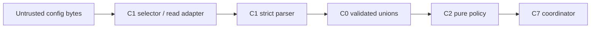

# Security Design — mirror-contract-policy

> 上流入力: `performance-requirements.md`、`security-requirements.md`、`scalability-requirements.md`、`reliability-requirements.md`、`tech-stack-decisions.md`、`business-logic-model.md`

## Trust Boundaries

filesystem pathとraw configはuntrusted inputである。C1 adapterは既存workspace selectorが返す正規pathだけをreadし、C1 parserが`off | prompt | auto`以外を拒否する。C2へ渡るのはC0のvalidated discriminated unionだけで、raw object、environment value、GitHub responseを渡さない。

## Input and Path Controls

| Control | Design | Verification |
|---|---|---|
| SEC-D-01 | Global／Space／Intent pathはselector resultから取得し、user-supplied arbitrary pathを受けない | traversal／symlink fixture |
| SEC-D-02 | fileはregular fileだけを許可し、root外realpath、symlink escape、device、FIFOを`read-failure`にする | filesystem fixture |
| SEC-D-03 | valueはexact string unionだけを許可し、boolean互換、coercion、trim、case-foldを行わない | type matrix |
| SEC-D-04 | invalid issueはallowlist fieldだけを持ち、raw bytes、token、環境変数値を含めない | snapshot＋secret scan |
| SEC-D-05 | event identityはIntent UUID、boundary kind／instance、operationだけを含み、path、Issue body、tokenを含めない | golden vectors |
| SEC-D-06 | C2からfilesystem／GitHub／process環境をimportしない | dependency rule |

C1Aのbounded readerはrealpath containment確認後にdescriptorを開き、開始時`fstat`でregular file／1 MiB以下を検証する。chunk readは1 MiB＋1 byteで停止し、終了時`fstat`のsize／mtime／inode相当identityが変化していれば`unstable-file`として全bytesを破棄する。symlink swap、file growth、TOCTOUを成功readへ丸めない。

## Defense in Depth

- parserはunknown propertyを無視してmodeだけを拾わず、Mirror config object全体のschema違反をissue化する。
- 全layerを検査してからfailし、低優先layerのinvalidを高優先layerで隠さない。
- unknown union variantはexhaustive helperで例外化し、`prompt`、`off`、`null`へ丸めない。
- manual operationはmode解決を迂回できるが、C7がC6へ渡す際のprovenance／repository／landing guardを迂回できない。
- diagnostic pathはworkspace-relative表示に変換し、absolute user pathを利用者表示、audit、test snapshotへ残さない。

## Compliance and Audit Boundary

本UnitはPII／PHI／cardholder dataを新規処理せず、credentialを保持しない。新しいaudit event typeも作らない。C2はsecret-freeな`MirrorAuditContext`素材だけを返し、C3が既存`ARTIFACT_UPDATED`へ投影する。security findingはrepositoryの既存retention／access policyに従い、規制適合を新たに主張しない。

## Verification

1. traversal、symlink、permission、oversize、malformed、boolean、unknown keyをtable testで網羅する。
2. diagnostic、event key、decision snapshotにsecret sentinelとabsolute home pathが含まれないことをassertする。
3. C2 bundleのimport graphに`node:fs`、`node:child_process`、GitHub adapter、process environment readerがないことを検証する。
4. manual／lifecycle双方のintegration fixtureでC6 safety guard callが省略されないことをC7側contract testへ渡す。

## Traceability

| Requirement area | Design／Verification owner |
|---|---|
| SEC-CP-01／05 | SEC-D-01／02、selector／traversal／UUID fixture |
| SEC-CP-02／06 | SEC-D-03、invalid type decision table |
| SEC-CP-03／07 | SEC-D-05、serialization golden／property test |
| SEC-CP-04／08 | SEC-D-04、diagnostic allowlist／secret scan |
| SEC-CP-09 | bounded three-layer reader、port call-count test |
| SEC-CP-10 | Defense in Depth、C7→C6 safety contract test |
