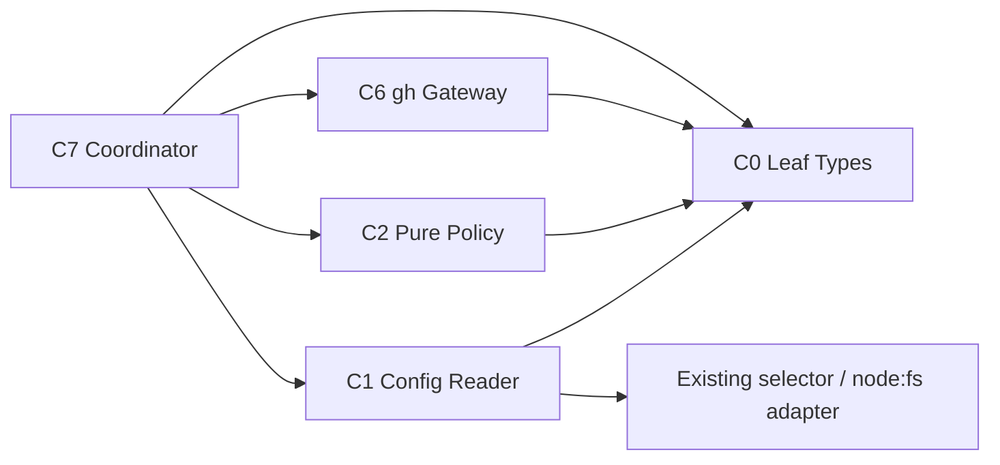

# Tech Stack Decisions — mirror-contract-policy

> 上流入力（consumes 全数）: `business-logic-model.md`、`business-rules.md`、`requirements.md`、`technology-stack.md`

## Decisions

| ID | Decision | Rationale／Consequence |
|---|---|---|
| TS-CP-01 | TypeScript `^6.0.3` strictの判別unionでmode、input、decision、failureを表現する | closed setのexhaustive checkをcompile時に強制し、invalid stateをgeneric stringへ退化させない |
| TS-CP-02 | Bun `1.3.13`互換ESMを既存CLI runtimeとtest runnerに使う | repository標準と一致し、新しいruntime／transpilerを増やさない |
| TS-CP-03 | config readは既存Node.js `node:fs`／`node:path` adapterとworkspace selectorを再利用する | C1だけへI/Oを閉じ、C2のpure contractへfilesystemを漏らさない |
| TS-CP-04 | event keyは標準JSON、UTF-8、Node.js互換base64urlで生成する | custom serializer／crypto dependencyを追加せず、golden vectorでbyte contractを固定する |
| TS-CP-05 | GitHub SDK、HTTP client、database、queue、daemonを追加しない | 本UnitはGitHubを呼ばず、後続Gatewayが既存`gh` adapterを所有する |
| TS-CP-06 | Bun unit test、必要最小限のfilesystem integration test、`fast-check`による純粋関数property testを既存依存の範囲で使う | invalid schema、決定性、identity escapingを実装から独立した不変量として検証する |
| TS-CP-07 | Biome、`tsc --noEmit`、project／patch coverageを既存quality gateとして維持する | 新しいCI workflowやsecurity productを導入せず、現在の配布規律へ統合する |

## Compile-time Dependency Direction

矢印は「左が右をimportする」を表す。C0はapplication moduleをimportしないleaf contractであり、C1／C2／C6／C7が一方向にC0をimportする。C7はC1／C2／C6をorchestrateするが、C1／C2／C6はC7をimportしない。C2からfilesystem／GitHubへの依存は禁止する。

## Runtime Data Flow

runtimeではC1がvalidated C0 valueをC2へ渡し、decisionをC7が受け、必要な外部作用だけをC6へ依頼する。data flowの向きはcompile-time import方向を表さない。

## Alternatives Rejected

| Alternative | Rejection reason |
|---|---|
| boolean互換shim | 明示された非互換契約に反し、三モードの意味を曖昧にする |
| generic tracker port／GitHub SDK | GitHub以外がスコープ外で、新しいruntime dependencyと抽象化を正当化できない |
| background worker／scheduler | NFR-5のboundary-driven実行に反する |
| config libraryの追加 | 3層・1 keyのstrict parseに対して過剰で、既存read／parse seamより攻撃面が増える |
| persistent cache | stale modeとcross-Intent混同を生み、毎boundaryで現在modeを解決する契約に反する |

## Validation

1. `package.json`へruntime dependencyを追加しない。
2. C2 moduleのimport graphに`node:fs`、`node:child_process`、GitHub adapterを含めない。
3. typecheck、Biome、unit／integration test、coverageが既存commandでpassする。
4. core sourceの決定表が配布contractと不一致になれば後続dist／self-install checkがfailする。
