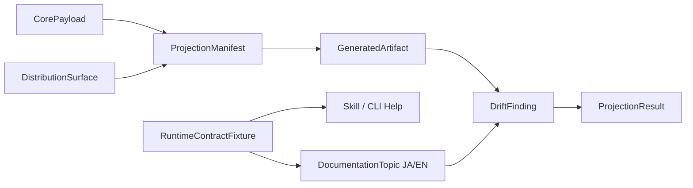

# Domain Entities — mirror-distribution-docs

> 上流入力（consumes 全数）: `unit-of-work.md`、`unit-of-work-story-map.md`、`requirements.md`、`components.md`、`component-methods.md`、`services.md`

## Domain Boundary

`unit-of-work.md`のDistribution Unit、`unit-of-work-story-map.md`のAS-06／07、`requirements.md`のFR-7〜9／NFR-3／4、`components.md`のC9、`component-methods.md`の完成contract、`services.md`のlayout／CLI semanticsをbuild-time valueへ投影する。runtime entityを複製しない。AS-08／NFR-5のruntime実装検証はOperation Lifecycle／Gateway Unitが所有する。

## DistributionSurface

- id: claude、codex、cursor、kiro、kiro-ide、opencode
- distRoot
- selfInstallRoots
- manifest path
- emitter path
- required payload paths

ID集合はclosedで、各IDは一意なdist rootを持つ。Kiro／Kiro IDEのselfInstallRootsはemptyであり、他4 surfaceは明示rootを持つ。

## CorePayload

- logical ID
- source path
- content bytes
- executable／skill kind
- rawDigest: sourceのexact bytesに対するSHA-256

payloadのdigest計算ではUnicode／改行を正規化しない。同じlogical IDは全surfaceで同じraw bytesを持つ。

同じlogical IDは全surfaceで同じruntime semanticsを持つ。harness metadataはpayload本体と分離する。

## ProjectionManifest

- surface ID
- payload mapping
- target relative path
- metadata transform

manifestはcopy対象の唯一の一覧である。未宣言payloadのad-hoc projectionを許可しない。

## GeneratedArtifact

- surface
- relative path
- bytes
- source logical ID
- digest

generated artifactは派生値で、独立したbusiness ownerを持たない。

## DocumentationTopic

- topic ID
- locale: ja／en
- required literals
- command set
- boundary set
- source path

同topic IDのJA/ENはsemantic setが一致する。自然言語本文のbyte一致はentity invariantではない。

## RuntimeContractFixture

- modes
- default mode
- compatibility rule
- lifecycle boundaries
- operations
- manual commands
- command schemas
- failure semantics
- close guards

C8 ownerの`amadeus-mirror-presentation.ts`が`MIRROR_USER_CONTRACT`としてexportする。C8とCLIがruntimeで読み、C9 validatorが一方向にimportする。skill、docs testが共有する期待値であり、別々のhard-coded集合を持たない。

command schemaはcommand path、required options、optional options、positional argument policy、selector defaultを持つ。`create | sync | close | status | repair status`はrequired optionなし、`repair relink`は`--issue <n>`、`repair abandon`は`--operation <id>`を必須にする。全commandは任意の`--intent <dirName>`を受け、positional argumentを禁止し、省略時はactive Intentを選択する。

## DriftFinding

| Kind | Data |
|---|---|
| missing | surface、path |
| extra | surface、path |
| content-mismatch | surface、path、expected／actual digest |
| semantic-mismatch | topic、locale、field |
| legacy-wording | path、rule ID |

findingは全件収集して表示するが、1件でも存在すればcheck resultはfailureである。

## ProjectionResult

| Variant | Meaning |
|---|---|
| clean | 全surface／docs／self-install一致 |
| drift | findingsあり、check failure |
| generation-failure | source／manifest／emit error |

check resultはruntime Mirror outcomeではなく、build／release quality gateである。

## Relationships

テキスト表現: core payloadをsurface manifestでgenerated artifactへ投影し、runtime fixtureをskill／CLI／docsへ照合する。artifact driftとsemantic driftをまとめてprojection resultにする。

## Lifecycle Constraints

- core source変更 → generate → check → release。
- generated artifactはgenerate以外で変更しない。
- checkはread-only。
- docs topicはJA/EN同時に更新する。
- distribution failureはreleaseを止めるがruntime workflow stateを変更しない。
