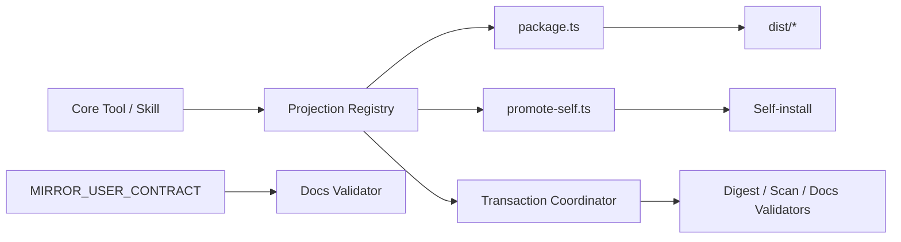

# Tech Stack Decisions — mirror-distribution-docs

> 上流入力（consumes 全数）: `business-logic-model.md`、`business-rules.md`、`requirements.md`、`technology-stack.md`

## Decisions

| ID | Decision | Rationale |
|---|---|---|
| TS-DD-01 | 既存TypeScript／Bun package／promote scriptsを拡張 | 新しいbuild systemを追加しない |
| TS-DD-02 | Node.js filesystem／crypto SHA-256を利用 | raw byte digestとtemporary treeを標準APIで扱う |
| TS-DD-03 | 共通Projection Registryを唯一のregistryとし、surface artifact、wrapper／registration、dist／self-install path、parity、golden owner、scan policy、docs entryを持たせる | package／promote／scanner／validators間のad-hoc copy／重複listを防ぐ |
| TS-DD-04 | C8の`MIRROR_USER_CONTRACT`をskill／docs validatorが一方向import | runtime semanticsの二重定義を防ぐ |
| TS-DD-05 | Markdown marker parserを小さなin-process parserとして実装 | docs実行／HTML parser依存を避ける |
| TS-DD-06 | Bun unit／integration、dist／promote check、Biome、typecheckを既存CIへ統合 | release前に全projection driftを阻止する |
| TS-DD-07 | 完成したowner recordをcandidate directoryからatomic publishするshared／exclusive／recovery transaction lock、fencing token、`prepared → committing → committed → cleaned`のfsync済みjournal、file単位renameを利用 | 不完全なactive lockを公開せず、portableなNode.js APIだけで管理外fileを巻き込まず、crash recoveryと準拠readerのsnapshot整合性を保証する |
| TS-DD-08 | Transaction Coordinatorのopaque read sessionをvalidator／scannerの唯一のgenerated-file reader／public-root listerとする | shared lockを迂回する直接filesystem read／directory walkをdependency境界で禁止し、extra fileも検出する |

## Dependency Direction

矢印はsourceからderived consumerへのdata flowを表す。Projection Registryのsurface entryは`surfaceId`とartifact entryを持つ。artifact entryは`kind: "tool" | "skill" | "wrapper" | "registration"`、core source、dist relative path、`selfInstall: "included" | "excluded"`、included時のliteral relative path、`parity: "raw-bytes" | "golden"`、golden owner path、scan policyを所有する。docs entryはlocale、`kind: "guide" | "reference"`、source path、topic／marker policy、scan policyを所有する。`package.ts`、`promote-self.ts`、scanner、validatorsは同じentry集合を読み、consumer側にsurface／docs listやpath mapを持たない。validatorはTransaction Coordinatorが返すshared read sessionを通じてのみgenerated outputを読み、同sessionの許可root列挙でextra／missing pathを検出する。runtime ownerへ逆依存させず、generated outputを正本としてimportしない。

## Alternatives Rejected

- surface別hand copy: driftと欠落を生む。
- normalized payload digest: runtime bytes差を隠す。
- prose byte parity: 翻訳を不可能にしsemantic errorを保証しない。
- new bundler／template engine: 2 payloadのprojectionに過剰。

## Validation

1. runtime dependency追加0件。
2. package／promote check、docs parity、contract fixture、secret／traversal testsをpassする。
3. CIで6 surface、4 self-install対象、4 docsをRegistryから明示集計する。
4. architecture testでvalidator／scannerからfilesystem adapterへの直接依存が0件であることを確認する。
