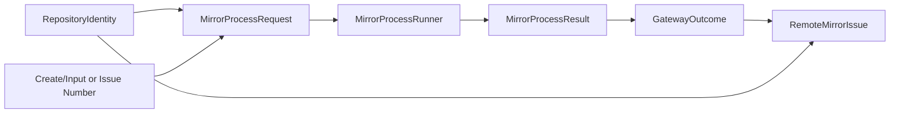

# Domain Entities — mirror-github-gateway

> 上流入力（consumes 全数）: `unit-of-work.md`、`unit-of-work-story-map.md`、`requirements.md`、`components.md`、`component-methods.md`、`services.md`

## Domain Boundary

`unit-of-work.md`のGateway Unitはremote transport DTOだけを扱う。`unit-of-work-story-map.md`のAS-02〜05／08、`requirements.md`のexplicit repository／non-blocking failure、`components.md`のC5、`component-methods.md`のGateway contract、`services.md`のremote interactionへ対応する。

## RepositoryIdentity

- Attributes: owner、name、canonical `owner/name`
- Invariant: ASCII英数字／`-_.`のみ、空白／slashなし、lowercase canonical一致
- Role: すべてのGateway callとremote responseをbindする

## CreateMirrorIssueInput

- Attributes: title、body、labels
- Invariant: titleはnon-empty、labelsは文字列配列
- Security: credentialやlocal absolute pathを含めない
- Ownership: body marker生成はC4／C6で完了済み

## RemoteMirrorIssue

- Attributes: RepositoryIdentity、number、title、body、state
- State: `OPEN | CLOSED`
- Invariant: numberはpositive、repositoryはrequestと一致
- Role: ownership／candidate／landing判断の入力であり、その判断結果ではない

## GatewayOutcome

| Variant | Attributes |
|---|---|
| `ok` | typed value |
| `failure` | classification、redacted summary、retryable |

classificationは`not-installed | unauthenticated | permission | rate-limit | network | api | command | invalid-response`に限定する。

failureはeffect certainty `not-started | no-effect-confirmed | outcome-unknown`も必須とする。

## MirrorMutationPermit

- Attributes: event、repository、operation、Issue numberまたはnull、非export `unique symbol` brand
- Producer: internal capability moduleのfactoryをimportできるC6 guard coordinatorだけ
- Consumer: create／edit／close Gateway method
- Invariant: method operation、repository、Issue numberと完全一致
- Encapsulation: brand symbolとfactoryはpackage exportへ公開せず、他moduleのobject literal／type assertionをlint／dependency testで拒否する
- Lifecycle: 単一operation invocationだけに使用し、永続化／再利用しない

## MirrorProcessRequest

- executable: `gh`
- args: immutable string array
- cwd: process実行用だがrepository identityのsourceではない
- expectedOutput: none／JSON schema ID

## MirrorProcessResult

- exitCode
- stdout
- stderr
- signal／spawn failure

ProcessResultはGateway内部entityで、raw stderrを外部outcomeへ直接公開しない。

## Relationships

テキスト表現: Repositoryとoperation inputからargument-array requestを作り、runner resultをtyped outcomeへparseする。成功時のRemote Issueはrequest Repositoryと一致する。

## Lifecycle

- Gateway entityは永続化されない。
- Remote Issueはcall時点のsnapshotであり、Intent recordの正本ではない。
- retryはGateway内部でsilent loopせず、C6／boundary lifecycleが判断する。
- fake runnerのfixtureはtest entityでありproduction domainへ含めない。
