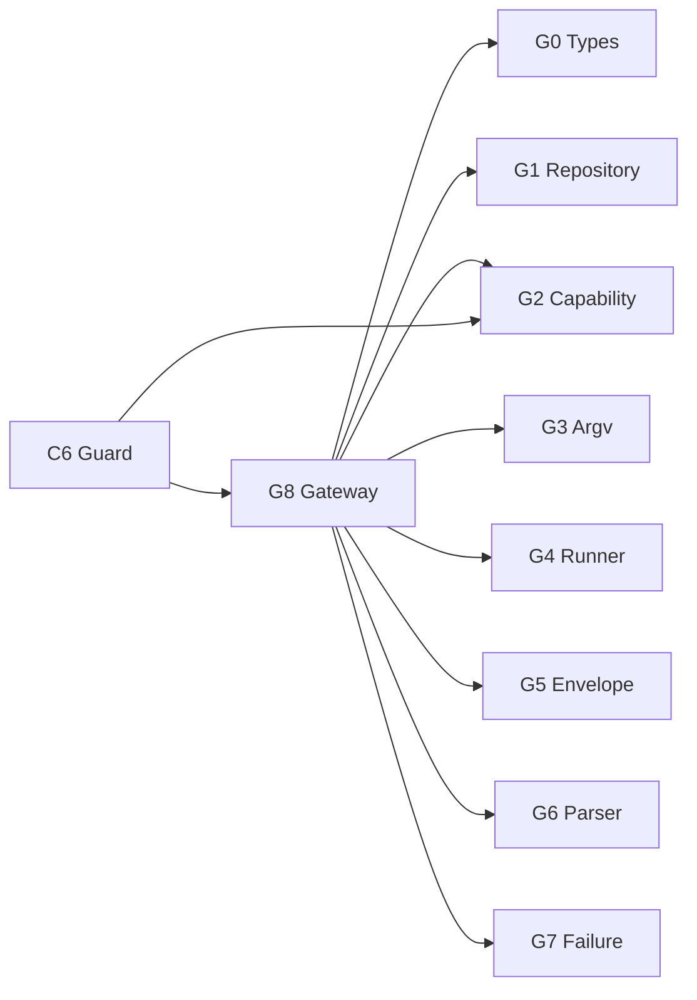

# Logical Components — mirror-github-gateway

> 上流入力: `performance-requirements.md`、`security-requirements.md`、`scalability-requirements.md`、`reliability-requirements.md`、`tech-stack-decisions.md`、`business-logic-model.md`

## Component Inventory

| ID | Component | Responsibility | Failure domain |
|---|---|---|---|
| G0 | Gateway Types | request、DTO、failure、effect unions | schema |
| G1 | Repository Validator | canonical owner/name、Issue number、remote URL | identity |
| G2 | Mutation Capability | WeakSet factory／validator、binding | authority |
| G3 | Argv Builder | operation別exact immutable argv | injection |
| G4 | Process Runner | RunToken、spawn、deadline／capacity trigger、termination | process |
| G5 | HTTP Envelope Parser | status／headers／body separation | protocol |
| G6 | Issue Parser／Finder | DTO validation、PR除外、marker filter | remote data |
| G7 | Failure Normalizer／Redactor | classification、effect、fixed summary | diagnostics |
| G8 | MirrorGitHubGateway | operation orchestration、typed outcome | adapter boundary |

## Dependency Direction



G0はleafでapplication moduleをimportしない。G2はinternal pathでC6 factory／G8 validatorを提供するがpublic package exportへ含めない。G4はdomain／C6をimportせずprocess observationだけを返す。G8はC6、state、workflow engineをimportしない。

## Public Contracts

```text
GatewayOutcome<T> =
  | { kind: "ok"; value: T; operation; repository }
  | { kind: "failure"; operation; repository; issueNumber?;
      classification; retryable; effect;
      exitCode; httpStatus; processPhase;
      timedOut; termination; summary }
```

readiness／find／viewはpermit不要、create／edit／closeはG2 validatorを通過したoperation-specific permitを必須とする。全operationはexplicit repositoryを受け、active git remote fallbackを持たない。

`MirrorProcessRunner`はargv、deadline、stdout limit、operation effect classを受け、RunTokenで1回だけsettleするspawn／exit／timeout／capacity／termination observationとbounded stdoutだけを返す。raw stderrはGateway boundary外へ返さない。G5は反復HTTP block＋単一slurped JSON grammar、G6はparse前body scannerとouter page count一致を所有する。

## Isolation and Blast Radius

- G1／G2／G3 failureはprocess起動前に閉じ、remote effectを`not-started`に限定する。
- G4 timeoutは専用process groupだけを終了し、親workflow processを巻き込まない。leader-first-exitでgroup identityを安全に維持できない場合は再signalせずtyped termination failureへ隔離する。
- G5／G6 failureはcandidate／Issue DTOを公開せず、mutationでは`outcome-unknown`に保守化する。
- G7はraw diagnosticを表示へ流さず、固定fieldだけでsummaryを構築する。
- G8 failureはstateやworkflowを直接変更せず、C6 handoffへ閉じる。

## Verification Boundaries

1. G1／G2／G3／G5／G6／G7はpure unit／golden／property test。
2. G4はfake clock、fake child、real descendant fixtureのprocess integration test。
3. G8はfake runnerでoperation matrix、argv、effect、DTO integration test。
4. C6／C3／C8とのwarning、receipt、audit convergenceはOperation Lifecycle Unitが所有する。

## Traceability

| NFR area | Components |
|---|---|
| deadlines／RSS／output limits | G4、G5、G6 |
| injection／identity／permit／redaction | G1、G2、G3、G7 |
| pagination／capacity／isolation | G4、G5、G6、G8 |
| typed outcome／termination／recovery | G0、G4、G7、G8 |
