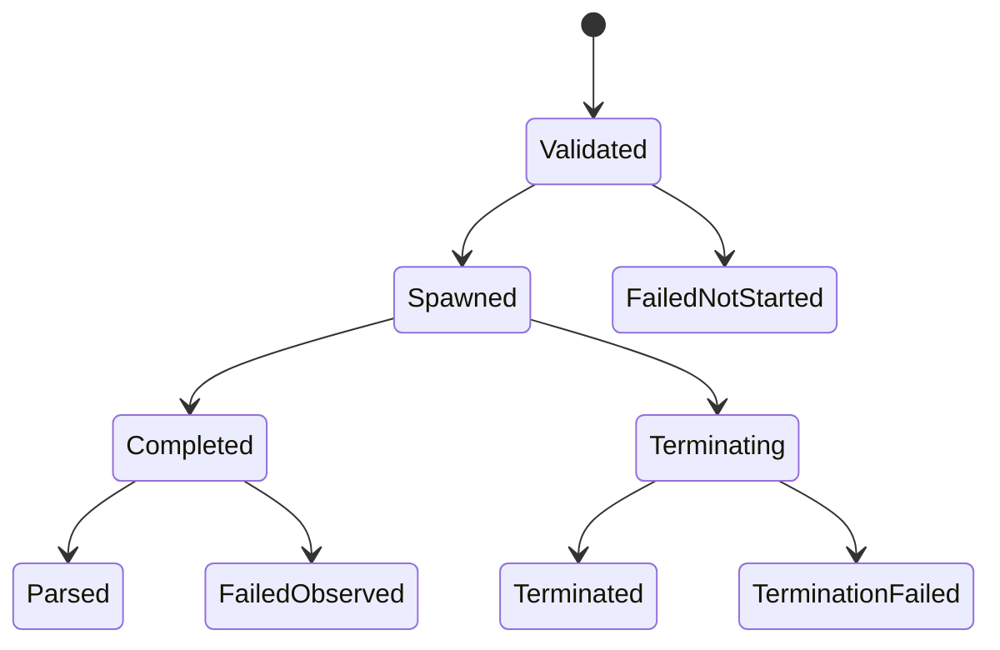

# Reliability Design — mirror-github-gateway

> 上流入力: `performance-requirements.md`、`security-requirements.md`、`scalability-requirements.md`、`reliability-requirements.md`、`tech-stack-decisions.md`、`business-logic-model.md`

## Process State Machine

runnerはcallごとに非再利用`RunToken`と`created → running → terminating → reaped | termination-failed`状態を持つ。spawn失敗だけが`not-started`で、positive PIDを受け取った後のmutation failureはすべて`outcome-unknown`である。read-only failureはspawn状態にかかわらず`no-effect-confirmed`とする。

## Termination Design

POSIXでは`detached:true`で直接`gh`を起動し、spawn APIが返すpositive PIDを専用PGIDとして記録する。別のPGID確認stepは置かない。deadlineまたはoutput capacity超過のcallbackは`RunToken`一致かつ状態`running`のときだけCASで`terminating`を取得し、negative PGIDへSIGTERMを送る。exit／close callbackが先に`reaped`を取得した場合はsignalを送らない。

SIGTERM graceは1秒、その後SIGKILLを1回送り、close／reapとprocess-group消滅確認を最大4秒待つ。cleanup budgetはtrigger後合計5秒で、超過時は`termination-failed`へ1回だけsettleして追加signal／pollを停止する。PID／PGIDへsignalできるのは元childのclose未観測かつ同じRunTokenが`terminating`を所有する間だけで、reap後の再利用PGIDへ送らない。

元childのclose／reapがprocess-group消滅より先に観測された場合、`kill(-pgid, 0)`が`ESRCH`ならclean terminationとしてsettleする。group存続または判定不能なら、再利用PGIDへの誤signalを避けて即時`termination-failed`（`residualDescendantPossible=true`）へsettleし、追加SIGKILLを送らない。このleader-first-exitは通常cleanup成功ではなく明示的failure pathであり、workflowは継続するが自動retryしない。

Windowsは同じCAS後に`taskkill /PID <pid> /T /F`をshellなしargument arrayで起動し、commandとtree消滅確認を合計5秒で打ち切る。どちらも通常pathはchild／descendant 0件を確認してからoutcomeを返す。5秒内に確認できない場合はread-only=`command + no-effect-confirmed + termination-failed`、mutation=`command + outcome-unknown + termination-failed`とし、無期限に待たない。

## Failure Classification

優先順位はENOENT→auth→HTTP 429→401→403→timeout／DNS／connection→API→command→response parseで固定する。failure unionはclassification、retryable、effect、fixed summary、operation、repository、Issue number、numeric exit／HTTP、process phase、timeout／terminationを必須にし、raw stdout／stderrを含めない。

findは全page成功時だけcandidate 0／1／複数を返す。repository mismatch、invalid envelope／shape、capacity超過は`invalid-response`とし、successへ変換しない。

## Recovery Boundary

Gatewayはretry、state、warning、auditを所有しない。`GatewayOutcome`をC6へ渡し、C6がoperation receiptとremote viewからreconcile／retryを決める。

- unknown createはmarker候補1件のprovenance検証成功以外で再createしない。
- unknown edit／closeはremote viewで未収束を確認し、CAS claim成功callerだけがretryする。
- failureはworkflow stage／phase遷移を停止せず、C6／C3／C8がpending／warningへ投影する。
- readiness成功後だけattemptedを永続化し、その成功後だけmutationをspawnする。

## Verification

1. classification×phase×operationのCartesian fixtureでeffectとretryableを固定する。
2. hanging child＋descendant fixtureでdeadline／capacity trigger後の通常path残存0件、cleanup ≤5秒を確認する。
3. leader-first-exit fixtureでgroup存続時に`termination-failed`、`residualDescendantPossible=true`、leader reap後signal 0件、settlement ≤5秒を確認する。
4. all-page、cross-repository、invalid shape、outcome-unknownのrecovery handoffを検証する。
5. Gateway testはDTOまで、C6→C3 receipt／auditとC8 warningはLifecycle integration testが所有する。

## Traceability

| Requirement | Design／Verification |
|---|---|
| REL-GW-01／02 | exhaustive GatewayOutcome union |
| REL-GW-03〜06 | Process State Machine、effect matrix |
| REL-GW-07／08 | all-page／repository validation |
| termination | Termination Design、descendant fixture |
| recovery／workflow continuation | Recovery Boundary、Lifecycle integration owner |
