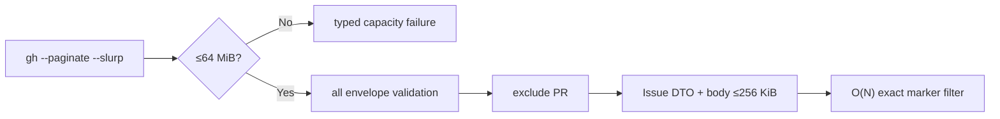

# Scalability Design — mirror-github-gateway

> 上流入力: `performance-requirements.md`、`security-requirements.md`、`scalability-requirements.md`、`reliability-requirements.md`、`tech-stack-decisions.md`、`business-logic-model.md`

## Capacity Architecture

| Dimension | Envelope | Design |
|---|---:|---|
| Issue count | 10,000 fixture | `per_page=100`、全page、O(N) local filter |
| find stdout | 64 MiB | runner hard limit before parse |
| other stdout | 1 MiB | operation profile hard limit |
| Issue body | 256 KiB UTF-8 | DTO化前byte check |
| marker matches | 0／1／複数 | candidate arrayを丸めない |
| read-only sequence | 100 call／60秒 | synchronous runner、immutable request |
| mutation | 1 operation at a time | permit＋receipt、Gateway batchなし |

horizontal scaling、queue、database、cache、daemonは導入しない。1 callは1 canonical repositoryだけを扱い、repository数やworkspaceのIntent数に応じて探索範囲を増やさない。

## Pagination Flow

全pageのenvelopeとshapeがvalidになるまでcandidateを公開しない。途中failure、deadline、body超過、stdout超過はpartial／empty successへ変換しない。rate limitはtyped failureとして上位へ返し、local parallelismやsilent retryで悪化させない。

## Concurrency and Isolation

requestはrepository、operation、argv、limit、deadlineをimmutable valueとしてcallごとに保持する。runner、parser、redactorはglobal mutable repositoryやlast stdoutを持たない。100 call testは逐次であり、各call完了前に次processを起動しない。mutationのthroughput改善目的でcreate／edit／closeを並行化しない。

## Degradation

- read-only capacity／timeout failure: `no-effect-confirmed`。
- mutation process開始後のcapacity／parse failure: `outcome-unknown`。
- marker candidate複数: failureへ丸めず全候補を返しC6判断へ委譲。
- remote完走不能: cacheやactive remote fallbackを使わない。

## Verification

1. 1／2／100 pageで同じmarker resultを確認する。
2. 64 MiB＋1、1 MiB＋1、256 KiB＋1の各fixtureでtyped failureとpartial result 0件を確認する。
3. 100 sequential readで60秒以内、argv／stdout／repository cross-talk 0件を確認する。
4. process historyで同時mutation数最大1、background process 0件を確認する。

## Traceability

`scalability-requirements.md`のIssue count、body size、marker matches、sequential calls、mutations、Scaling Rules、Degradationを上記Capacity Architecture、Pagination Flow、Concurrency and Isolationへ対応付ける。
