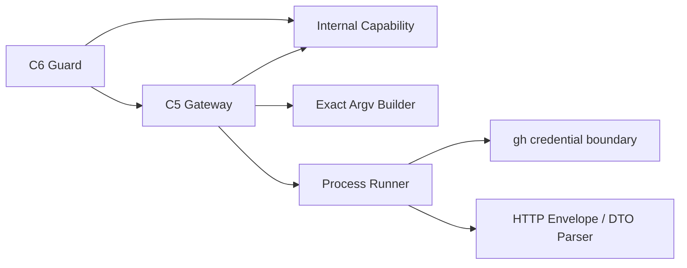

# Security Design — mirror-github-gateway

> 上流入力: `performance-requirements.md`、`security-requirements.md`、`scalability-requirements.md`、`reliability-requirements.md`、`tech-stack-decisions.md`、`business-logic-model.md`

## Trust Boundary Components

credentialは`gh` storeから外へ出さない。Gatewayはvalidated `RepositoryIdentity`、positive Issue number、operation input、mutation時のpermitだけを受ける。cwd、git remote、environment tokenをrepository選択に使わない。

## Capability Design

`amadeus-mirror-capability.ts`はmodule-private `WeakSet<object>`、非export brand、C6専用factory、Gateway専用validatorを所有する。factoryはevent、canonical repository、operation、Issue numberをbindしたfrozen objectをWeakSetへ登録する。validatorは次をprocess spawn前に検証する。

1. WeakSet membership。
2. operation一致。
3. repository canonical一致。
4. createではIssue number absent、edit／closeではpositive number一致。
5. event identity一致。

package public exportへfactory／validator／brandを含めない。dependency testでfactory importはC6、validator importはGatewayだけに限定し、runtime testでobject literal、type assertion、JavaScript callerを拒否する。

## Command and Response Safety

- operation別immutable argv builderだけが`gh` argument arrayを作り、`shell:false`で起動する。
- title、body、labelsは独立argumentで、shell quotingやcommand substitutionを行わない。
- repositoryは検証済みlowercase canonicalからAPI pathを生成する。
- findの`--include --paginate --slurp` stdout grammarは、先頭からpage数P個のHTTP block `HTTP/<version> <3-digit-status> <reason> CRLF *(header CRLF) CRLF`が連続し、その後に単一slurped JSON outer array（要素数P）、末尾LF、EOFだけを許す。各statusは2xx、header block数とouter array要素数は一致しなければならない。単一Issue operationはHTTP block 1個＋JSON object＋末尾LF＋EOFとする。
- parserはheader blockをraw bytesで順次消費し、最後のheader終端後だけをJSON bytesとする。途中のJSON、extra bytes、status非2xx、page count不一致、outer element非arrayを拒否する。このgrammarの1／2／100 page golden fixtureを正本にする。
- Issue parserはpositive number、string title、nullable body、closed union state、canonical repository URLを検証する。
- response、stderr、header、URLをsummaryへ転記しない。

## Redaction

failure summaryは`classification`、`effect`、numeric exit／HTTPだけから`GitHub unavailable ({classification}; {effect}; exit={number|none}; http={number|none})`を生成する。unknown値は`none`とし、raw exceptionをfallback表示しない。token、query、absolute path、credential helper outputを含むfixtureでも期待summaryと完全一致させる。

## Verification

1. metacharacterを含むtitle／bodyでargv element数と値をgolden比較する。
2. forged permit、binding mismatch、wrong repository responseをspawn前／success前に拒否する。
3. traversal、slash、空白、unsafe integer、1／2／100 page goldenおよびmalformed envelope／JSONをfail closedする。
4. token／path sentinelがoutcome、summary、audit handoffへ出ないことを検証する。

## Traceability

| Security area | Design／Verification |
|---|---|
| spoofing／repository binding | canonical API path、response identity test |
| tampering／injection | immutable argv、shell false、metacharacter fixture |
| repudiation | operation／repository／Issue／effect DTO |
| disclosure | fixed redaction template、sentinel test |
| denial of service | deadline／output／body limits |
| privilege escalation | WeakSet capability、dependency／runtime negative tests |
