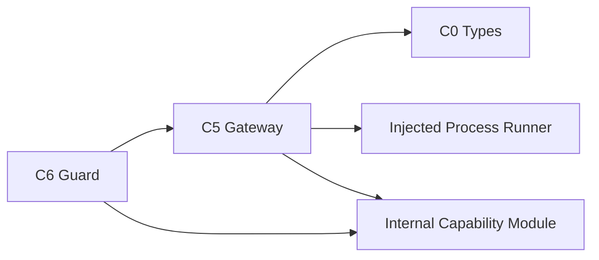

# Tech Stack Decisions — mirror-github-gateway

> 上流入力（consumes 全数）: `business-logic-model.md`、`business-rules.md`、`requirements.md`、`technology-stack.md`

## Decisions

| ID | Decision | Rationale |
|---|---|---|
| TS-GW-01 | TypeScript strictの判別unionでrequest／response／failure／effectを表現 | unknown remote inputをfail closedにする |
| TS-GW-02 | Bun／Node.js `child_process`互換の既存injected runnerを使う | timeout、argv、exit、stdout／stderrをtest seamで観測する |
| TS-GW-03 | GitHub accessは既存`gh api`だけを使う | credential storeと既存運用を再利用しSDK／HTTP clientを追加しない |
| TS-GW-04 | JSONはoperation別manual parserで必要fieldだけを抽出 | remote objectをdomain DTOとして無検証castしない |
| TS-GW-05 | fake／failing runnerはtest側だけに置く | productionへtest modeを作らない |
| TS-GW-06 | Bun test、Biome、`tsc --noEmit`、dependency testを既存CIへ追加 | permit、secret、argv、failure contractを機械検証する |

## Dependency Direction

矢印は左が右をimportする。`amadeus-mirror-capability.ts`が非export `unique symbol`、module-private `WeakSet<object>`、factory、validatorを所有する。C6はfactory、Gatewayはvalidatorをinternal pathからimportする。factoryはbinding済みfrozen objectをWeakSetへ登録し、validatorはmembershipとoperation／repository／Issue number一致を検査する。package public exportには含めない。GatewayはC6をimportせず、runnerはdomainをimportしない。

## Alternatives Rejected

- GitHub SDK／generic tracker port: runtime dependencyと対象外抽象化を増やす。
- shell command string: injectionとescaping差異を生む。
- Gateway内retry／queue: mode、receipt、effectを知らない層で重複mutationを起こす。
- active git remote fallback: cwdによって別repositoryを操作する。

## Validation

1. runtime dependency追加0件。
2. 全remote commandがexact argv goldenと一致する。
3. permit factory importはC6だけ、validator importはGatewayだけであり、forged object／type assertion／JavaScript callerをWeakSet membershipでruntime拒否する。
4. typecheck、Biome、unit／integration／large pagination benchmarkがpassする。
