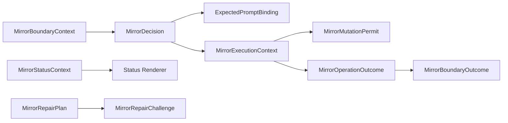

# Domain Entities — mirror-operation-lifecycle

> 上流入力（consumes 全数）: `unit-of-work.md`、`unit-of-work-story-map.md`、`requirements.md`、`components.md`、`component-methods.md`、`services.md`

## Domain Boundary

`unit-of-work.md`のOperation Lifecycle Unit、`unit-of-work-story-map.md`のAS-02〜06／08、`requirements.md`のoperation／boundary outcome、`components.md`のC6〜C8、`component-methods.md`のC0 DTO、`services.md`のcoordinator lifecycleへ対応する。型はC0からimportし、本Unit内で互換unionを再定義しない。

## MirrorExecutionContext

- statePath
- intentUuid
- intentDir
- canonical RepositoryIdentity
- current boundaryのtriggerEvent
- MirrorEventIdentity
- operation
- C7／C8が生成したMirrorIssueContent
- expected Mirror revision
- injected clock
- injected operation ID generator
- MirrorGitHubGateway

contextのoperation event、repository、Intent identityは実行中に不変である。retryではtriggerEventがcurrent boundary、eventが元receiptを指す。cwdやactive git remoteをidentity sourceにしない。

## MirrorOperationOutcome

| Variant | Meaning |
|---|---|
| completed | remoteとlocal stateが収束 |
| skipped | userがsame eventをskip |
| suppressed | off／not-applicable／configuration |
| pending | retryableまたはreconciliation待ち |
| safety-blocked | guard違反または曖昧状態 |
| repaired | relink／abandonがatomic完了 |

outcomeはengine transition resultではない。C7が必ず`workflowMayAdvance=true`付きboundary outcomeへ包む。

## MirrorBoundaryContext

- projectDir、intentDir、intentUuid
- canonical repository
- engine-owned MirrorBoundary
- optional expected prompt binding

boundary instanceは永続engine transitionを指し、同じresumeで不変である。

## MirrorBoundaryOutcome

| Variant | Data |
|---|---|
| none | eligible operationなし |
| ask | question、event、operation binding |
| continued | operation outcomes、workflowMayAdvance=true |

askはremote effectをまだ実行していない。continuedはMirror成功を意味せず、本体workflowをMirror結果から分離するenvelopeである。

## MirrorMutationPermit

- nominal unique-symbol brand
- event
- repository
- operation
- Issue numberまたはnull

internal factoryだけが生成し、C6が全guard通過後に使用する。永続化、再利用、別operation転用をしない。

## Completion Chain

- Identity: workflow completion boundary instance
- Ordered steps: create、final sync、close
- Cursor: current instanceのreceiptからderived
- Terminal: succeeded close、skip、pending、safety-blocked、abandoned

別completion instance、phase、park、manual receiptをchain判断へ混ぜない。

## Expected Prompt Binding

- event identity
- operation
- boundary instance
- Intent UUID

single-useであり、answer report時に完全一致検証する。skip receiptまたはapproved executionを開始した時点で消費する。

## MirrorSnapshot

- intentUuid、intentDir
- project summary
- lifecycle phase、current stage、status
- updatedAt

C8がIssue bodyを描画するread-only snapshotである。GitHub Issue本文から生成しない。

## MirrorIssueContent

- title
- body
- labels

C7がMirrorSnapshotとmarkerをC8へ渡して生成し、C6 contextへimmutable valueとして注入する。C6はC8をimportせず、create／syncで同じ描画結果を使う。

## MirrorStatusContext

- resolved mode
- config source paths
- MirrorStateSnapshot
- provenance status

modeは毎回configからresolveし、stateへ複製しない。status renderはcontextを変更しない。

## MirrorRepairPlan and Challenge

planはrelink、abandon-attempt、rejectedの判別unionである。challengeはIntent、repository、operation、canonical plan digest、expected phrase、issued／consumed時刻を持つ。repair applyはchallenge proofをC3へ渡し、atomic consume outcomeをoperation outcomeへ変換する。

## Relationships

テキスト表現: Boundaryからpolicy decisionを得て、promptまたはexecutionへ分岐する。executionだけがpermitを生成し、operation outcomeを非阻害boundary outcomeへ包む。statusとrepairは別の明示CLI flowである。

## Lifecycle Constraints

- expected prompt: absent → issued → consumed。
- operation: policy decision → guarded preparation → attempted → remote → complete／pending／blocked。
- completion chain: success時だけ次へ進む。
- repair: inspected → challenged → confirmed → consumed。
- status: read-onlyでlifecycle stateを変更しない。
- background timer、poller、daemon entityを追加しない。

## MirrorAuditContext

- current trigger event
- operation event／operation ID
- reconciliation flag
- optional failure classification

全C3 transitionへ必須で渡し、既存audit carrierのContextを構成する。state entity自体には複製しない。
