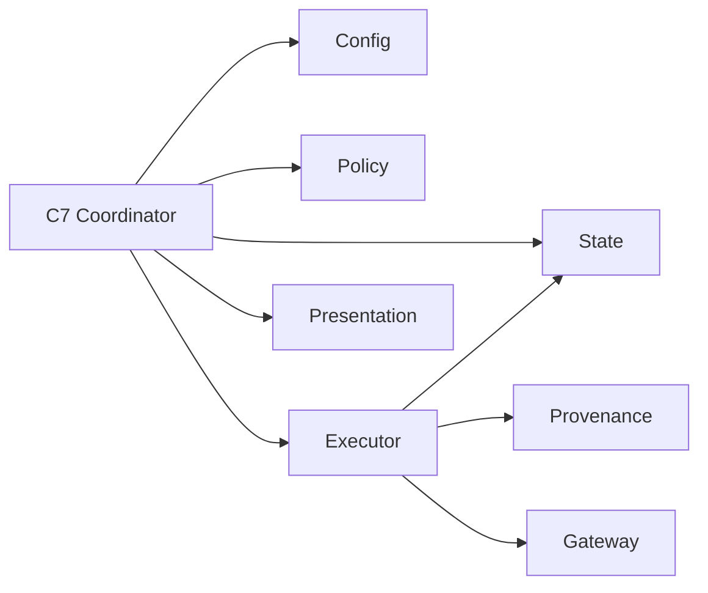

# Tech Stack Decisions — mirror-operation-lifecycle

> 上流入力（consumes 全数）: `business-logic-model.md`、`business-rules.md`、`requirements.md`、`technology-stack.md`

## Decisions

| ID | Decision | Rationale |
|---|---|---|
| TS-OL-01 | TypeScript strictの判別unionでboundary／decision／outcomeを表現 | unknown pathをdefault successへ丸めない |
| TS-OL-02 | C7 coordinatorはC1〜C6／C8の既存portsだけをcompose | codec、Gateway、presentationを再実装しない |
| TS-OL-03 | 同期Bun CLI／engine callを維持 | daemon、queue、schedulerを追加しない |
| TS-OL-04 | state CASとoperation-specific permitを排他制御に利用 | process-local mutexへ依存しない |
| TS-OL-05 | fake config／state／Gateway／clockはtest側へ置く | production test modeを作らない |
| TS-OL-06 | Bun unit／integration／failure injection、Biome、typecheckを既存CIへ統合 | boundary決定表と端到端順序を検証する |

## Dependency Direction

矢印は左が右をimportする。C6はC3の公開operation transition APIだけを利用し、state codec／filesystemへ直接依存しない。C1〜C6／C8はC7をimportせず、循環依存を作らない。C7はengine routingを所有せず、non-blocking Mirror outcomeだけを返す。

## Alternatives Rejected

- background worker／scheduler: boundary-driven契約と非阻害性を複雑化する。
- generic workflow engine: create／sync／closeの3 operationには過剰。
- Gateway内retry: mode／receipt／effectを持たず重複mutationを生む。
- boolean compatibility:明示された非互換契約に反する。

## Validation

1. runtime dependency追加0件。
2. completion／prompt／retry／repairのdecision tableをunit testで網羅する。
3. fake Gateway integrationで全command順序とcall countを検証する。
4. typecheck、Biome、coverage、security negative testsをpassする。
