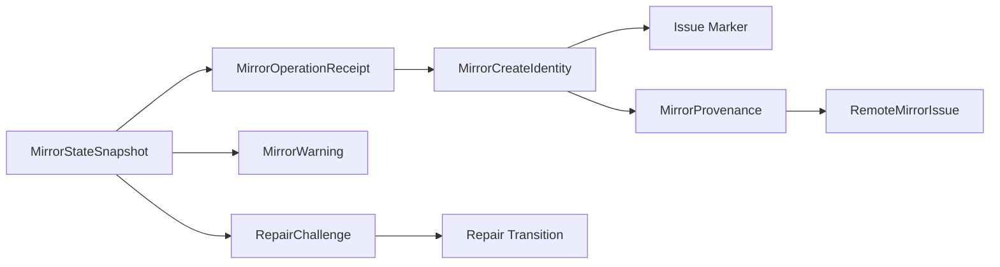

# Domain Entities — mirror-state-provenance

> 上流入力（consumes 全数）: `unit-of-work.md`、`unit-of-work-story-map.md`、`requirements.md`、`components.md`、`component-methods.md`、`services.md`

## Domain Boundary

`unit-of-work.md`のState／Provenance Unit、`unit-of-work-story-map.md`のAS-02／04／05、`requirements.md`の永続性と安全性、`components.md`のC3／C4、`component-methods.md`のC0 DTO、`services.md`のIntent record正本原則へ対応する。C0所有型を再定義せず、C3／C4でのlifecycleとinvariantを具体化する。

## MirrorStateSnapshot Aggregate

- Root: Mirror state schema version、revision
- Members: issueNumber、provenance、receipt map、warnings、`repairChallenges` map、expected prompt
- Persistence: `amadeus-state.md`内の単一versioned Mirror block
- Identity: active Intent record
- Concurrency token: non-negative integer revision

Aggregate invariant:

- root Issue numberとprovenance Issue numberは同時に成立する。
- receipt map keyはcanonical event keyに一致する。
- active create provenanceは最大1件。
- challenge IDはaggregate内で一意。
- aggregate mutationはrevision単位の全体置換であり、member単独writeを持たない。

## MirrorOperationReceipt Entity

| Attribute | Constraint |
|---|---|
| key | `mirror-event:v1:` canonical key |
| event | keyを再生成できる完全identity |
| operationId | non-empty、同attempt系列で不変 |
| status | defined `MirrorReceiptStatus`だけ |
| preparedAt | RFC 3339 UTC、全statusで必須 |
| attemptedAt | attempted／pending／succeededで必須 |
| completedAt | succeeded／skip／terminal repairで必須 |
| createIdentity | create receiptだけ、prepare以後不変 |
| failureClass | pending／safety-blockedで必須 |
| lastEffect | pendingで必須、not-startedはprepared状態で表現 |

receiptのidentityはevent keyであり、operation IDはremote attempt系列のidentityである。再入時に両者を交換しない。

## MirrorCreateIdentity Value

- schema: `1`
- intentUuid: eventと一致
- intentDir: canonical Intent record path identity
- repository: canonical RepositoryIdentity
- operationId: receiptと一致
- preparedAt: receiptと一致

Issue numberを含まないためremote create前に成立できる。ただし、成功したprepare atomic writeから返された値だけが有効であり、callerが作った候補objectは永続化成功前にはidentityとして扱わない。

## MirrorProvenance Entity

- schema: `1`
- createIdentity: Issue markerと共有するidentity
- issueNumber: positive integer
- createdAt: caller supplied RFC 3339 UTC

provenanceはremote Issueをlocal正本へlinkする。Issue本文からlocal requirementやstateを復元するためのentityではない。

## MirrorWarning Entity

- operationId: operationが成立前ならnull、それ以外はreceiptと一致
- operation: `create | sync | close`またはnull
- classification: defined `MirrorFailureClass`
- summary: secretを含まない固定形式
- occurredAt: RFC 3339 UTC
- retryable: boolean
- effect: not-started、no-effect-confirmed、outcome-unknown
- source: persisted receipt、persisted warning、current invocation

warningはworkflow blockではない。C3は永続状態だけを表し、workflowMayAdvanceの判断はC7へ残す。

## RepairChallenge Entity

| Attribute | Meaning |
|---|---|
| challengeId | random one-time identity |
| intentUuid | 対象Intent |
| repository | canonical target |
| operationId | 対象attempt系列 |
| planDigest | canonical repair planのSHA-256 hex |
| expectedPhrase | 人間が完全一致入力する文 |
| issuedAt | RFC 3339 UTC |
| consumedAt | absentまたは消費時刻 |

Stateは`issued → consumed`だけを許し、期限切れはderived stateとして扱う。消費済みをissuedへ戻さない。

## ExpectedPrompt Entity

- event identity
- operation
- issuedAt

同時に最大1件だけ存在する。answerのevent／operation完全一致時だけ消費し、別boundaryや別operationの回答を拒否する。

## Marker Value

- Envelope: `<!-- amadeus-intent-mirror:v1 {payload} -->`
- Payload: canonical `MirrorCreateIdentity`
- Encoding: UTF-8 JSON、base64url、paddingなし
- Cardinality: Issue body内に正準markerは1件だけ

markerは人間向け本文から独立したmachine identityである。未知version、複数marker、malformed payloadはinvalidである。

## Outcome Entities

### State Outcomes

| Variant | Data | Meaning |
|---|---|---|
| `ok` | snapshot、original document | parse成功 |
| `written` | new snapshot、new document | atomic replace成功 |
| `unchanged` | current snapshot、original document | idempotent no-op |
| `conflict` | actual revision | CAS不一致 |
| `invalid` | path付きissues | codec／transition invariant違反 |
| `io-failure` | redacted summary | read／temp write／flush／rename失敗 |

### Marker and Ownership Outcomes

| Type | Variants |
|---|---|
| MarkerOutcome | parsed、missing、invalid |
| OwnershipOutcome | verified、missing-marker、mismatch、wrong-repository |
| CandidateOutcome | adopt、create-new、safety-blocked |

booleanへ潰さず、C6がwarning／repair actionを決められるreasonを保持する。

## Relationships

テキスト表現: State aggregateがreceiptを所有し、create receiptのidentityがmarkerとprovenanceを結ぶ。provenanceがremote Issue番号を固定し、warningとchallengeは同じaggregate revisionで管理される。

## Lifecycle Constraints

- create identity: candidate → prepared writeで確定 → immutable。
- receipt: absent → prepared → attempted → succeeded、またはabsentからskip、attempted → pending → attempted（no-effect-confirmed retry）、safety-blocked／abandoned。
- provenance: unlinked → linked。通常operationで別Issueへ差し替えず、human-gated repairだけが変更できる。
- warning: derived／recorded → same-operation successまたはrepairで解消。
- challenge: issued → consumed。期限切れ／mismatchはmutationなし。
- State StoreはGitHub mutation、mode resolve、stage／phase advanceを行わない。
- `skipped-for-event | safety-blocked | abandoned`は同じcompletion boundaryのterminalであり、後段operationを抑止する。
