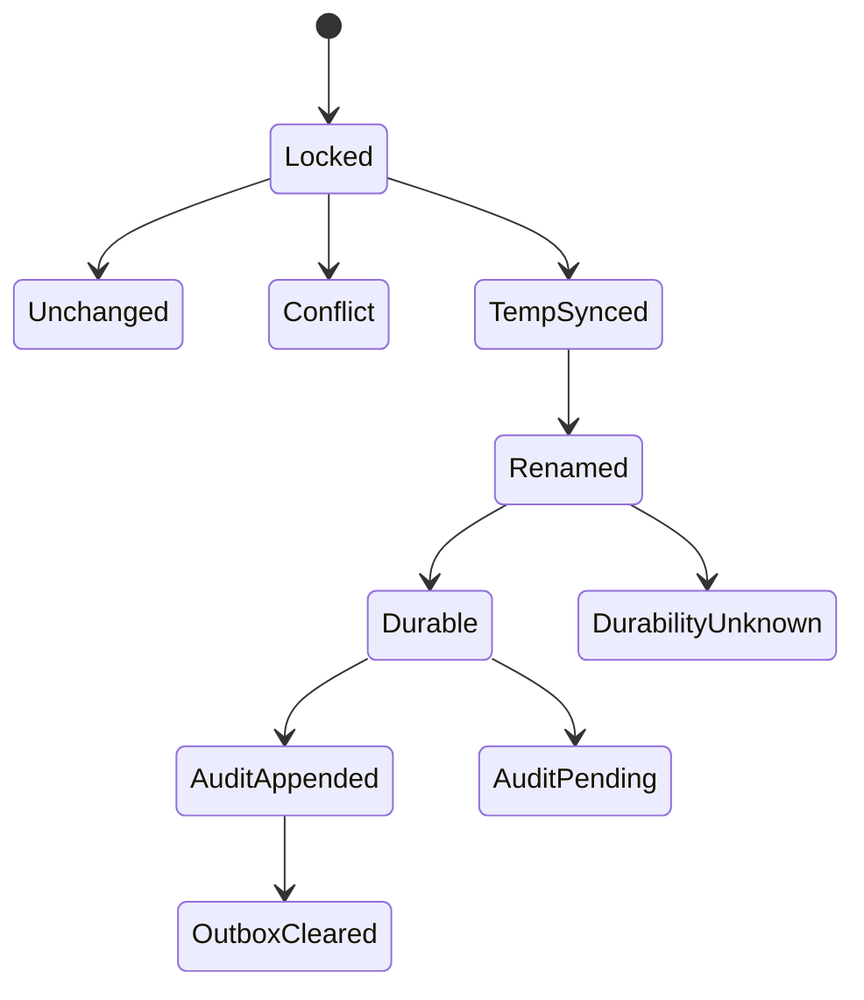

# Reliability Design — mirror-state-provenance

> 上流入力: `performance-requirements.md`、`security-requirements.md`、`scalability-requirements.md`、`reliability-requirements.md`、`tech-stack-decisions.md`、`business-logic-model.md`

## Commit State Machine



business stateと完全な`ARTIFACT_UPDATED` outboxを単一renameへ含める。parent directory fsyncがcommit pointである。rename前failureは元file不変、rename後fsync failureは`durability-unknown`、audit failureは`committed-audit-pending`とする。

## Outbox Recovery

transaction IDはIntent UUID、event key、operation ID、transition kind、next revision、state digestから生成する。次operationはoutbox drainを最優先し、idempotent append成功後だけrevision不変のatomic clearを行う。outbox中は別transitionを開始しない。

C3 State Transaction Coordinatorが唯一のownerであり、state lockを保持したままS4 Audit Outbox moduleを呼ぶ。lock順は常にstate lock→audit lockで、逆順取得を禁止する。S4はaudit appendだけを行い、stateを直接writeしない。append成功後、C3がS3 Atomic File Storeでoutbox clearを行う。C6はC3の単一public APIを呼ぶだけでlock／drainをorchestrateしない。

```text
appendArtifactUpdatedIdempotent({ transactionId, digest, payload })
  -> appended | already-present | conflict | io-failure
```

audit lock内でactive Intentの全version-controlled audit shardに同一transaction IDを検索する。IDなしはcanonical event 1件をappendしてfile flush＋parent directory fsync後に`appended`、同じID＋digest＋payload bytes一致は`already-present`、同じIDでdigest／payload不一致は`conflict`とする。`appended | already-present`だけがoutbox clearを許可する。conflict／I/O failureはoutboxを保持して新transitionを拒否する。

## Transition Closure

pure reducerは全status／transitionをexhaustiveに扱う。同値再入は`unchanged`、pending＋no-effect-confirmedだけが同operation IDへretry、outcome-unknown createはverified candidate 1件以外で再createしない。skip／safety-blocked／abandonedは同completionのterminalである。

## Recovery

tempを正本へ昇格せずcanonical stateだけを読む。invalid／conflictをauto repairしない。directory fsync済みsuccessのRPOは0、durability-unknownは次readの新旧実体から収束する。

## Verification

REL-SP-01〜09、全reducer edge、temp／fsync／rename／directory fsync／audit／outbox-clear failure、32 writerをboundary injectionで検証する。
