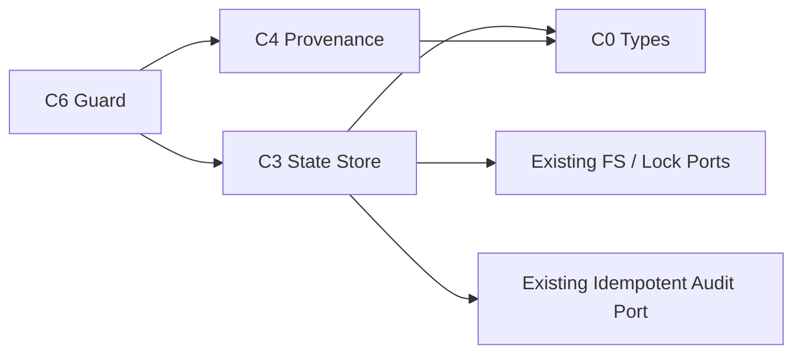

# Tech Stack Decisions — mirror-state-provenance

> 上流入力（consumes 全数）: `business-logic-model.md`、`business-rules.md`、`requirements.md`、`technology-stack.md`

## Decisions

| ID | Decision | Rationale |
|---|---|---|
| TS-SP-01 | TypeScript strictの判別unionとpure reducer | transition closureとexhaustive checkを強制する |
| TS-SP-02 | 既存Bun／Node.js filesystem APIとstate／audit lockを再利用 | 新しいdatabase／lock dependencyを追加しない |
| TS-SP-03 | duplicate-key-awareな小さなJSON tokenizerをcore内に実装 | `JSON.parse`のsilent overwriteを避け、外部parser依存を増やさない |
| TS-SP-04 | same-directory temp＋flush＋atomic rename | cross-device renameを避け、torn writeを防ぐ |
| TS-SP-05 | canonical JSON／UTF-8／base64urlとSHA-256は標準APIを使用 | marker／digestをbyte安定させる |
| TS-SP-06 | Bun unit／filesystem integration／failure injection／fast-checkを既存CIで実行 | codec、reducer、atomicity、propertyを分離検証する |
| TS-SP-07 | state block内の単一transactional audit outboxを使用 | two-file atomicityを偽らず、commit後audit failureを再入で回復する |

## Dependency Direction

矢印は左が右をimportする。C3がstate lockを所有し、state→auditの固定lock順でidempotent audit portを呼ぶ。C3／C4はGitHub Gateway、mode policy、lifecycle coordinatorをimportしない。fake filesystem／clockはtest側だけに置く。

## Alternatives Rejected

- database／SQLite: Intent record正本とGit共有を二重化する。
- plain `JSON.parse`: duplicate keyを検出できない。
- in-place write: crash時にtorn stateを残す。
- unconditional CAS retry: stale caller判断を新stateへ無断再適用する。
- auto repair: provenance安全契約とhuman challengeを迂回する。

## Validation

1. runtime dependency追加0件。
2. codec golden、transition matrix、32-writer、failure injectionがpassする。
3. typecheck、Biome、project／patch coverageを既存commandで満たす。
