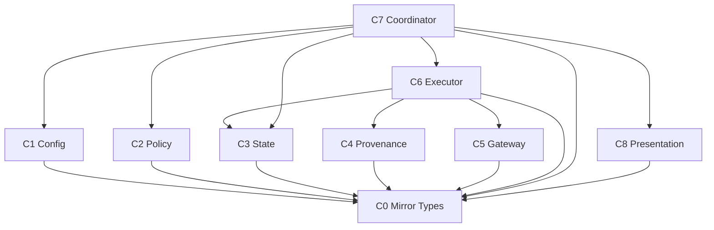
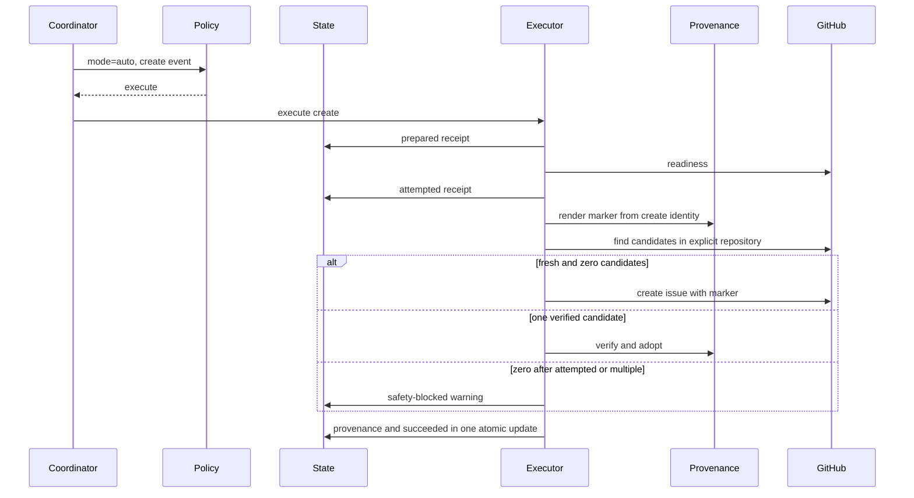
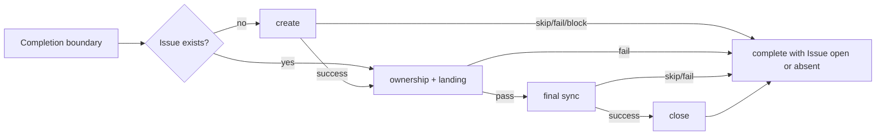
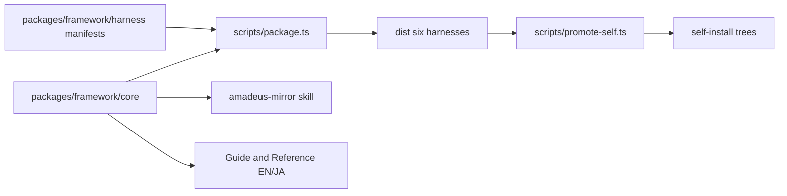

# Component Dependency

> 上流入力（consumes 全数）: `requirements.md`、`architecture.md`、`component-inventory.md`、`team-practices.md`

## Runtime dependency matrix

`→`は行componentが列componentへ依存することを示す。

| From＼To | C0 Types | C1 Config | C2 Policy | C3 State | C4 Provenance | C5 Gateway | C6 Executor | C7 Coordinator | C8 Presentation |
|---|---:|---:|---:|---:|---:|---:|---:|---:|---:|
| C0 Types | — |  |  |  |  |  |  |  |  |
| C1 Config | → | — |  |  |  |  |  |  |  |
| C2 Policy | → |  | — |  |  |  |  |  |  |
| C3 State | → |  |  | — |  |  |  |  |  |
| C4 Provenance | → |  |  |  | — |  |  |  |  |
| C5 Gateway | → |  |  |  |  | — |  |  |  |
| C6 Executor | → |  |  | → | → | → | — |  |  |
| C7 Coordinator | → | → | → | → |  |  | → | — | → |
| C8 Presentation | → |  |  |  |  |  |  |  | — |

C0は型だけを所有するleafである。C3とC4、C6とC8の相互type importは存在しない。C9 Distributionはbuild-time projectionなのでruntime matrixへ含めない。

## Dependency direction

テキスト表現: 矢印はimport元からimport先を示す。low-level componentはCoordinatorを知らず、ExecutorはTypes／State／Provenance／Gatewayだけに依存する。PolicyはTypes以外をimportしないため循環はない。

## Communication contracts

| Producer | Consumer | Pattern | Contract |
|---|---|---|---|
| Engine | C7 | 同期関数 | typed boundary context |
| C7 | C1 | 同期read | resolved／invalid union |
| C7 | C2 | pure call | decision union |
| C7／C6 | C3 | 同期filesystem | expected-state atomic transition |
| C6 | C4 | pure parse／verify | ownership／candidate union |
| C6 | C5 | sync child process | repository-bound gateway outcome union |
| C7 | C8 | pure render | status／prompt text |
| C5 | GitHub | `gh` argument array | JSON response／exit status |

async event、REST、gRPC、queueは使わない。

## Data flow

### Auto create

### Completion chain

## Shared resources

- `amadeus-state.md`: C3だけがMirror fieldのwrite contractを所有する。
- Intent registry: C7／C6がlanding checkのreadに使用し、Mirrorはwriteしない。
- GitHub Issue: C5だけがmutationする。
- Audit: state／orchestrator／mirror toolの既存tool-owned emitterを使用する。
- Config files: C1がread-onlyで解決する。
- Core／dist／self-install: C9だけがpackage／promote pipelineのprojection contractを所有する。

## Circular dependency check

循環は0件である。特に次を禁止する。

- C2 PolicyからC7 Coordinatorを呼ぶ。
- C3 StateからC5 Gatewayを呼ぶ。
- C5 GatewayからC3 Stateを書き込む。
- C6 ExecutorとC8 Presentationが相互importする。
- C3 StateとC4 Provenanceが相互importする。
- C8 Presentationからoperationを実行する。
- `amadeus-mirror-policy.ts`が`amadeus-orchestrate.ts`をimportする。

実装時はtype importを含むdependency testまたは静的import検査でこの方向を固定する。

## Failure containment

| Failure | Contained by | Blast radius |
|---|---|---|
| config invalid | C1→C7 blocked outcome | 当該IntentのMirrorだけ |
| GitHub unavailable | C5→C6 pending | 当該operationだけ、workflow継続 |
| marker mismatch | C4→C6 safety-blocked | 対象Issueへmutationなし |
| state CAS conflict | C3再読込 | 同じeventの再評価だけ |
| renderer fault | C8 fail before mutation | prompt／statusだけ |
| completion close failure | C6 warning | Issueはopen、workflow完了維持 |

## Build-time distribution dependency

C9の変更ownerはcore tool／skill、必要な6 harness manifest／emit、package output、promote output、日英docs、distribution testsである。正準6ハーネスはdist directory名で`claude | codex | cursor | kiro | kiro-ide | opencode`とし、表示名はClaude Code、Codex CLI、Cursor、Kiro CLI、Kiro IDE、OpenCodeである。harness固有実装がないC0／C2は全manifestのcore tools globから同じbytesで投影する。
