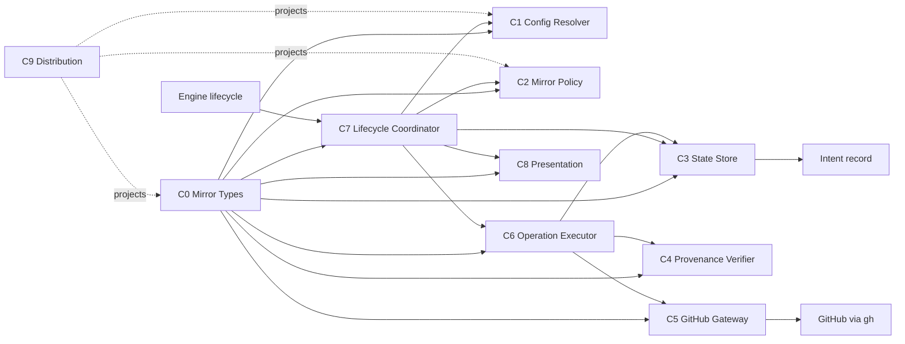

# Application Components

> 上流入力（consumes 全数）: `requirements.md`、`architecture.md`、`component-inventory.md`、`team-practices.md`

## 設計方針

`requirements.md`の三モードとfailure決定表を、I/Oを持たないpolicy、Intent recordの永続状態、GitHub adapter、lifecycle coordinatorへ分離する。`architecture.md`と`component-inventory.md`で確認した既存CLI構造を維持し、`team-practices.md`どおり正本と6ハーネス生成物を同期する。

新しい常駐service、database、queue、AWS resource、UIは追加しない。利用者接点は既存のAmadeus gate、status、Mirror CLI、設定ファイルである。

## C0 Mirror Types

**目的:** Mirror domainの値型と判別unionだけを所有し、component間の型依存を一方向にする。

**所有する責務**

- `MirrorMode`、`MirrorOperation`、`RepositoryIdentity`
- `MirrorBoundary`、`MirrorEventIdentity`、`MirrorCreateIdentity`
- `MirrorStateSnapshot`、receipt、provenance、warning
- `RemoteMirrorIssue`、`CreateMirrorIssueInput`、`GatewayOutcome`
- policy／marker／ownership／candidate／write／operation outcome
- `MirrorGitHubGateway`、executor／rendererが共有するcontextとsnapshot
- repair plan／one-time challenge

**公開面**

- `amadeus-mirror-types.ts`からのtype exportだけ

**境界**

- runtime関数、filesystem、GitHub、orchestratorをimportしない。
- C1〜C8はC0をimportできるが、C0はC1〜C8をimportしない。

## C1 Mirror Config Resolver

**目的:** 三層設定から厳密な`MirrorMode`を解決する。

**所有する責務**

- 既存workspace selectorによるGlobal／Space／Intent configのread-only読込
- `auto-mirror`の`off | prompt | auto`構文
- 未指定時の`prompt`
- Global → Space → Intentの後勝ちmerge
- booleanを含むinvalid valueの全件診断

**公開面**

- `resolveMirrorConfig(projectDir, explicitIntentDir?)`
- `MirrorMode`
- `MirrorConfigOutcome`

**境界**

- lifecycle、GitHub、receiptを知らない。
- filesystem writeを行わず、read結果をpure parserへ渡す。
- invalid valueをfallbackで隠さない。

## C2 Mirror Policy

**目的:** `mode × operation × boundary × current state`から、副作用なしで次のactionを一意に決める。

**所有する責務**

- `suppress | prompt | execute`のmode／applicability／event-skip決定
- create→final sync→closeの前後関係
- 同一event再入、skip、pending retryの扱い
- `off`での完全抑止

**公開面**

- `decideMirrorAction(input): MirrorDecision`
- `nextCompletionOperation(state): MirrorOperation | null`
- `mirrorEventIdentity(input): MirrorEventIdentity`

**境界**

- filesystem、`gh`、state書込みを行わない。
- provenance、repository、landing、candidate安全guardを評価せず、C6が全operationへ必須適用する。
- stateやgateway componentが定義した型を参照せず、C0のDTOだけを使用する。
- PR mergeやrelease actionを表現する型を持たない。

## C3 Mirror State Store

**目的:** Intent record内のMirror状態を単一の原子的更新境界として管理する。

**所有する責務**

- `Mirror Issue`
- `Mirror Provenance`
- `Mirror Operation Receipts`
- `Mirror Warnings`
- event identityごとの`prepared`、`attempted`、`succeeded`、`skipped-for-event`、`pending`、`safety-blocked`、`abandoned`
- one-time repair challengeの発行、binding検証、同一atomic writeでの消費
- versioned JSON fieldのparse／validate／atomic update
- Mirror revisionを比較し、同じstate lock内で最新documentのMirror fieldだけを変換

**公開面**

- `readMirrorState(stateContent): MirrorStateOutcome`
- `transitionMirrorOperation(state, transition): MirrorStateOutcome`
- `setMirrorWarning`／`clearMirrorWarning`
- `setMirrorProvenance`

**境界**

- GitHub mutationを行わない。
- lifecycle fieldを含む最新`amadeus-state.md`全体をlock内で再読込し、非Mirror fieldをbyte-preserveしたままMirror fieldを1回の原子的writeで更新する。

## C4 Mirror Provenance Verifier

**目的:** local recordとGitHub Issueが同じIntent・repository・operationに属することを検証する。

**所有する責務**

- create前に生成可能なversioned create identity markerの生成・parse
- Intent UUID／record directory／repository／Issue番号／create operation identityの一致
- 0件・1件・複数件候補の分類
- marker欠落・改変・local部分保存のfail-closed判定

**公開面**

- `renderMirrorMarker(createIdentity): string`
- `parseMirrorMarker(body): MarkerOutcome`
- `verifyMirrorOwnership(local, remote): OwnershipOutcome`
- `classifyMirrorCandidates(receipt, issues): CandidateOutcome`

**境界**

- credentialやtokenをprovenanceへ含めない。
- `RemoteMirrorIssue`を含む入出力型はC0からimportし、C5をimportしない。
- Issue番号はcreate後にlocal provenanceへ追加し、create前markerには要求しない。
- 候補選択のためにIssue本文をrecordへ逆同期しない。

## C5 Mirror GitHub Gateway

**目的:** `gh` CLIとの唯一のprocess境界としてIssueをcreate／view／search／edit／closeする。

**所有する責務**

- executable／auth readiness
- argument arrayによる`gh`起動
- JSON response shape validation
- GitHub failureの正規化
- すべての`gh api` commandで明示的な`owner/name` repositoryを`repos/{owner}/{name}/issues...` request pathへbindする
- mutation failureの副作用確定性（未開始／無作用確定／結果不明）

**公開面**

- `createIssue`
- `findIssuesByMarker`
- `viewIssue`
- `editIssue`
- `closeIssue`

**境界**

- modeやlifecycleを判断しない。
- stateを書かない。
- cwdやgit remoteからmutation先repositoryを暗黙推論しない。
- shell command stringやcredential persistenceを使わない。
- mutation methodはC6がguard通過後に発行するnominal permitを必須とする。

## C6 Mirror Operation Executor

**目的:** policyで許可された単一operationをreceipt・provenance・gatewayの順序契約に従って実行する。

**所有する責務**

- operationId／preparedAt候補を注入されたgeneratorから生成
- remote call前の`prepared`永続化
- `attempted`遷移
- candidate 0件後のCAS `claim-create-attempt`
- createの候補再発見と重複防止
- sync／close前guard
- GitHub failureをnon-blocking outcomeへ変換

**公開面**

- `executeMirrorOperation(context): MirrorOperationOutcome`
- `reconcileCreate(context): MirrorOperationOutcome`

**境界**

- stage／phaseをadvanceしない。
- `blocked`を強行実行しない。
- create identityを自分で確定せず、C3の成功したprepare writeが返した永続済みidentityだけをmarkerへ渡す。
- C8を直接importせず、C7が描画してcontextへ注入したIssue contentだけを使う。

## C7 Mirror Lifecycle Coordinator

**目的:** EngineのIntent Capture承認、phase verification、park、workflow completionからMirror評価を呼び出す。

**所有する責務**

- boundary instanceの生成
- config → state → policy → executorの呼出し順
- `prompt` directiveの生成と回答report
- Mirror失敗後も本体workflow transitionを継続
- completion chainの次operation選択
- workflow completionの`auto`だけ最大3段のchainを同じboundary instanceでdrive
- `prompt`回答のoperation／event identity照合と、成功後の次prompt生成
- C8でIssue contentを描画してC6 contextへ注入

**公開面**

- `evaluateMirrorBoundary(context): MirrorBoundaryOutcome`
- `reportMirrorChoice(context, choice): MirrorBoundaryOutcome`
- `driveMirrorBoundary(context): MirrorBoundaryOutcome`

**境界**

- GitHub詳細をdirectiveへ漏らさない。
- Mirror outcomeからstage routingを再定義せず、engine routingを維持する。
- promptに記録したevent以外のoperation回答を拒否する。

## C8 Mirror Presentation

**目的:** runtimeのstatus、warning、prompt、Issue本文を一貫した利用者可視contractで描画する。

**所有する責務**

- Issue title／body／status line
- immutable `MIRROR_USER_CONTRACT` data export
- resolved mode、pending、warning、provenance statusの表示
- create／sync／close／skipの一貫したprompt
- secret redaction

**境界**

- status表示はmutationしない。
- UI frameworkやweb画面を追加しない。
- skill、Guide、Reference、distribution projectionは所有せず、C9へ完成runtime contractを提供する。

## C9 Distribution Synchronizer

**目的:** core正本のMirror契約を6ハーネス、self-install、skill、日英文書へ同時に投影する。

**所有する責務**

- `packages/framework/core/tools/`のC0／C2を含む正本
- `packages/framework/harness/*/{manifest,emit}.ts`のtool／skill登録
- `scripts/package.ts`による`dist/{claude,codex,cursor,kiro,kiro-ide,opencode}`生成
- `scripts/promote-self.ts`による`.claude/.codex/.agents/.cursor/.opencode`同期
- `packages/framework/core/skills/amadeus-mirror/SKILL.md`
- Guide／Referenceの日英ペア

**公開面**

- runtime APIは持たない。
- `dist:check`、`promote:self:check`、distribution testsを検証契約とする。

**境界**

- `dist/`とself-installを正本として編集しない。
- harness固有差が不要なcore toolへoverlay実装を作らない。

## 既存ファイルへの配置

| Component | 正本候補 | 変更理由 |
|---|---|---|
| C0 | 新規`amadeus-mirror-types.ts` | 相互type importを除去するleaf module |
| C1 | `amadeus-mirror-config.ts` | 既存責務の型置換 |
| C2 | 新規`amadeus-mirror-policy.ts` | pure decisionを巨大orchestratorから隠蔽 |
| C3 | `amadeus-state.ts`内のMirror専用codec／transition | stateの唯一write ownerを維持 |
| C4〜C6 | `amadeus-mirror.ts`、必要ならMirror内部module | GitHub process境界を1か所に維持 |
| C7 | `amadeus-orchestrate.ts`の狭いintegration seam | engine routing ownerを維持 |
| C8 | `amadeus-mirror-presentation.ts`のruntime renderer、`MIRROR_USER_CONTRACT`、status／prompt／Issue body | runtime利用者contractの同期 |
| C9 | skill、Guide／Reference、harness manifests、package／promote scripts、distribution tests | 文書と6面投影の変更owner |

新規moduleはC0とC2だけを既定とする。C3〜C6の追加分割は、実装時に単一ファイル内で変更理由を保てない場合に限りUnits Generationで明示する。

## コンポーネント図

テキスト表現: C0は全runtime componentが参照できる型leafである。EngineはC7だけを呼び、C7が設定・policy・state・executorを調整する。GitHubへ到達できるのはC5だけで、永続状態を書けるのはC3だけである。C9はbuild-time projectionでありruntime dependency graphには入らない。

## Review — Iteration 1

- **Verdict:** NOT-READY
- **Reviewer:** amadeus-architecture-reviewer-agent
- **Date:** 2026-07-24T03:13:19Z
- **Iteration:** 1
- **Scope decision:** none

create provenance生成、型依存、state CAS、completion chain、repository binding、repair path、配布ownerに実装不能または未確定な契約がある。

### Findings

- create前marker identityとcreate後provenanceを分離すること。
- shared type所有moduleを確定し相互type importを除去すること。
- full-documentを保護し非Mirror fieldを上書きしないatomic state transitionを定義すること。
- completion chain driverとprompt回答のevent照合を定義すること。
- Gatewayの全methodへ明示repository identityを渡すこと。
- 公開Context／Outcome／state invariantを定義すること。
- safety-blockedのmanual repair経路を設計すること。
- post-remote state write失敗でも永続warning／reconciliationが成立する契約を定義すること。
- 6ハーネス配布の正本、manifest、生成、docs ownerを定義すること。

## Review — Iteration 2

- **Verdict:** NOT-READY
- **Reviewer:** amadeus-architecture-reviewer-agent
- **Date:** 2026-07-24T03:23:24Z
- **Iteration:** 2
- **Scope decision:** none

Iteration 1の主要契約は強化されたが、型依存、create identity生成、公開型、failure表現、配布対象に実装を一意化できない矛盾が残る。

### Findings

- 解消済み: full-document atomicity、completion chain、全Gateway呼び出しの明示repository binding、post-remote write failureからのreconciliationは、順序・不変条件・失敗時挙動まで具体化された。
- pre-create identity未解消: MirrorCreateIdentityはoperationIdとpreparedAtを必須とする一方、operationIdは最初のprepared transitionで生成するとされる。しかしexecutor順序はcreate identity生成 → prepared writeで、prepare transitionは生成済みidentityを入力として受ける。生成主体・原子的保存・生成値の返却契約が循環している。
- 型依存循環が残存: C2のMirrorPolicyInputはC3で定義されたMirrorStateSnapshotを参照し、C4はC5で定義されたRemoteMirrorIssueを参照するため、記載されたC2/C4はC0だけに依存とdependency matrixを実装すると成立しない。C0がDTOを所有するとの説明と、各component節での型定義位置も一致していない。
- 公開型が未完備: MirrorFailureClass、WriteOutcome、MarkerOutcome、OwnershipOutcome、CandidateOutcome、GatewayOutcome、CreateMirrorIssueInput、MirrorExecutionContext、MirrorSnapshotのshapeと所有moduleが定義されていない。開発者はerror分類、CAS結果、repair入力を推測する必要がある。
- state invariantとtransitionが不一致: succeeded receiptはcompletedAt必須だが、complete transitionにcompletedAtがない。State Storeが時刻を生成するのかcallerが渡すのかも未定義で、決定的テストと再入時の同一性を実装できない。
- failure outcomeが型で表現不能: config invalidはwarning付きcontinuedを返す設計だが、MirrorOperationOutcomeにconfiguration/suppressed結果がなく、MirrorWarningはoperationとoperationIdを必須とする。remote前のstate write失敗時にも、prepared receiptからwarningを導出・表示する契約が定義されていない。
- repair pathは部分解消: CLI経路は追加されたが、applyMirrorRepair(..., explicitConfirmation: string)の有効な確認値、確認binding、再利用防止が未定義で、常にhuman-gatedを実装・検証できない。
- 6ハーネス配布ownershipに矛盾: C9と配布図はclaude/codex/cursor/kiro/kiro-ide/opencodeを対象とする一方、ADR-10はClaude、Codex、Cursor、Gemini CLI、Kiro、OpenCodeとし、Kiro IDEを欠落させGemini CLIを追加している。正準配布対象を一意に確定する必要がある。

## Gate Rejection Revision 1

利用者のRequest Changesを受け、Iteration 2の未解決事項を次の契約で解消した。

| Finding | Resolution |
|---|---|
| pre-create identity | C6が候補値を生成し、C3の成功した`prepare` atomic writeがreceiptとcreate identityを同時に確定して返す。失敗時はremote callなし |
| 型依存 | shared DTOとGateway interfaceをC0へ集約し、C2／C4／C5はC0だけから型をimport |
| 公開型 | 指摘された9型に加え、receipt、warning、repair plan／challengeのshapeとownerをC0へ定義 |
| completedAt | `complete` transitionの必須caller-supplied fieldとし、注入clockで決定的に生成 |
| failure表現 | `suppressed: configuration`、nullable operation identity、persisted receipt由来とcurrent invocation warningを区別 |
| repair確認 | Intent／repository／operation／plan digestへbindした10分・一度限りchallengeをrepairと同じatomic writeで消費 |
| 6ハーネス | 正準directoryを`claude | codex | cursor | kiro | kiro-ide | opencode`へ統一 |
