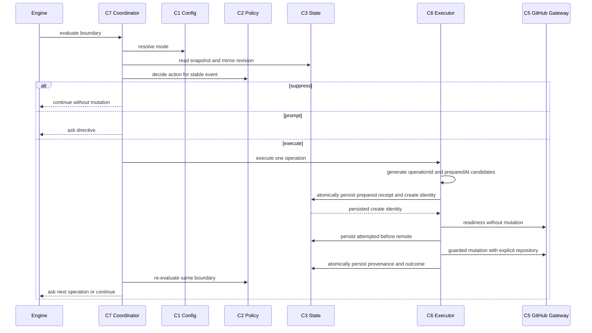

# Service Design

> 上流入力（consumes 全数）: `requirements.md`、`architecture.md`、`component-inventory.md`、`team-practices.md`

## Service topology

本Intentは新しいnetwork serviceを導入しない。`architecture.md`に記録された既存のBun／TypeScript CLI process内でC1〜C8を同期的に調整し、外部境界は`gh` child processだけとする。AWS Platform観点ではcompute、storage、queue、IAM role、network、監視resourceの新設はすべてN/Aである。

## Orchestration pattern

中央のC7 Mirror Lifecycle Coordinatorが、engineから渡された単一boundaryを調整するorchestration方式を採用する。choreographyやevent busは使わない。

テキスト表現: engineはboundaryを1回渡し、coordinatorがmodeとstateから単一operationを決定する。GitHub failureはoutcomeとして戻り、engineのstage transitionを妨げない。

## Lifecycle

### Intent Capture

承認transitionのcommit後、create eventを評価する。Mirror処理が失敗してもIntent Captureの承認を巻き戻さない。

### Phase verification

既存Issueがあればsync、なければ追いつきcreateを評価する。create成功後に同じphase boundaryで追加syncは不要であり、create bodyがそのsnapshotを含む。

### Park

park stateを書いた後にsyncを評価し、parked stageをIssueへ反映する。失敗してもparkは成立する。

### Workflow completion

Issueなしならcreate、成功後にfinal sync、成功後にcloseを直列化する。`prompt`は各段を別々に確認し、`auto`は同じchainを自動実行する。前段のskip／failure／blockedは後段を抑止する。

C7のdriverが同じengine-owned completion instanceを保持してchainを進める。`auto`は各operation成功後に最新stateを再読込して最大3回loopし、`prompt`は成功ごとにdriverへ戻って次の`ask`を返す。reportは保存済みexpected event／operationと回答を完全一致検証し、任意operationの注入を拒否する。

## Data ownership

| Data | Owner | Persistence | Consumer |
|---|---|---|---|
| resolved mode | C1 | config layers | C2、C7、status |
| event identity／receipt | C3 | `amadeus-state.md` versioned fields | C2、C6、C7 |
| create identity | C3 | `amadeus-state.md` receipt | C4、C6 |
| provenance | C3 | `amadeus-state.md` | C4、C6、status |
| marker | C4 | GitHub Issue body、create前identityのみ | C4、C6 |
| warning | C3 | `amadeus-state.md` | status、next boundary |
| Issue body | C8 | GitHub Issue | 利用者、C4 |

Intent recordが正本であり、GitHub Issueから要求・設計・stateを逆輸入しない。

## Scaling and concurrency

- 1 Intentにつき正準Mirror Issueは最大1件。
- boundary処理はIntent stateのMirror revisionと既存state／audit lockで直列化する。
- C3はlock内で最新documentを再読込し、非Mirror fieldをbyte-preserveしてMirror fieldだけを一括更新する。
- 並列workflowが同じIntentを処理した場合、最初のMirror revision transitionだけが成功し、後続は最新documentを再読込して同じeventを再評価する。
- background worker、polling、queue、distributed lockを導入しない。
- GitHub rate limitはgateway failureとしてpendingへ正規化し、busy retryしない。

## UX and accessibility

web UIはないためWCAG componentはN/Aである。ただしCLI UXとして、mode、operation、Issue番号、warning、次アクションをテキストだけで判別できるようにし、色やemojiだけへ意味を依存させない。`prompt`はcreate／sync／close／skipを明示し、`auto`の同意範囲をstatusと文書で確認できるようにする。

## Operational characteristics

- 可用性はGitHubに依存するが、AI-DLC本体はMirror degradationから分離する。
- retryは次のlifecycle boundaryまたは明示manual commandでのみ行う。
- releaseは`team-practices.md`どおり既存workflow_dispatchを使い、本設計から自動publishしない。
- observabilityは永続receipt、warning、tool-owned audit、status出力で提供する。
- `prepared`後のreadinessが失敗した場合、またはreadiness成功後に`attempted` receiptを永続化できない場合は、`prepared`を維持して`not-started` warningをbest-effort保存し、外部mutationを行わない。`pending + no-effect-confirmed`のretryは同じoperation IDを`attempted`へ再遷移してから行う。remote後のcomplete writeが失敗した場合も、未完了`attempted` receipt自体がstatus warningと次回reconciliationの正本になる。

## Manual repair lifecycle

`safety-blocked`は自動mode変更では解除しない。Mirror CLIのread-only `repair status`で候補と原因を確認し、人間が対象Intent／repository／Issue／operationを明示承認した場合だけ`repair relink`または`repair abandon`を実行する。marker欠落Issueは自動採用せず、GitHub側markerを人間が修復してから再検証する。repair operationは`auto`の継続同意に含めない。

repair promptはIntent UUID、repository、operationId、plan digestへ結び付けた一度限りのchallengeを先に永続化する。利用者は表示されたexact phraseで確認し、applyは10分以内・未消費・全binding一致をlock内で検証する。成功時はrepairとchallenge消費を同じatomic writeで行い、replayや別planへの転用を拒否する。
