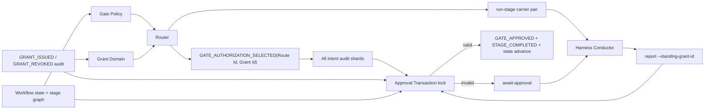

# Component Dependency: Solo Standing Grant

## Design Inputs

依存関係は`requirements.md`、現行`architecture.md`、`component-inventory.md`、`team-practices.md`のcanonical core→harness投影規則から導出する。

## Dependency Matrix

| Consumer ↓ / Provider → | Grant Domain | Directive Contract | Router | Approval Transaction | Audit/State | Harness Protocol |
|---|---:|---:|---:|---:|---:|---:|
| Grant Domain | — |  |  |  | read |  |
| Directive Contract |  | — |  |  |  |  |
| Router | call | type | — | CLI call | read | emit |
| Approval Transaction | exact-ID call | outcome type |  | — | write |  |
| Harness Protocol |  | parse | report |  |  | — |

依存は一方向であり、Grant Domainはorchestrate/stateをimportしない。Directive Contractはdomain logicを持たない。

## Data Flow

テキスト表現: auditとworkflow policyは別入力としてrouterへ入り、Route Idで相関されたID pairだけがconductorを経由してlockへ運ばれる。commitはspace全intentからreceipt所有intentを一意に解決し、そのintentのlockでexact receipt、audit、stateを再読する。active cursorが別intentへ変わっても新intentは操作しない。

## Ordering Constraints

1. gate requirementを現行policyで確定する。
2. gateが存在する場合だけauthorization candidateを選ぶ。
3. UUID Route Idを生成し、route選択をprotected audit receiptへ記録してからcarrier pairをemitする。
4. stage body、reviewer、sensors、learningsを完了する。
5. reportが同じRoute Id / Grant Id pairをstateへ渡す。
6. space全intentからRoute Id exact receiptを解決し、所有intentへtransaction targetをpinする。
7. target intentのstate lock内でstage/Grant Id一致、exact grant validityを再検証する。
8. valid時だけtarget intentへapproval auditとstate mutationを行う。

## Mode Isolation

| Concern | solo mode | team mode |
|---|---|---|
| route carrier | 対象gateでGrant Id / Route Id pairを付与 | 付与しない |
| approval source | explicit Grant Idまたはhuman | 既存human/delegation/active grant |
| delegation event | 発生させない | 既存`DELEGATED_APPROVAL` |
| candidate order | expiry→issued timestamp→ID | 現行探索順序を維持 |
| fallback | `await-approval` | 既存拒否/委任契約を維持 |

同一stageの重複`next`、crash/re-entry、並行sessionはRoute Idで分離する。receiptにlatest/consumed推論はなく、後発routeが先発の正当なcarrierを上書きしない。

## Policy Interaction Matrix

| Gate class | Gate exists? | solo grant authorization |
|---|---:|---|
| ordinary stage gate | yes | eligible |
| phase boundary、flagなし | yes | ineligible |
| phase boundary、flagあり | yes | eligible if all other checks pass |
| effective walking skeleton on | yes | ineligible |
| effective walking skeleton off | existing policy | eligible if gate exists |
| per-unit uncovered iteration | no stage-level approval yet | ineligible |
| per-unit all-covered final gate | yes | eligible |
| reject / Request Changes / halt-and-ask | human-control path | ineligible |

## Distribution Dependency

canonical sourceの変更順:

1. `packages/framework/core/`のtype、domain、router、state、protocol
2. `packages/framework/harness/<name>/`のharness固有表現が必要な場合だけ変更
3. `scripts/package.ts`で6 harnessへ生成
4. `scripts/promote-self.ts`で4 self-install面を同期
5. drift checksで手編集や欠落を拒否
