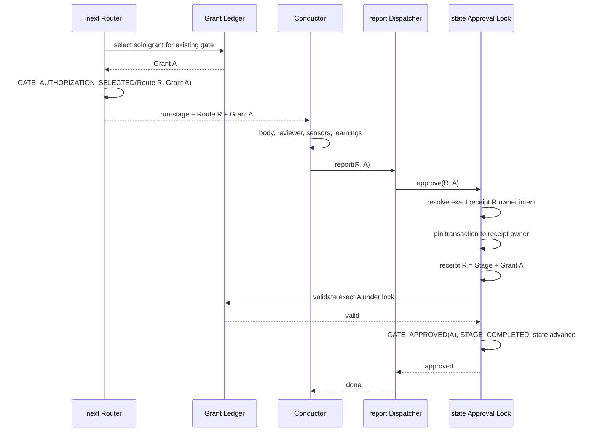
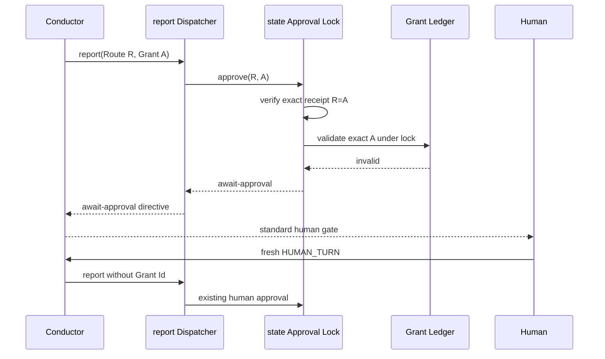

# Services and Orchestration: Solo Standing Grant

## Design Inputs

`requirements.md`、`architecture.md`、`component-inventory.md`、`team-practices.md`から、対象は単一process CLIのworkflow orchestrationであり、network serviceやAWS infrastructureを必要としないと判断する。

## Service Topology

物理serviceは追加しない。次の論理serviceを既存TypeScript module内の関数境界として扱う。

| Logical service | Runtime | State owner | Communication |
|---|---|---|---|
| Grant Ledger Query | in-process | audit shards（read-only） | direct typed call |
| Workflow Router | `amadeus-orchestrate.ts next` | state read-only +既存routing side effect | JSON directive |
| Transition Dispatcher | `amadeus-orchestrate.ts report` | mutationをstate CLIへ委譲 | argv + typed stdout |
| Approval Transaction | `amadeus-state.ts approve` | audit + state under lock | typed outcome |
| Harness Conductor | host session | none | directive forwardingとhuman prompt |

grant-backed state CLI transportはJSON Linesではなく、正確に1行のJSON objectとする。`report`が唯一のparser/ownerであり、補助log混在やunknown shapeを真正protocol errorとして拒否する。

## Orchestration Pattern

central orchestrationを維持する。event choreographyや新しいbackground workerは導入しない。

### Grant-backed Success

テキスト表現: routerは既存gateへGrant Aを選び、workspace outer lock内でRoute Rのspace-wide未使用を確認してprotected receiptを記録してからpairをemitする。conductorはquality ritual後にR/Aをそのままreportする。commitは同じworkspace outer lock内でRをspace全intentからexact lookupし、receipt所有intentへtransactionをpinしてowner intent inner lockでAだけを再検証する。route後にactive cursorが変わっても新intentを操作せず、同じRoute Idの別intent receiptは判定後へ割り込めない。

### Expiry / Revocation Race

テキスト表現: invalidはmutation前の通常結果として返り、`GATE_APPROVED`、`STAGE_COMPLETED`、`ERROR_LOGGED`、state advanceを増やさない。human reply後は既存経路で完了する。

## Lifecycle Characteristics

- **Availability:** local filesystemと既存lockに依存し、新しいremote dependencyはない
- **Scaling:** single workflow transactionの既存特性を維持
- **Consistency:** routeはoptimistic、commitはlock内exact-ID再検証
- **Idempotency:** fallbackはmutationなし。human再reportは既存idempotent recoveryに従う
- **Observability:** `GRANT_ISSUED` / `GRANT_REVOKED`をgrant正本、`GATE_AUTHORIZATION_SELECTED`をroute相関、`GATE_APPROVED.Grant Id`をcommit証跡とし、新しいerror eventを作らない

## CLI Experience

UX上、grant失効は技術errorではなく「承認が必要な状態」として表示する。全harnessは同じ番号付きhuman gateを提示し、内部reasonやstderrを利用者の制御入力として解析しない。

## AWS and UI Assessment

- AWS service mapping: 該当なし
- data migration: 該当なし
- browser UI component: 該当なし
- accessibility上の変更: CLI gateの既存番号付きproseを維持し、状態と次の操作を明示する
