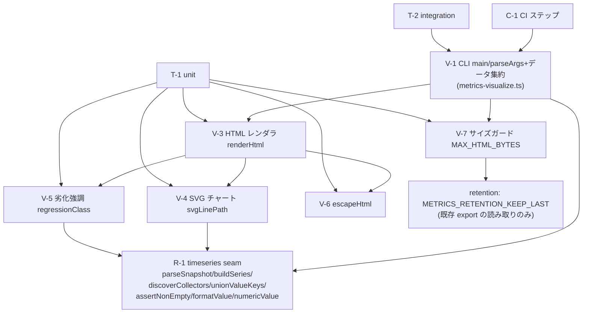

# Component Dependency — metrics 可視化(B1 後続)

上流入力(consumes 全数): requirements.md, architecture.md, component-inventory.md, team-practices.md

## 依存グラフ

テキストフォールバック: V-1(CLI+データ集約)→ R-1(timeseries seam)。V-3(HTML)は V-4/V-5/V-6 を合成し、V-4/V-5 は R-1 の numericValue を使う。V-7 は retention の定数のみ参照。C-1(CI)は V-1 を呼ぶ。T-1 は純関数群、T-2 は V-1 の fs/CLI 境界を検証。

## 依存の制約(方向の統制)

- `metrics-visualize.ts` → `metrics-timeseries.ts`(import 可)/ → `metrics-retention.ts`(定数 import のみ可)
- 逆方向(timeseries/retention/snapshot → visualize)の import は禁止(reader 群の独立性維持)
- `metrics-visualize.ts` → `metrics-snapshot.ts` の import は**しない**(16_384 はローカルミラー+実駆動テストでピン — ADR-3。snapshot を import すると lizard/test-size への推移依存が生じ、可視化が計測系の重い依存を引き込むため)
- 循環なし(単方向 DAG)。`packages/framework/core/` への依存なし(amadeus-lib 非依存 — codekb dependencies.md の実測を維持)
- tests → scripts の import は既存様式どおり(t230/t231 と同型)
