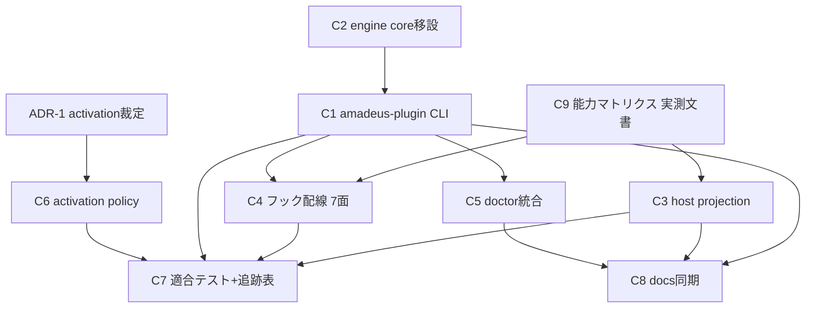

# Component Dependency — plugin-host-delivery

> 上流入力(consumes 全数): requirements、architecture、component-inventory、team-practices

## 依存グラフ

テキストフォールバック: C9(マトリクス)が C3・C4 の確定条件。C2(移設)が C1 の前提、C1 が C4・C5・C8 の前提。ADR-1 裁定(本ステージゲート)が C6 の前提。C7(適合テスト)は C1/C3/C4/C6 の後段。C8(docs)は実装確定後。

## 依存の性質(循環なしの根拠)

- C2→C1→{C4,C5} は一方向の呼び出し依存(フック/doctor は CLI を呼ぶだけ — 逆依存なし)
- C3(ビルド時)と C1(実行時)はファイル成果物(dist/plugins/…)経由で疎結合 — ビルド産物を実行時が読むのみ
- C6 は 2 面で構成: (i) hash 計算・状態永続化(composition record 隣接ファイルで完結 — 依存なし) (ii) **engine 側パッチ**(amadeus-orchestrate.ts の build-and-test 指令発行経路への advisory 1 行 — stderr のみ、directive JSON 不変)。(ii) は C6 見積り(100-200 行)に含み、graph compile 本体のデータ構造には触れない(循環なし)
- 循環候補の検査: C7(テスト)は全コンポーネントへ依存するが、被依存はない(テストは生産コードから参照されない)

## requirements との突き合わせ

- FR-3a の「engine への薄い配線のみ」= C1→C2 の単方向依存として構造化(components.md の Reuse Inventory と整合)
- FR-4 の再コンパイルは既存 runtime/graph(codekb architecture.md 実測の composition record 配線)への依存であり、新規エッジは C1→既存 compile 呼び出しの 1 本のみ
- team-practices.md の harness 境界: C4 の各面実装は `harness/<name>/` に置き、C1/C2(中立)からハーネス固有物への依存を作らない(依存方向は常に harness 表層 → core 中立層)
