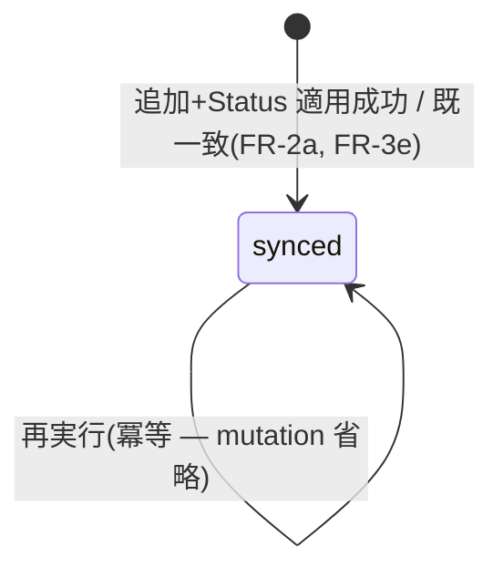

# Domain Entities — u1-project-sync-skeleton

上流入力(consumes 全数): unit-of-work, unit-of-work-story-map, requirements, components, component-methods, services

型はすべて component-methods の C0 追加型を正本とし、ここでは unit-of-work の U1 境界(台帳の最小形 = synced のみ)で実体化する部分集合とライフサイクルを定義する(cross-unit 型参照は component-methods を verbatim 正とする — 独立進化させない)。永続化は components の codec 3面(ADR-3 最小形)。U1 が成立させる体験は unit-of-work-story-map のジャーニー1(intent 開始でボードに Ideation)。外部境界(GraphQL・gh)の障害時挙動は services のプロセス境界表に従う。

## エンティティ(U1 実体化分)

| 型(component-methods 正本) | U1 での役割 | 不変条件(requirements 由来) |
|---|---|---|
| `MirrorProjectRef { owner, number }` | `"owner/number"` 文字列の parse 結果(parse-don't-validate — 不正形式は config 層で fail-closed 拒否し、以降は検証済み型で運ぶ) | owner 非空 / number 正整数(FR-5 の fail-closed 契約) |
| `MirrorProjectTarget { project, statusNames }` | 設定済み対象 Project(U1 は先頭1要素のみ消費 — FR-2d) | statusNames のキーは 5 フェーズ語彙 closed set |
| `MirrorProjectStatusField { fieldId, options }` | Status フィールド解決結果 | options は実 Project の実在選択肢のみ(合成しない — FR-6c の診断がこれを一覧表示) |
| `MirrorProjectItem` | 所属照会の1件(FR-1a の no-op 判定と FR-2a の冪等判定の入力) | itemId は ProjectV2Item の実 ID |
| `MirrorProjectSyncEntry` | projectSync 台帳の1行。**U1 が書くのは state=`synced` のみ**(unit-of-work U1 の「台帳の最小形(synced のみ)」境界。型自体は3値 union だが pending / safety-blocked の書込・収束遷移は U2 で導入) | 追加〜適用の成功時のみ upsert(FR-3e の冪等 no-op 時も synced を維持) |
| `ExpectedProjectStatus` | policy 導出の判別 union(FR-3a 既定表+FR-4 keep) | `keep` は mutation 抑止を意味し、名前を持たない |

## MirrorProjectSyncEntry のライフサイクル(U1 範囲)

<!-- Text fallback: U1 では entry は成功時にのみ作られ、常に synced。失敗(照会失敗・選択肢未解決)は台帳へ書かず、警告/診断のみ(business-logic-model 手順2・4)。pending / safety-blocked 状態と収束遷移(pending→synced 等)は U2 で導入する。 -->

## 永続化(ADR-3 最小形)

- v1 sentinel ブロックの `projectSync.projects[]` に entry を格納。書込は既存 canonical 経路(`renderMirrorStateJson`)、読取は `parseMirrorStateDocument` のみ(write⇔read 対称)。
- codec 3面(keys/validate/render)の closed set: `PROJECT_SYNC_KEYS = {projects}` / `PROJECT_ENTRY_KEYS = {project, projectId, itemId, lastAppliedStatus, state, updatedAt}`。unknown key は invalid(fail-closed)。state の validate は3値 union を受理する(U2 の拡張が codec 変更なしで載るように — 書き手側の制約が U1=synced のみ)。
