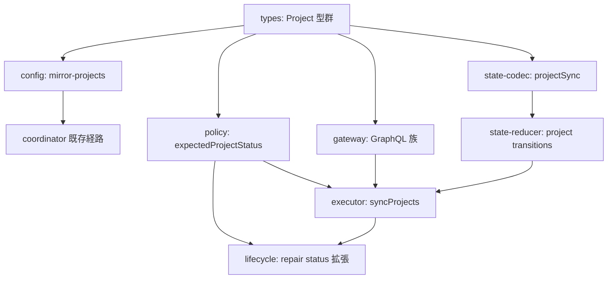

# Component Dependency — Intent Mirror の GitHub Project Status 同期

上流入力(consumes 全数): requirements, architecture, component-inventory, team-practices

既存依存グラフ(architecture.md の C0〜C8 構造、component-inventory の公開関数面)への追加エッジのみを示す。**新規モジュールなし・循環なし**(既存の layering: types ← policy/config ← executor/coordinator ← lifecycle を維持)。

## 依存図(追加エッジのみ)

<!-- Text fallback: types(C0) は config/policy/gateway/codec の型基盤。policy の expectedProjectStatus は executor(同期)と lifecycle(repair)の両方から消費される canonical 1 定義(ADR-5)。gateway の GraphQL メソッドは executor のみが呼ぶ。codec の projectSync は reducer の新 transition 経由で executor が更新し、lifecycle が read-only で読む。config は既存の coordinator 経由で executor へ届く。 -->

## 対操作の対称性(symmetric-pair-review 観点の設計時明示)

| 対 | write 側 | read 側 | 対称性の担保 |
|---|---|---|---|
| projectSync 台帳 | reducer transition(executor 経由) | repair status(lifecycle)/ completion gate(executor) | codec の render/parse 1 定義(ADR-3) |
| 期待 Status | executor の適用 | repair の drift 判定 | policy の expectedProjectStatus 1 定義(ADR-5) |
| item 追加 | addProjectItem(mutation) | listProjectItems(照会) | itemId キャッシュ+照会での実在確認の二重(FR-2a 冪等) |
| 追加の permit | capability mint(executor のみ) | gateway requireValidPermit | 既存 WeakSet 機構を新 mutation 2種にも適用 |

## 台帳・配布面への影響(component-inventory の閉じた台帳)

- `MIRROR_TOOL_FILES`(16)/ t285 `toHaveLength(15)`: **変更なし**(新モジュールなし — ADR-4)。
- docs TOPICS(8種×4文書): Project 同期・認証 scope の追記が TOPICS 拡張になる場合は mirror-docs-contract.ts と t287 を同一変更で同期(FR-12b)。
- `MIRROR_USER_CONTRACT`: 設定・診断の追記(scopeExclusions 不変)+ t291 parity 維持。
- 7 ハーネス dist + self-install: 正本変更 9 ファイルの再生成(bt-dist-regen-seven-harnesses)。
