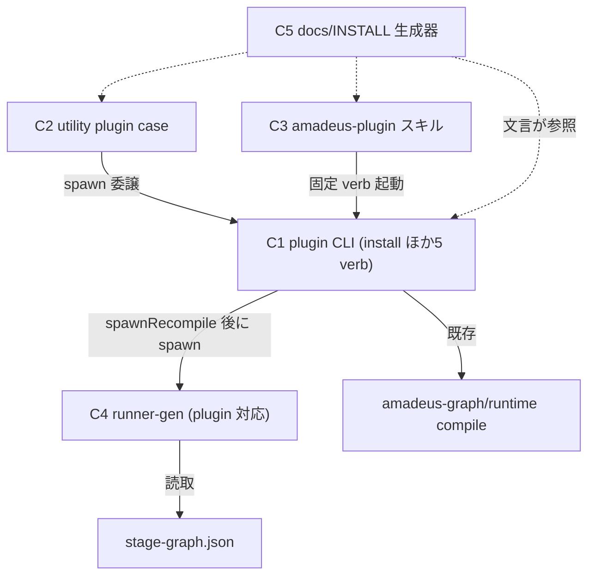

# Component Dependency — 260727-plugin-verb-skills

上流入力(consumes 全数): requirements.md(FR 依存)、architecture.md(既存依存エッジ実測)、component-inventory.md(既存構成)、team-practices.md(境界規範)

## 依存グラフ

テキストフォールバック: C2(utility case)と C3(スキル)はともに C1(plugin CLI)へ委譲する。C1 は compose/drop 後に既存の2段 compile(G)を回し、その成功後に C4(runner-gen)を spawn する。C4 は stage-graph.json(SG)のみを読む。C5(docs/INSTALL)は C1〜C3 の入口文言を参照する文書面。

## 依存の性質と順序制約

| エッジ | 性質 | 実装順への含意 |
|---|---|---|
| C2→C1、C3→C1 | 実行時 spawn / 導線 | C1(install 含む CLI 面)が先 |
| C1→C4 | compose/drop 成功後の後段 spawn(recompile と同型) | C4 は C1 の配線点に依存するが、runner-gen 側拡張自体は独立実装可 |
| C4→SG | 読取のみ | compile(#1592 の2段)が先行して SG に plugin stage が載っていること — A1 仮説の実測確定を含む |
| C5→C1/C2/C3 | 文言参照 | 全面の形が確定した最後に更新 |

## 循環なしの確認

C4 は C1 を呼ばない(spawn の向きは C1→C4 のみ)。utility(C2)⇔plugin CLI(C1)も一方向。循環依存なし。

## 対称性(write⇔check / compose⇔drop)

- compose で runner 生成 ⇔ drop で runner 除去(FR-4a/4b の対)— 片側実装を禁じる(symmetric-pair-review)。**起動配線も対称**: handleCompose / handleDrop の両方が spawnRecompile 成功後に runner-gen `write` を spawn する(compose 側は生成、drop 側は再生成+prune による除去 — component-methods.md C4)
- install でコピー ⇔ drop で staging はどうするか: **drop は composed 面の復元のみで staging(.amadeus-plugin-src)には触れない**(既存挙動不変。install が置いた staging の除去は利用者操作 — docs に明記)。この非対称は意図的相違として decisions.md ADR-2 に記録
