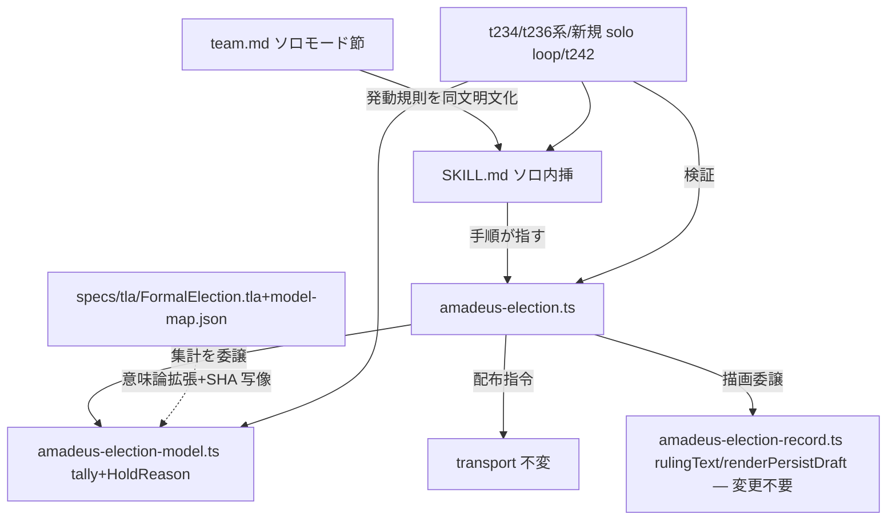

# Component Dependency — solo-election

上流入力(consumes 全数): requirements.md(FR-09 の同文照合・FR-13 の同期面)、components.md(変更対象と境界)、services.md(実行時構成)、architecture.md(SKILL→CLI→model の現行依存方向の実測源)、code-structure.md(投影面)、component-inventory.md(依存図の頂点集合の出典)、team-practices.md(norm→SKILL の同文明文化の運用前提)。

## 依存方向(変更面のみ)

テキストフォールバック: SKILL→CLI→model の一方向。CLI は描画を amadeus-election-record.ts へ委譲(reason 非依存につき変更不要)。TLA は FormalElection.tla の意味論拡張+model-map.json の SHA 写像の2作業。transport は不変。norm(team.md)と SKILL は発動規則を同文で持つ(FR-09 の grep 照合対象)。TLA model-map は model の HoldReason 拡張に追従。テストは CLI/model/SKILL の3面を検証。

## 同期面(FR-13)

- model.ts / election.ts 変更 → self-install 5面+dist 7面の再生成(bun scripts/package.ts + promote:self)
- SKILL.md 変更 → self-install 3面+dist 3面
- 循環依存なし(SKILL は prose、CLI→model の単方向は現行のまま)
