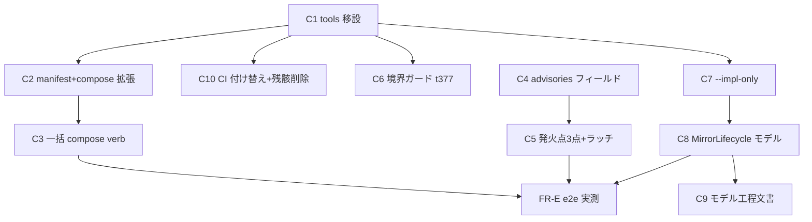

# Component Dependency — formal-verif-value-chain

上流入力(consumes 全数): requirements, architecture, component-inventory

components.md の C1〜C10 間の依存(実装順序の制約)。scope-document の順序裁定(dependency+risk-first、WS-A 先行)を具体化する。

## 依存グラフ

<!-- Text fallback: C1(移設)が C2/C10/C6/C7 の前提。C2→C3、C4→C5、C7→C8→C9。e2e 実測(FR-E)は C3・C5・C8 の完了後 -->

## 依存の根拠

- **C1 → C2/C10/C6**: 移設が確定しないと配布経路(tools パス)・CI パス・ガード検査面が決まらない(scope Q1 裁定の直接展開)。
- **C1 → C7**: `--impl-only` のテストは移設後の loader パス(SOURCE_DRIFT 検出面)を踏む — 移設前に書くと直後にパス書換の手戻り。
- **C7 → C8**: 新規モデルの model-map エントリ登録は複数モデル対応(model-map v2、decisions.md 設計注記)と `--impl-only` 運用の存在を前提にするのが安全順序 — モデル追加直後に mirror 実装の無関係変更で SOURCE_DRIFT 赤が出た場合の正規復旧経路を先に用意する。
- **C4 → C5**: 発火点を増やす前に構造化チャネルを作る(3点発火を stderr 単線のまま増やすと弱チャネル問題が3倍になるだけ)。
- **C4/C5 と C1 系は非交差**: advisories 系は orchestrate/activation、移設系は plugins/scripts/ci — ファイル単位交差なしで並行可能(c6 非交差判定は Bolt 編成時に実 diff で再確認)。

## 交差リスク(delivery-planning への引き継ぎ)

- C2(amadeus-plugin-compose.ts)と C3(amadeus-plugin.ts)は同一モジュール群 — 直列(同一 Bolt)推奨。
- C7(model-completeness)と C8(model-map v2 スキーマ)は同一モジュールに触れる — 直列推奨。
- 全コンポーネントが dist 再生成(NFR-3)を伴う — 並行 Bolt の dist 面衝突は c6 の dist ツリー集合判定で管理。
