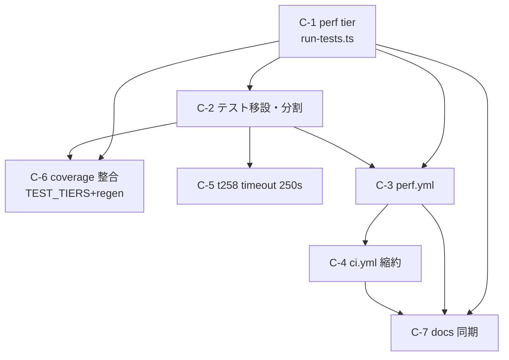

# Component Dependency — 260731-perf-ci-separation

上流入力(consumes 全数): requirements.md、architecture.md、component-inventory.md、stories(N/A — user-stories は本 scope(self-feature)の EXECUTE 集合で SKIP のため成果物不存在。ユーザー価値の導出は intent-statement 経由で requirements.md に固定済み)、team-practices(N/A — practices-discovery SKIP のため不存在。プラクティスは memory 層が ambient 適用 — requirements.md line 3 と同判断)

## 依存グラフ

テキストフォールバック: C-1(perf tier)が全ての前提。C-2(移設)は C-1 に依存し、C-5(timeout)と C-6(coverage)は C-2 に依存。C-3(perf.yml)は C-1/C-2 の後(--perf が実体を持ってから)。C-4(ci.yml 縮約)は C-3 の後(受け皿ができてから外す — 検証の無音喪失防止順序)。C-7(docs)は最後。

## 順序のリスク制御(cid:delivery-planning:intra-bolt-order-as-risk-control の設計段適用)

**C-3(perf.yml 新設)→ C-4(ci.yml 削除)の順序は必須**: 逆順にすると distribution-benchmark の検証が どの workflow にも存在しない窓が commit 単位で生じる(P2 の検証無音喪失)。同一 PR 内でも commit 順序でこの窓を作らない。

## 外部依存

- GitHub Actions schedule(新規利用 — repo 初。suspend 仕様は R-3 で docs 注記)
- bun 1.3.13 / setup-bun@v2(既存)
- 追加 runtime dependency なし(Forbidden 準拠)
