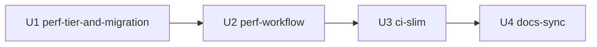

# Unit of Work Dependency — 260731-perf-ci-separation

上流入力(consumes 全数): components.md、component-methods.md(U2 timeout 導出元)、services.md(実行面表)、component-dependency.md、decisions.md(ADR-2/ADR-4 の編成根拠)、requirements.md、stories(N/A — user-stories は self-feature の EXECUTE 集合で SKIP。application-design 各成果物と同判断)

## 依存エッジ(parseBoltDag 用 — cid:units-generation:per-unit-loop-activation (a))

```yaml
units:
  - name: perf-tier-and-migration
    depends_on: []
  - name: perf-workflow
    depends_on: [perf-tier-and-migration]
  - name: ci-slim
    depends_on: [perf-workflow]
  - name: docs-sync
    depends_on: [ci-slim]
```

## 依存の根拠

- **perf-workflow → perf-tier-and-migration**: perf.yml は `bash tests/run-tests.sh --perf` を実行する — `--perf` フラグと tests/perf/ の実体が main に存在しなければ dispatch 実行が構造的に赤(component-dependency.md C-1/C-2 → C-3)
- **ci-slim → perf-workflow**: 受け皿(perf.yml)が main に着地してから ci.yml の benchmark 群を外す — 逆順は検証の無音喪失窓を作る(component-dependency.md の順序リスク制御、FR-3d/P2)
- **docs-sync → ci-slim**: docs は最終形の CI 構成を記述する — 中間形を書くと直後に陳腐化する

直列 4 Bolt(並行なし)。相互依存が真に必要な箇所のみ直列(cid:requirements-analysis:parallel-bolts の逆適用 — 本 intent は依存連鎖が全域を貫くため並行余地なし)。

## Mermaid(テキストフォールバック: U1→U2→U3→U4 の直列)


