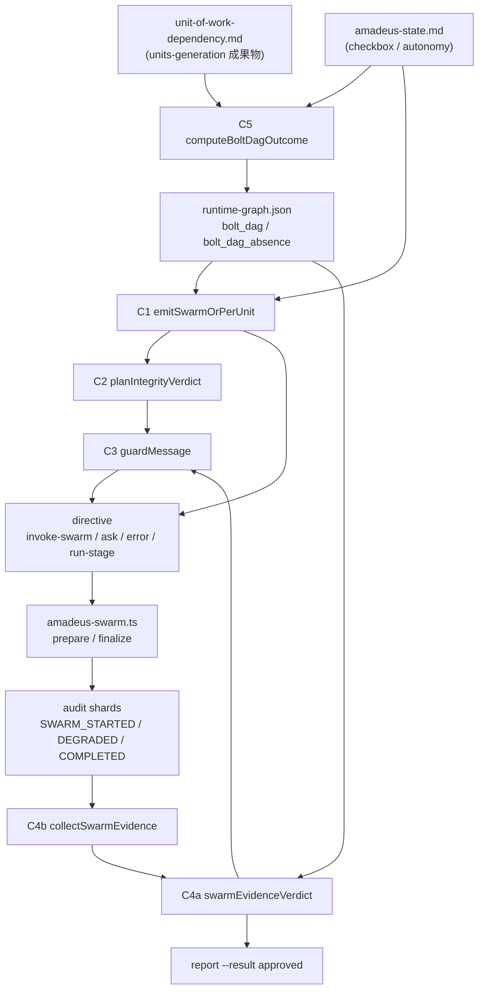

# Component Dependency — 260801-cg-plan-guard

上流入力(consumes 全数): requirements.md、architecture.md、component-inventory.md

- `requirements.md` の NFR-2(既存 fail-closed の非弱体化)と NFR-3(新規 I/O ゼロ)を、下記の依存行列で「既存関数の再利用のみ」「新規読み手は approve 経路の1本のみ」として検証可能な形に落とした。
- `architecture.md` 現在節の患部3点と SWARM 一次証拠の所在を、データフロー図の3経路(next / report / compile)の結節点として引いた。
- `component-inventory.md` 現在節の「新規コンポーネントなし」判断に従い、行列の縦横はすべて既存モジュール内の関数であり、モジュール間の新しい依存辺は増えない(orchestrate→lib、runtime→lib は既存方向)。

## 依存行列

行が呼び出し元、列が呼び出し先。◎=本 intent で新設、○=既存関数の再利用、—=依存なし。

| ↓呼び出し元 \ 呼び出し先→ | C2 planIntegrity | C3 guardMessage | C4a evidenceVerdict | C4b collectEvidence | C5 computeOutcome | 既存 firstUncoveredBatch | 既存 readBoltDagBatches | 既存 readAllAuditShards / findAllEvents / auditBlockField | 既存 parseCheckboxes | 既存 recoverBoltDag |
| --- | --- | --- | --- | --- | --- | --- | --- | --- | --- | --- |
| C1 `emitSwarmOrPerUnit`(orchestrate) | ◎ | ◎ | — | — | — | ○ | ○ | — | — | (間接○) |
| FR-2 ガード(`handleReport`) | — | ◎ | ◎ | ◎ | — | — | ○ | — | — | (間接○) |
| C4b `collectSwarmEvidence`(orchestrate) | — | — | — | — | — | — | — | ○ | — | — |
| C5 `computeBoltDagOutcome`(runtime) | — | ◎ | — | — | — | — | — | — | ○ | — |
| `compile`(runtime) | — | — | — | — | ◎ | — | — | — | — | — |
| C7 corpus sweep(tests) | ◎ | — | ◎ | — | — | — | — | — | — | — |

新規のモジュール間依存はゼロ。`orchestrate → lib` と `runtime → lib` は既存の方向であり、循環は生じない(lib は上位を参照しない)。

## データフロー

テキスト代替(図と同内容): `unit-of-work-dependency.md` と `amadeus-state.md` が C5 の入力になり、C5 は `runtime-graph.json` へ `bolt_dag` または `bolt_dag_absence` を書く。`next` 側では graph と state を C1 が読み、C2 の判定を経て C3 が文言を組み、directive(invoke-swarm / ask / error / run-stage)として出力する。conductor が invoke-swarm を実行すると `amadeus-swarm.ts` の prepare/finalize が audit へ SWARM 行を書く。`report --result approved` 側では C4b が audit を読み、graph の宣言 batch と併せて C4a が突合し、不足なら C3 の文言で拒否する。

Mermaid 構文は `flowchart TD` + 角括弧ラベル + `-->` のみを使用し、ラベル内の丸括弧は引用符で囲んだ文字列内にのみ置いている(パイプ・未引用の丸括弧・セミコロンは不使用)。

## 通信パターンと共有資源

- **同期のみ**。非同期・イベント駆動の通信は増やさない。C1・C4・C5 はいずれも呼び出し元と同一プロセス内の関数呼び出しである。
- **共有資源は3つ**、いずれも既存: `runtime-graph.json`(書き手 = compile のみ、読み手 = orchestrate)、`amadeus-state.md`(本 intent で書き手を増やさない)、audit shards(書き手 = `amadeus-swarm.ts` のみ、読み手に C4b が加わる)。
- **書き手の単一性を保つ**: SWARM 行の emitter は `amadeus-swarm.ts` に限る(RE §4 の一次証拠単一性)。C4b は読み手専用で、突合結果を audit へ書き戻さない — 書き戻すと「検証の結果が次の検証の入力になる」自己参照になり検証劇場に落ちる。

## 実行順序の依存(実装順への含意)

1. C3(文言 canonical)→ C2 / C4a(純判定)は C3 に依存するため先に確定させる。
2. C5 / C6(compile 側)は C1 の `no-dag` 判定材料を供給するため、C1 より先に着地させると C1 のテストが実データで書ける。ただし逆順でも C1 は `absence === null` を安全側(`ok`)に倒すため、ブロッキング依存ではない。
3. FR-5(record 是正)は他のどれにも依存しない独立データ変更。
4. C7(corpus sweep)は C2 / C4a の署名確定後に書ける。

この依存は units-generation の Unit 分割と Bolt 順序の入力であり、本書では順序の含意までを示す(Bolt 編成そのものは delivery-planning の所掌)。
