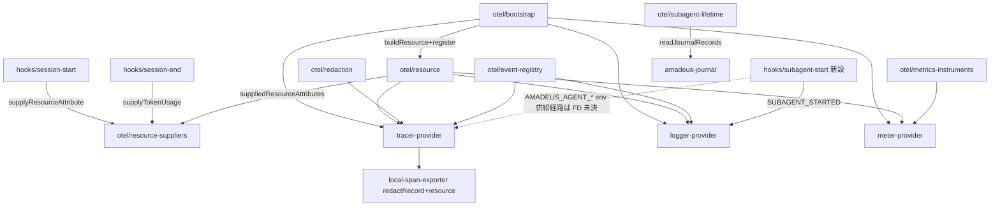

# Component Dependency — otel-meta-schema

上流入力(consumes 全数): requirements.md、architecture.md(codekb 260801 現在節)、component-inventory.md(同)— 依存の向き(bootstrap→3プロバイダ、redaction/registry の横断)は architecture.md 現在節の現行依存グラフへ additive に重ねた。component-inventory.md 現在節の改修面目録と1:1。

## 依存グラフ

## テキストフォールバックと不変条件

テキストフォールバック: hooks(session-start/session-end/subagent-start)が suppliers へ供給し、resource が suppliers を読んで(RES→SUP)合成、bootstrap が3プロバイダへ配布。redaction/registry は tracer/logger の横断依存。metrics-instruments → meter-provider。subagent-lifetime は journal 読みのみに依存(Relay 非依存)。

**循環なし**(呼び出し方向は resource → suppliers の一方向。suppliers はどのモジュールへも依存しない葉ノード)。ハーネス中立境界: 新設は全て core 側、ハーネス固有値は hook 実行時の supplier 呼出しでのみ流入(NFR-2)。
