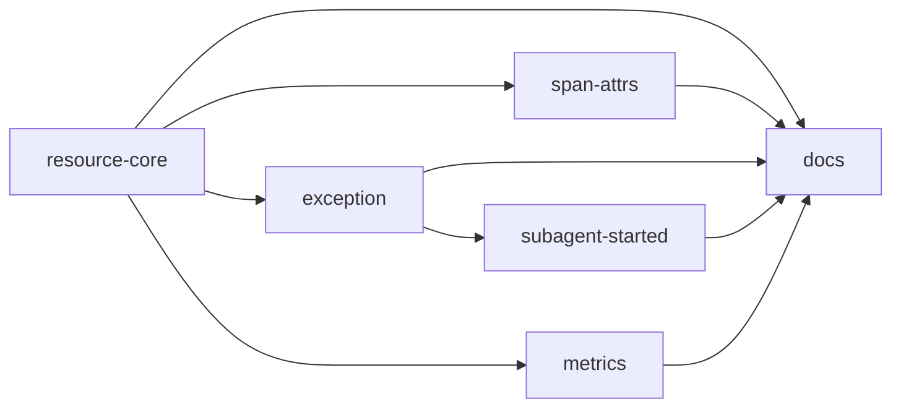

# Unit Dependency — otel-meta-schema

上流入力(consumes 全数): requirements.md、components.md、component-methods.md、services.md、component-dependency.md、decisions.md — エッジは component-dependency.md のモジュール依存(RES→SUP、bootstrap→3プロバイダ)を Unit 粒度へ持ち上げ、ADR-1(decisions.md)の resource 前提と component-methods.md の API 依存で裏付けた。services.md の「Relay 無改変」境界により運用 Unit は発生しない。

## YAML edge block(parseBoltDag 消費の正準)

```yaml
units:
  - name: resource-core
    depends_on: []
  - name: span-attrs
    depends_on: [resource-core]
  - name: exception
    depends_on: [resource-core]
  - name: subagent-started
    depends_on: [exception]
  - name: metrics
    depends_on: [resource-core]
  - name: docs
    depends_on: [resource-core, span-attrs, exception, subagent-started, metrics]
```

## グラフ



テキストフォールバック: U1→{U2,U3,U5}(tracer-provider 同領域と resource 前提)、U3→U4(event-registry 交差の直列化)、全実装 Unit→U6。

## 並行編成の含意

- batch 1: U1(walking skeleton を内包 — requirements.md FR-RES-3 の注入 seam が本 intent の最大リスクであり、その最小 end-to-end(claude 発の1属性が3シグナルへ現れる)を U1 の最初のスライスとする)
- batch 2: U2 / U3 / U5(並行 — 相互にファイル非交差、いずれも U1 着地後)
- batch 3: U4(event-registry で U3 と交差のため直列)→ batch 4: U6
