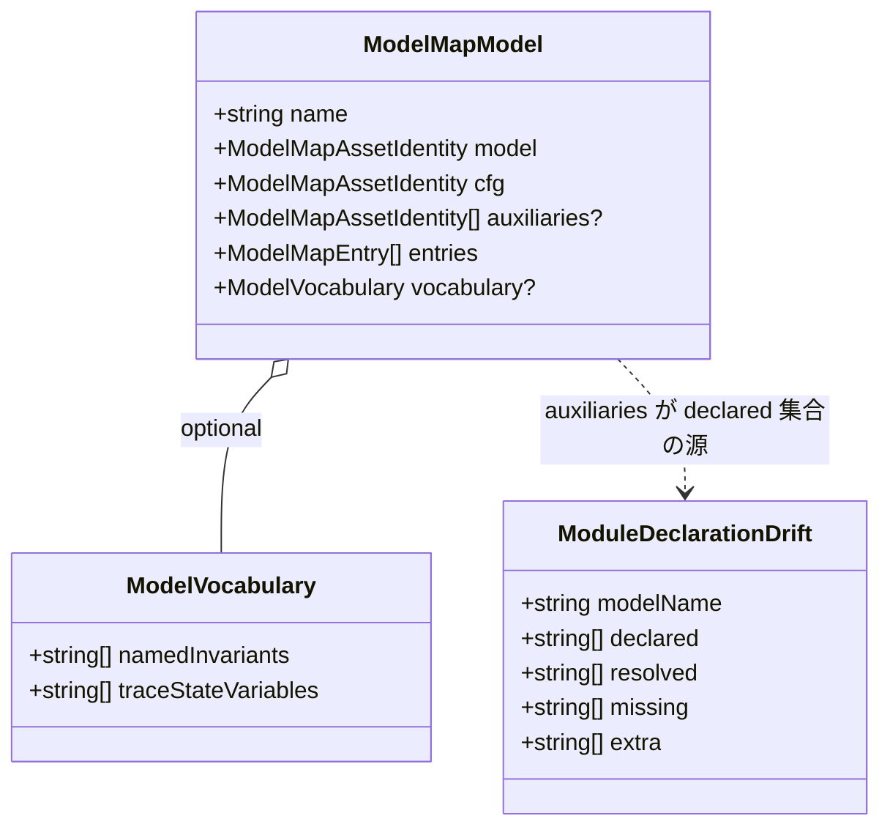

# Domain Entities — u1-schema-resolver

**Intent**: 260801-tla-multi-model / **Stage**: functional-design / **Unit**: u1-schema-resolver(C1+C2)

上流入力(consumes 全数): unit-of-work(u1 節), unit-of-work-story-map(FR→Unit 写像 — stories 未生成の代替), requirements(FR-1 / FR-2), components(C1 / C2), component-methods(C1 / C2 節), services(S3), decisions(ADR-1 / ADR-2 / ADR-3 / ADR-6 / ADR-7), 実測ソース(business-logic-model.md 冒頭と同じ)

unit-of-work-story-map は FR 写像表(stories なし)であり、u1 帰属は FR-1 / FR-2 で本書のエンティティ設計の由来と一致する。型の命名・修飾は既存コード流儀(`readonly` 全フィールド、exactObject 前提の plain object、ローカル `Result<T,E>` 型、named export)に厳密一致させる(component-methods 冒頭、team-practices Code Style)。

## 1. ModelMapModel(拡張 — C1)

`amadeus-formal-verif-model-map.ts`(2 複製共通)の既存エンティティ。u1 では optional フィールド2件の追加のみ。

```ts
export interface ModelMapModel {
  readonly name: string;                                  // TLA モジュール識別子(MODEL_NAME 文法)
  readonly model: ModelMapAssetIdentity;                  // specs/tla/<name>.tla + canonical identity
  readonly cfg: ModelMapAssetIdentity;                    // specs/tla/<name>.cfg + canonical identity
  readonly auxiliaries?: readonly ModelMapAssetIdentity[]; // 新規 optional。非空・path 一意昇順・自己 aux 禁止(BR-S3〜S6)
  readonly entries: readonly ModelMapEntry[];             // 不変(impl ハッシュ pin、一意昇順)
  readonly vocabulary?: ModelVocabulary;                  // 新規 optional(BR-S7)
}
```

ライフサイクル: model-map.json bytes → `parseTlaModelMap` → 本エンティティ。パース以降は不変値として loader(u2)・sensor(u4)へ配給される。`auxiliaries` / `vocabulary` を持たない既存2モデルは変更前と byte 一致のパース結果を持つ(成功 (iii))。

## 2. ModelVocabulary(新規 — C1、語彙の器)

```ts
export interface ModelVocabulary {
  readonly namedInvariants: readonly string[];     // invariant 名(TLA 識別子)、非空・一意
  readonly traceStateVariables: readonly string[]; // 状態変数名(TLA 識別子)、非空・一意
}
```

ADR-6 の語彙レコードの受け器。u1 は**形の検証のみ**を担い、語彙の値(実際の invariant 7件 / 3件、TRACE_STATE_VARIABLES)の供給・消費は u3(C4)・u4(C8)の責務。スキーマ上は drift pin の照合対象ではない(ADR-6 の正直な限定どおり — pin は model/cfg/aux の bytes と identity が担う)。

## 3. AuxModuleRef(補助モジュール参照 — C2 リゾルバ内部の概念)

リゾルバが抽出する直接参照。公開型は持たず、`extractModuleRefs` の戻り値 `readonly string[]`(モジュール名)として表現される。概念的属性:

- `name: string` — `MODEL_NAME` 文法に一致するモジュール識別子。
- 出所: EXTENDS 行 / INSTANCE 宣言行(代入形を含む)。コメント・WITH 句由来は存在しない(BR-R1/R2)。
- 標準モジュール(`TLA_STANDARD_MODULES` 内)は AuxModuleRef として採用されない(BR-R3)。

リゾルバ内部では「抽出した生の名前列 → 標準モジュール除去 → 境界解決」の段階で消費され、外部にはモジュール名の配列としてのみ現れる。

## 4. VocabularySet(語彙集合 — u3 への引き渡し概念)

u1 では `ModelVocabulary`(§2)として宣言の器のみを提供する。toolchain 消費面の語彙集合(component-methods C4 の `TraceVocabulary`: moduleName + traceStateVariables + namedInvariants)は u3 で構成され、u1 のスキーマ出力を loader 経由でのみ受け取る(宣言源の単一化 — ADR-6)。u1 の責務境界: `ModelVocabulary` が map から正しくパスされることまで。

## 5. ResolvedDeps(解決済み依存 — C2)

```ts
// resolveAuxiliaryModules の戻り値(成功側)
readonly string[] // モジュール名。起点自身を除く、ソート済み・重複排除(BR-R5)
```

失敗側は既存流儀のエンティティ(component-methods C2 どおり、変更なし):

```ts
export type ModuleDepsErrorCode =
  | "MODULE_DEP_UNRESOLVED"    // 参照先モジュールが specs/tla に存在しない(非標準名)
  | "MODULE_DEP_CYCLE"         // 循環参照(自己参照を含む)
  | "MODULE_DEP_OUT_OF_BOUNDS"; // 文法外モジュール名(パストラバーサル含む)

export interface ModuleDepsError {
  readonly kind: "MODULE_DEPS";
  readonly code: ModuleDepsErrorCode;
  readonly relativePath: string; // 対象モジュールの specs/tla 相対パス
  readonly detail: string;
}
```

`Result` 型は既存ファイル同様ローカル宣言(`type Result<T, E> = { readonly ok: true; readonly value: T } | { readonly ok: false; readonly error: E }`)。

## 6. DriftReport(宣言-解決の差分 — C2 比較、消費は u2/u4)

```ts
export interface ModuleDeclarationDrift {
  readonly modelName: string;
  readonly declared: readonly string[];  // 宣言集合(model.auxiliaries 由来、省略は空)
  readonly resolved: readonly string[];  // 解決集合(resolveAuxiliaryModules 出力)
  readonly missing: readonly string[];   // resolved − declared(宣言漏れ)→ red
  readonly extra: readonly string[];     // declared − resolved(過剰宣言)→ red
}
```

- 判定: `missing.length === 0 && extra.length === 0` のときのみ一致(BR-C1)。**双方向のどちらか一方でも非空なら不一致**(RA Q2=A)。
- ライフサイクル: u2(loader)では不一致時に SOURCE_DRIFT 系の明示失敗へ変換、u4(sensor)では sensor 失敗 detail / updateModelMap の補正入力として消費される。u1 は判定と detail 保持のみを担い、エラー型への変換は消費側の責務(BR-C3)。
- 本型は component-methods C2 の公開シグネチャに対する**設計上の追加**(比較実装の単一化 — ADR-2 の帰結、BR-C2)。code-generation で component-methods との差分として明示すること。

## エンティティ関係



テキストフォールバック: `ModelMapModel` が optional で `ModelVocabulary` を内包。`ModelDeclarationDrift` は `ModelMapModel.auxiliaries` を宣言集合の源として、リゾルバの解決集合と対置される(u2/u4 で消費)。
