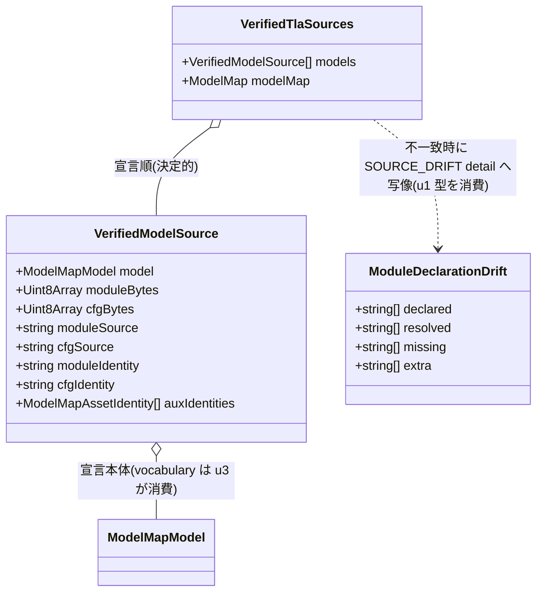

# Domain Entities — u2-loader-generalization

**Intent**: 260801-tla-multi-model / **Stage**: functional-design / **Unit**: u2-loader-generalization(C3)

上流入力(consumes 全数): unit-of-work(u2 節), unit-of-work-story-map(FR→Unit 写像 — stories 未生成の代替), requirements(FR-2 / FR-4 / FR-6), components(C3), component-methods(C3 / C5 節), services(S1 / S3 / S4), decisions(ADR-1 / ADR-2 / ADR-4 / ADR-10), u1 functional-design(domain-entities §1 ModelMapModel / §5 ResolvedDeps / §6 ModuleDeclarationDrift), 実測ソース(business-logic-model.md 冒頭と同じ)

unit-of-work-story-map は FR 写像表(stories なし)であり、u2 帰属は FR-2 / FR-4 / FR-6 で本書のエンティティ設計の由来と一致する。型の命名・修飾は既存コード流儀(`readonly` 全フィールド、exactObject 前提の plain object、ローカル `Result<T,E>` 型、named export)に厳密一致させる(component-methods 冒頭、team-practices Code Style)。

## 1. VerifiedTlaSources(新規 — 無引数 loader の戻り値)

```ts
export interface VerifiedTlaSources {
  readonly models: readonly VerifiedModelSource[]; // 宣言順(= parser 強制の名前昇順、決定的。BR-S2)
  readonly modelMap: ModelMap;
}
```

旧 `VerifiedTlaSource`(:30-41)を置き換える複数形エンティティ。`executionModel` 単一フィールドは撤廃され、「どのモデルを実行するか」の知識は loader の外(呼出側の ModelSelection)へ移る(ADR-4)。

ライフサイクル: `loadVerifiedTlaSourcesInternal(moduleUrl, fs?)` 1回の呼出しで構築される。全要素は identity 照合・宣言-vs-解決照合・entries 照合を**通過済み**であることが型の契約 — 未検証の bytes が本型に乗る経路は存在しない(fail-fast、BR-V6)。構築後は不変値として toolchain(u3)・CI 駆動(u5)へ配給される。

## 2. VerifiedModelSource(新規 — モデル単位の検証済みソース)

```ts
export interface VerifiedModelSource {
  readonly model: ModelMapModel;                            // 宣言本体(entries / auxiliaries / vocabulary を含む。u3 はここから vocabulary を取る — ADR-6)
  readonly moduleBytes: Uint8Array;                         // identity 照合済み model bytes(単一読込原則、BR-V5)
  readonly cfgBytes: Uint8Array;
  readonly moduleSource: string;                            // UTF-8 fatal decode 済みソース
  readonly cfgSource: string;
  readonly moduleIdentity: string;                          // canonicalIdentity(…tla.module.v1)
  readonly cfgIdentity: string;                             // canonicalIdentity(…tla.cfg.v1)
  readonly auxIdentities: readonly ModelMapAssetIdentity[]; // 実測した aux identity(宣言値と一致確認済み、省略モデルは空配列)
}
```

旧 `VerifiedTlaSource` の bytes/source/identity フィールド群をモデル単位へ移したものに、`model`(宣言本体)と `auxIdentities` を加えた構成。旧型の `modelMap` は全モデル共通のため §1 側へ移動、`executionModel` は `model` へ一般化された。

- `auxIdentities` は「宣言どおりの path で、実測 identity が宣言値と一致した」ことの証跡。宣言省略モデルでは空配列(省略と空配列の区別はスキーマ層 u1 BR-S3 が済ませており、ここでは単純に「aux なし」を表す)。
- u3(C5)の byte-pin は `moduleBytes` / `cfgBytes` を照合相手に使い、`publicContractIdentity` は `model.entries` から計算する(計算式不変、BR-I2/BR-I3)。

## 3. ModelSelection(概念 — selectVerifiedModel の入出力)

選択は独立したエンティティを持たず、純粋関数として表現する(component-methods C3 どおり):

```ts
export function selectVerifiedModel(
  sources: VerifiedTlaSources,
  name: string,                              // 要求モデル名(登録名との一致のみ検査)
): Result<VerifiedModelSource, ModelLoadError>; // 未登録名は MODEL_MAP_INVALID 明示失敗(BR-S3)
```

概念的属性: 入力は `VerifiedTlaSources` + モデル名、出力は選択された `VerifiedModelSource` 単体。ファイル I/O を持たない純粋関数であり、「選択」という振る舞いが loader の検証 semantics に影響しない(検証は常に全モデル — 選択は配給の絞り込みに過ぎない)ことが設計上の要点(ADR-4)。

## 4. LoaderDriftReport(概念 — loader 側の不一致診断)

u1 の `ModuleDeclarationDrift`(u1 domain-entities §6)を loader が消費した際の診断形。独立した export 型は新設せず、u1 の DriftReport を `drift(...)`(SourceDriftError)の detail へ写像する際の構造として定義する:

- `modelName`: 不一致が起きたモデル名(relativePath は `specs/tla/<modelName>.tla`)。
- `declared` / `resolved`: 診断用に両集合を detail へ列記(u1 BR-C3)。
- `missing`(宣言漏れ)/ `extra`(過剰宣言): どちらが非空かで detail のメッセージを分岐(BR-D2)。両方非空の場合は両方を列記する。

エラー型自体は既存の `SourceDriftError`(kind/code "SOURCE_DRIFT"、:43-48)を不変で使う — 新しいエラー kind は追加しない(BR-I4 と同じ不変方針)。

## 5. エラー union の改訂

```ts
// 改訂後の loader 戻り値の失敗側
Result<VerifiedTlaSources, TlaModelPipelineError | ModuleDepsError>
```

- `TlaModelPipelineError = ModelLoadError | SourceDriftError`(現行 :50)は**不変**。
- `ModuleDepsError`(u1 が `tla-module-deps.ts` で定義: MODULE_DEP_UNRESOLVED / CYCLE / OUT_OF_BOUNDS)を union に追加する。SOURCE_DRIFT へ変換しない(BR-D3 — 「宣言と解決のズレ」と「解決不能」は別欠陥クラス)。
- `ModelLoadErrorCode` 列挙は不変(BR-I4) — `selectVerifiedModel` の未登録名失敗は既存の `MODEL_MAP_INVALID` を使う。

## エンティティ関係



テキストフォールバック: `VerifiedTlaSources` が `VerifiedModelSource` の決定的順序配列を内包。`VerifiedModelSource` は宣言 `ModelMapModel` を保持し、u3 はそこから vocabulary を取り出す。`ModuleDeclarationDrift`(u1 型)は loader が不一致時に SOURCE_DRIFT の detail へ写像して消費する。

## 旧型との対応表(改訂の明示)

| 旧(VerifiedTlaSource、:30-41) | 新 | 備考 |
|---|---|---|
| `moduleBytes` / `cfgBytes` / `moduleSource` / `cfgSource` / `moduleIdentity` / `cfgIdentity` | `VerifiedModelSource` の同名フィールド | 値の計算式は不変(BR-I3) |
| `executionModel: ModelMapModel` | `VerifiedModelSource.model` | 単一固定 → モデル単位へ一般化(ADR-4) |
| `modelMap: ModelMap` | `VerifiedTlaSources.modelMap` | 全モデル共通のため上位へ移動 |
| (なし) | `VerifiedModelSource.auxIdentities` | 新規(aux 照合の証跡、BR-V2/V3) |
| (なし) | `VerifiedTlaSources.models` 配列 | 新規(全モデル配列、BR-S1/S2) |
| `loadVerifiedTlaSourceInternal` / `VerifiedTlaSource` | **期間限定 shim として残置**(BR-S4、Finding-1 裁定) | 新パイプライン上の薄い射影(FormalElection 選択→旧型)。除去は u3 が run-model-check-source.ts / tla-arm.ts を複数形 API へ追随させた時点で u3 が行う |
