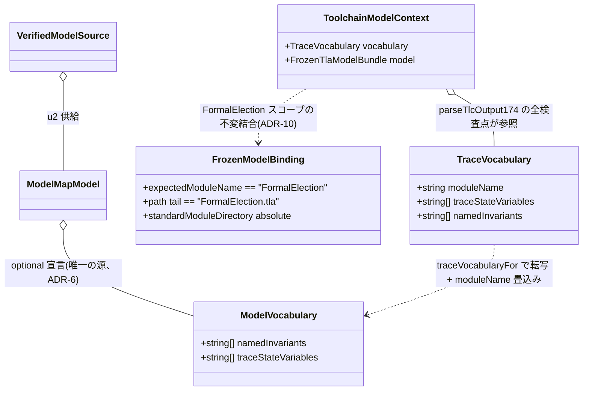

# Domain Entities — u3-vocabulary-supply

**Intent**: 260801-tla-multi-model / **Stage**: functional-design / **Unit**: u3-vocabulary-supply(C4+C5+C8-FormalElection 面)

上流入力(consumes 全数): unit-of-work(u3 節・AC1〜4, テスト割当節), unit-of-work-story-map(FR→Unit 写像 — stories 未生成の代替), requirements(FR-4 / FR-6, NFR-1/2), components(C4 / C5 / C8), component-methods(C1 ModelVocabulary / C4 TraceVocabulary / C5 節), services(S4), decisions(ADR-5 / ADR-6 / ADR-10), u1 functional-design(ModelMapModel 拡張), u2 functional-design(domain-entities §1 VerifiedTlaSources / §2 VerifiedModelSource / §3 ModelSelection), 実測ソース(business-logic-model.md 冒頭と同じ)

unit-of-work-story-map は FR 写像表(stories なし)であり、u3 帰属は FR-4 / FR-6 で本書のエンティティ設計の由来と一致する。型の命名・修飾は既存コード流儀(`readonly` 全フィールド、exactObject 前提の plain object、ローカル `Result<T,E>` 型、named export)に厳密一致させる(component-methods 冒頭、team-practices Code Style)。

## 1. ModelVocabulary(map スキーマ側の語彙宣言 — u1 定義、u3 は消費)

```ts
// tla-model-map.ts(u1 が追加。本 Unit は型の消費のみ、変更しない)
export interface ModelVocabulary {
  readonly namedInvariants: readonly string[];
  readonly traceStateVariables: readonly string[];
}
// ModelMapModel.vocabulary?: ModelVocabulary(optional、省略時パース不変 — ADR-3)
```

- **属性の意味**: `namedInvariants` は cfg の INVARIANT 宣言集合を TLC 報告名と同じ綴りで保持する閉集合(順序は cfg 宣言順)。`traceStateVariables` は TLC トレース出力の `/\ <name> =` 行の**出現順タプル**(TLA VARIABLES 宣言順とは一致し得ない — FormalElection で実測済み、business-logic-model §1.1)。順序は検査 semantics の一部であり、ソート・正規化を加えない。
- **ライフサイクル**: model-map.json で宣言され、u1 の parser が構造検証(exactObject の許可キー集合、ADR-3)を経て `ModelMapModel` に乗る。u2 の loader は identity 照合の対象に含めず(vocabulary は drift pin 対象外、ADR-6)、検証済み宣言として `VerifiedModelSource.model` に同封する。u3 が toolchain へ配給する。
- **確定値**(business-rules BR-P1 / BR-P2):
  - FormalElection: namedInvariants 7件(ChoiceWinner / UnknownChoiceRejected / ReceivedAtAxis / InvalidTimestampRejected / AmendSubmission / UnknownRefRejected / PerVoterResolution)、traceStateVariables 7件(initialBudget / amendBudget / accepted / holdMarkers / holdBudget / tally / reexamRequired)。u3 が map へ移管。
  - MirrorLifecycle: namedInvariants 3件(TypeOK / NoCloseWithoutLandedSync / NoDuplicateCreate)、traceStateVariables 3件(receipts / issueNumber / boundaryIdx)。宣言は u4。

## 2. TraceVocabulary(toolchain 供給形 — 新規、tlc-toolchain.ts)

```ts
export interface TraceVocabulary {
  readonly moduleName: string;              // = model.name(ラベル regex 埋込み用)
  readonly traceStateVariables: readonly string[]; // ModelVocabulary からの転写(順序保存)
  readonly namedInvariants: readonly string[];     // 同上
}
```

- `ModelVocabulary` に `moduleName` を畳み込んだ toolchain 消費形。map 側に moduleName を持たせないのは、model name との二重宣言(ドリフトの温床)を避けるため(BR-V6)。
- **解決**(純粋関数、I/O なし):

```ts
// tlc-toolchain.ts
export function traceVocabularyFor(
  model: ModelMapModel,
): Result<TraceVocabulary, ModelLoadError>; // vocabulary 省略は MODEL_MAP_INVALID 明示失敗(BR-V3)

// tla-arm.ts(invariant 集合のみ必要な消費者向けビュー — 同一の vocabulary を読む)
export function namedInvariantsFor(
  model: ModelMapModel,
): Result<readonly string[], ModelLoadError>;
```

- 解決後は不変値として `TlcOutputInput.vocabulary` / `RunModelCheckSource.vocabulary` に乗り、TRACE 解析の全検査点(ラベル regex・変数列・invariant メンバシップ)がこの1レコードだけを参照する。toolchain 内部に語彙の別出所(定数・map 直読み)を残さない(BR-B4)。

## 3. ToolchainModelContext(概念 — 語彙を伴う解析コンテキスト)

独立した export 型は新設せず、parseTlcOutput174 内部の関数間で「選択モデルの語彙 + frozen receipt」を一緒に受け回す構造として定義する(u2 domain-entities §4 の LoaderDriftReport と同じ概念エンティティ方式):

```ts
// 入力側(TlcOutputInput の改訂 — 既存フィールド不変、vocabulary 追加)
export interface TlcOutputInput {
  // ... 既存フィールド(chunks / exitCode / signal / timedOut /
  //      expectedModuleName / expectedModulePath / expectedStandardModuleDirectory /
  //      verifiedArtifactDescriptorIdentity / modelReceipt)不変 ...
  readonly vocabulary: TraceVocabulary; // 追加(必須)
}
```

概念的属性:

- `vocabulary`: §2 の解決済み語彙。`parseTrace` / `counterexampleExploration` / `initialStateCounterexampleExploration` / `statisticsShapeExploration` が引数で受け回す。
- `model`(receipt): 従来どおり `validateFrozenTlaModelReceipt` を通過した FrozenTlaModelBundle。receipt の invariant キー集合は語彙集合と一致することが BR-F4 の契約。
- **ライフサイクル**: run 系(run-model-check-source.ts)が `selectVerifiedModel` 済みの `VerifiedModelSource` から `traceVocabularyFor` で構築し、TLC 実行の出力正規化1回のスコープでのみ生きる。永続化・再利用はしない(短寿命 CLI、services S5)。

## 4. FrozenModelBinding(概念 — FormalElection スコープの出力結合)

ADR-10 により一般化されない不変の結合関係を、概念エンティティとして明示する(型変更なし):

```ts
// tlc-toolchain.ts:492-496 — 本 Unit では一字不変(コメント追加のみ)
function hasFrozenModelOutputBinding(input: TlcOutputInput): boolean {
  return input.expectedModuleName === "FormalElection"
    && input.expectedModulePath.split(/[\\/]/).at(-1) === "FormalElection.tla"
    && input.expectedStandardModuleDirectory.startsWith("/");
}
```

概念的属性(3条件の結合):

- `expectedModuleName = "FormalElection"`: 出力が frozen model と同名モジュールに属すること。
- `expectedModulePath` の末尾が `FormalElection.tla`: 出力の対象ファイルが frozen model のファイルと一致すること(パス区切りは `/`・`\` 両対応、現行どおり)。
- `expectedStandardModuleDirectory` が絶対パス: 標準モジュール dir が閉じた配置であること。

**ライフサイクルとスコープ**: frozen model receipt が FormalElection 語彙に固定される限り、receipt と出力の binding も FormalElection にスコープされるのが一貫した semantics(BR-F1)。本 Unit はこの結合を**一般化対象外**として固定し、コメントで明示する。非 FormalElection モデルの TLC 証跡正規化経路の設計は u5 に引き渡す(business-logic-model §3.5/§9.2)。

frozen 生成側の選択結合(もう1つの binding):

```ts
// tla-arm.ts — frozen model は FormalElection 固定(ADR-10、BR-F3)
const sources = loadVerifiedTlaSources();
// ...
const selected = selectVerifiedModel(sources.value, "FormalElection");
const invariants = namedInvariantsFor(selected.value.model);
```

`generateFrozenTlaModel` の戻り型 `FrozenTlaModelBundle` / `FrozenTlaModelReceipt` はフィールド構成不変だが、invariant キー型が値集合の消滅に伴い `Record<TlaNamedInvariant, …>` → `Record<string, …>` へ緩和される(§5)。キー集合の閉性は実行時の `exactPlainObject` closed-set 検査(:553-554)が引き続き強制するため、型緩和は検出力の後退を伴わない。

## 5. 改訂される既存型・廃止される型

| 型 / 定数 | 改訂 | 備考 |
|---|---|---|
| `TLA_NAMED_INVARIANTS`(tla-arm.ts:322-330) | **削除**(BR-V1) | 消費者 :359/:405/:464/:521/:538/:553-554/:575 は語彙引数化 |
| `TlaNamedInvariant` 型 alias(:332) | **廃止** | receipt 型のキーは `Record<string, …>` へ。tlc-toolchain.ts:4/:9 の import 追随 |
| `TRACE_STATE_VARIABLES`(tlc-toolchain.ts:418) | **削除**(BR-V1) | :439-440/:515-516 は `vocabulary.traceStateVariables` 参照へ |
| `FrozenTlaModelReceipt` / `FrozenTlaModelBundle`(:339-355) | キー型の緩和のみ | フィールド構成・`freezeRevision: 1`・identity 計算は不変(BR-F2) |
| `TlcOutputInput`(tlc-toolchain.ts) | `vocabulary: TraceVocabulary` 追加 | 既存フィールド不変(§3) |
| `RunModelCheckSource`(run-model-check-source.ts) | `source: VerifiedModelSource` へ追従 + `vocabulary: TraceVocabulary` 追加 | u2 の型改訂の下流追随(u2 §3.4 / BR-B4) |
| `VerifiedTlaSources` / `VerifiedModelSource` / `selectVerifiedModel`(u2) | **変更なし(消費のみ)** | 語彙は `VerifiedModelSource.model.vocabulary` から取る(ADR-6 の受け口) |

## エンティティ関係



テキストフォールバック: `ModelVocabulary` は map 宣言の語彙(唯一の源)で、`VerifiedModelSource.model` に乗って loader から届く。`TraceVocabulary` はそこへ moduleName を畳み込んだ toolchain 消費形で、`traceVocabularyFor` が解決する。`ToolchainModelContext` は語彙 + frozen receipt を parseTlcOutput174 内部で受け回す概念構造。`FrozenModelBinding` は FormalElection スコープの不変の結合(ADR-10)で、一般化しない。

## 値の確定表(pin の対象 — business-logic-model §1 の再掲)

| モデル | namedInvariants | traceStateVariables | 宣言主体 |
|---|---|---|---|
| FormalElection | ChoiceWinner / UnknownChoiceRejected / ReceivedAtAxis / InvalidTimestampRejected / AmendSubmission / UnknownRefRejected / PerVoterResolution(7件、現行定数順) | initialBudget / amendBudget / accepted / holdMarkers / holdBudget / tally / reexamRequired(7件、TLC 出力順) | **u3**(map 移管) |
| MirrorLifecycle | TypeOK / NoCloseWithoutLandedSync / NoDuplicateCreate(3件、cfg 宣言順) | receipts / issueNumber / boundaryIdx(3件、タプル順は u5 実測で最終確定) | u4 |
