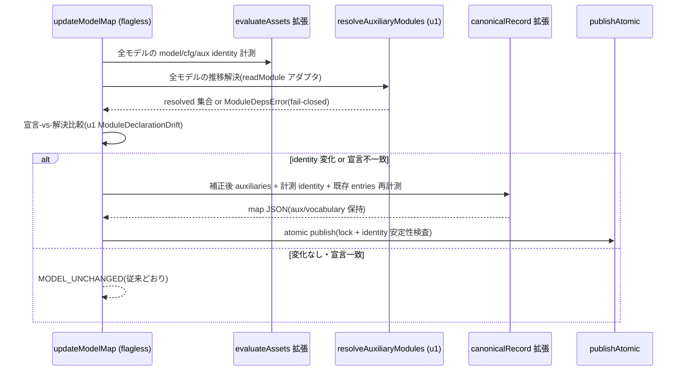

# Business Logic Model — u4-mirror-declaration-drift

**Intent**: 260801-tla-multi-model / **Stage**: functional-design / **Unit**: u4-mirror-declaration-drift(C7+C8-MirrorLifecycle 面)

上流入力(consumes 全数): unit-of-work(u4 節・AC1〜4, テスト割当節, 共通契約節), unit-of-work-story-map(FR→Unit 写像 — user-stories スコープ外のため stories 未生成、FR 写像がストーリー代替), requirements(FR-2 / FR-3, NFR-1/2/4), components(C7 / C8), component-methods(C7 節), services(S1 検出点② / S3), decisions(ADR-1 / ADR-2 / ADR-6 / ADR-7 / ADR-10), u1-schema-resolver functional-design(BR-C1〜C3 宣言照合, domain-entities §6 ModuleDeclarationDrift, §2 リゾルバ仕様), u2-loader-generalization functional-design(business-logic-model §2 loader 側照合 semantics, business-rules BR-D1〜D6 / BR-V2〜V5), u3-vocabulary-supply functional-design(§1.2 MirrorLifecycle 語彙確定値), 実測ソース(`packages/framework/core/tools/amadeus-sensor-model-completeness.ts` 全文 — evaluateAssets :398-448 / evaluateEntries :450-479 / checkModelCompletenessInternal :481-547 / canonicalRecord :558-590 / assetsUnchanged :706-715 / performImplOnlyUpdate :717-771 / performModelMapUpdate :773-829 / updateModelMapInternal :831-868 / FindingReason :37-47, `packages/framework/core/tools/amadeus-formal-verif-model-map.ts` canonicalIdentity :33-47 / diffModelMap :253-264, `scripts/package.ts` :785-823 GENERATED_PLUGIN_SOURCES 機構, `specs/tla/model-map.json` 全文, `specs/tla/MirrorLifecycle.tla` 全文, `specs/tla/MirrorLifecycle.cfg` 全文, `specs/tla/MirrorLifecycleCore.tla` :1-60, `tests/integration/t-formal-verif-mirror-model-registration.integration.test.ts` 全文, `tests/integration/t380-impl-only-model-map-update.integration.test.ts` 全文, `tests/integration/t-formal-verif-model-completeness-sensor.integration.test.ts` :1-120)

unit-of-work-story-map は FR-1〜FR-6 → Unit の写像表(user-stories 未生成の代替)であり、u4 帰属は FR-2(sensor 側検出点)/ FR-3(Core 宣言・pin)で本設計の FR 帰属と一致する。フロントエンド要素はなく frontend-components.md は生成しない。

## 0. 変更の輪郭

本 Unit は RA Q2=A の**第2検出点**(sensor `check` / `updateModelMap`)と、MirrorLifecycle エントリへの宣言追記(auxiliaries + vocabulary)、entries sha256 の連動更新の3面からなる。骨子:

1. **sensor check 経路の拡張**: `evaluateAssets`(:398-448)を model/cfg に加えて aux 全件の identity 計測へ拡張し、新たに**宣言-vs-解決照合ステップ**を挿入する。u1 の `resolveAuxiliaryModules` + 宣言比較(u1 BR-C1)を全登録モデルに実行し、不一致を sensor 赤(findings)化する。
2. **updateModelMap 経路の拡張**: `canonicalRecord`(:558-590)を auxiliaries / vocabulary を保持・再計算する形へ拡張し、flagless update が宣言不一致を**解決集合への機械補正**として書戻すようにする。aux identity は domain `amadeus.formal-verif.tla.module.v1` の canonical identity で、loader(u2)と同一アルゴリズム(S3)。
3. **--impl-only ラッチの拡張**: `assetsUnchanged`(:706-715)を aux も含む判定へ拡張。entries-only 更新は model/cfg/aux identity と aux 宣言の**いずれにも触れない**ことを latch で保証し、宣言不一致が存在する状態での --impl-only は拒否する。
4. **MirrorLifecycle 宣言(C8)**: `specs/tla/model-map.json` の MirrorLifecycle エントリに `auxiliaries`(MirrorLifecycleCore.tla の canonical identity pin)と `vocabulary`(u3 §1.2 確定値: 3 invariant + 3 状態変数)を追記する。u2 BR-D6 で赤化した実 map の loader 検証を**緑へ復帰**させるのが本宣言の効用。
5. **entries sha256 連動**: 本 Unit が編集する sensor 実装ファイル(`packages/framework/core/tools/amadeus-sensor-model-completeness.ts`)は MirrorLifecycle entries の pin 対象ではないが、u4 所有の map 変更と実装変更を同一 PR で運ぶ際、entries drift は `updateModelMap --impl-only` 経路で機械補正する(component-dependency 共有資源節 / unit-of-work u4 所有ファイル3行目)。**MirrorLifecycle entries の impl-only 更新は u4 単独の所有**(他 Unit は触らない)。

依存: u1(リゾルバ・スキーマ)、u2(loader 照合と同一 semantics の前提)、u3(FormalElection vocabulary 追加後の map に追記する — unit-of-work 共通契約「u4 は u3 の map 変更を前提に追記」)。

## 1. リゾルバ共有の物理配置(設計上の前提解決 — 要裁定事項 D-U4-1)

### 1.1 問題

sensor は `packages/framework/core/tools/`、u1 のリゾルバ `tla-module-deps.ts` は `plugins/formal-model-check/tools/` に配置された。ツリー横断 import は本 repo の機構上**禁止**である: `scripts/package.ts` :785-792 のコメントが明記するとおり、「plugin ツール群は packages/framework を持たない host へ投影されるため、import は自身のディレクトリ内で解決しなければならず、依存する canonical モジュールは横断参照せず複製する」。実測でも `packages/framework/core/tools/` から `plugins/` への import は 0 件。

### 1.2 裁定(D-U4-1): canonical home を core へ移し、GENERATED_PLUGIN_SOURCES へ1行追加

既存の `amadeus-formal-verif-model-map.ts` と全く同じ機構に乗せる:

1. **canonical home**: `packages/framework/core/tools/tla-module-deps.ts`(u1 が plugins に置いたファイルの同一 byte をこちらへ移す)。
2. **generator-owned 複製**: `scripts/package.ts` の `GENERATED_PLUGIN_SOURCES`(:798-803)に `{ from: "packages/framework/core/tools/tla-module-deps.ts", to: "plugins/formal-model-check/tools/tla-module-deps.ts" }` の1行を追加。plugin 側コピーは以降 generator が byte-identical に維持し、`bun scripts/package.ts --check` が drift を赤にする(手編集はどちら側も dist:check 赤)。
3. sensor は `./tla-module-deps.ts` をローカル import する(core 内で解決が閉じる)。loader(u2)の plugin 側 import パスは不変(生成コピーを指す)。

### 1.3 所有権の明示(unit-of-work からの追加)

unit-of-work u4 所有ファイルには本配置変更が列挙されていない(u1 策定時点では sensor 側の物理配置が未解決だった)。本 Unit は次の**追加所有**を宣言する:

- `packages/framework/core/tools/tla-module-deps.ts`(新規 = u1 ファイルの移動)
- `plugins/formal-model-check/tools/tla-module-deps.ts`(内容不変、以降 generator-owned へ転換)
- `scripts/package.ts`(GENERATED_PLUGIN_SOURCES へ1行追加)

u1 が未完であれば u1 側でこの配置に修正するのが筋(リゾルバの出生地の問題)だが、u1 が完了済みの場合は本 Unit が移転を運ぶ。どちらで運ぶかは code-generation 冒頭に u1 の実装状態を確認して確定し、memory.md に記録する。**検出点の二重化・実装の単一性(ADR-2 / u1 BR-C2)はこの配置でも維持される** — 実装は1ファイル、複製は generator の byte 保証付き。

### 1.4 却下案

- (a) sensor から plugins への cross-tree import — package.ts の投影機構に反し、host 側で解決不能になる。
- (b) sensor 側に抽出・比較の別実装 — ADR-2 却下案 (c)(規則ドリフトの温床)そのもの。
- (c) `loadCanonical` シームへリゾルバを載せる動的供給 — CanonicalModelMapModule は byte-identical canonical モジュールの型であり、リゾルバ注入は依存の見通しを悪くする。静的ローカル import の方が既存流儀(sensor の `./amadeus-formal-verif-model-map.ts` import と同型)。

## 2. sensor check 経路の拡張(第2検出点・報告側)

### 2.1 evaluateAssets の aux 拡張(:398-448)

現行は model/cfg の2資産固定ループ。これを model/cfg/**aux 全件**へ拡張する(u2 BR-V2 と同じ展開規則):

```
for model of map.models:
  assets = [
    { path: model.model.path, domain: "amadeus.formal-verif.tla.module.v1", recorded: model.model.identity },
    { path: model.cfg.path,   domain: "amadeus.formal-verif.tla.cfg.v1",    recorded: model.cfg.identity },
    ...(model.auxiliaries ?? []).map(aux =>
      { path: aux.path, domain: "amadeus.formal-verif.tla.module.v1", recorded: aux.identity }),
  ]
```

- aux の計測値は `ModelAssetIdentities` に `auxIdentities: readonly (string | undefined)[]`(宣言順対応)として蓄積する(domain-entities.md §2)。読込は既存の `deps.readFile`(safeReadFile: 境界・symlink・サイズ・TOCTOU 検査)と `decodeIdentity`(UTF-8 fatal + canonicalIdentity)をそのまま通す — **aux 専用の新しい読込・identity 経路は作らない**(u2 BR-V2 と同一方針)。
- aux identity 不一致は model/cfg と同じく `{ path: aux.path, reason: "changed" }` の finding。**これが AC1(Core 意味論編集 red)の sensor 側の発火点**である: MirrorLifecycleCore.tla の意味論編集は canonical identity を動かし、宣言 identity と不一致になる。canonicalIdentity(:33-47)はソース文字列全体を canonical JSON 化して hash するため**コメントのみの編集でも identity は動く** — したがって t405 の「Core コメント編集」も「Core 遷移編集」もともに赤(成功 (ii) の保守的な強い保証。コメント不感の identity は設計していない)。
- 宣言にない aux(= 宣言漏れで未計測のモジュール)は本ステップでは扱わず、§2.2 の宣言照合で検出する。

### 2.2 宣言-vs-解決照合ステップ(新設、check 経路)

`evaluateAssets` の後、`evaluateEntries` の前に挿入する(資産が読めないモデルの宣言照合は意味をなさないため、identity 計測の後置。entries 照合より先に宣言の健全性を確定させる順序は u2 BR-V6 の検証順序と同じ思想)。アルゴリズム:

```
for model of map.models:
  resolved = resolveAuxiliaryModules(model.name, readModule)   // u1 リゾルバ(§1 の core コピー)
  if resolved is ModuleDepsError:
    findings.push({ path: model.model.path, reason: "declaration-unresolved" }); continue
  declared = (model.auxiliaries ?? []).map(aux => basename(aux.path, ".tla"))
  drift    = compareDeclarations(model.name, declared, resolved.value)  // u1 比較ヘルパ(ModuleDeclarationDrift)
  if drift.missing.length > 0 || drift.extra.length > 0:
    findings.push({ path: model.model.path, reason: "declaration-drift" })
```

- **`readModule` アダプタ**: §2.1 で safeReadFile 済みの資産(各モデルの model source と宣言 aux source)を優先的に返し、未読込のモジュール(宣言にないが解決で現れた補助モジュール)は `deps.readFile(rootReal, "specs/tla/<Name>.tla", …)` でその場読みし UTF-8 decode(fatal)する。読取失敗は `MODULE_DEP_UNRESOLVED` へ変換(u2 §2.1 と同一規則 — **照合した bytes と解決したソースが別物になる経路を作らない**単一読込原則)。
- **新しい FindingReason を2種追加**する: `"declaration-drift"`(宣言漏れ・過剰宣言の不一致)と `"declaration-unresolved"`(リゾルバ失敗 — 未解決・循環・境界外)。verdict の `reason` は従来どおり `"drift"`(findings が非空なら drift — verdict 種別の追加はしない、NFR-1)。
- **fail-closed**: リゾルバ失敗を「宣言なしとみなす」等の黙示 fallback はしない(NFR-2)。判定不能は赤。
- declared 側の導出は u2 と同じく「path の basename から拡張子を除く」(u1 §1.3 で path は `specs/tla/<Name>.tla` 形に検証済みのため失敗し得ない)。
- **findings 形状の正直な限定**: `CompletenessFinding` は `{ path, reason }` の2フィールドのみで、declared/resolved/missing/extra の集合を載せる detail 面がない。u1 BR-C3 の「detail に両集合」義務は loader(u2 BR-D2)では満たされるが、sensor findings には載せられない。集合の診断は (i) 同じ finding を受けた利用者が `updateModelMap` を走らせると補正内容で分かる、(ii) loader の SOURCE_DRIFT detail が同一情報を持つ、の2経路で担保し、sensor の finding 形状は変えない(形状拡張は sensor 消費側の harness 契約への侵襲が大きい — 最小変更)。本限定は business-rules.md BR-SC4 と §8 オープン事項に記録する。
- **判定不能時の読込二重化防止**: 宣言照合は check では計測済み identity を再計算しない。比較に必要なのはモジュール名の集合のみで、identity 照合は §2.1 が担う。

### 2.3 check verdict の組立て不変

`checkModelCompletenessInternal`(:481-547)の verdict 組立て(timeout 扱い・`pass` 判定・`findings_count`)は不変。宣言照合の findings は資産 findings と同じ配列へ畳み込む。`pass: true` は従来どおり findings 0 件のみ — **宣言が正しく pin された実 map(u4 完了後)でのみ緑**になる(u2 BR-D6 の表裏: u2 完了〜u4 完了の間、実 map は sensor でも赤であり、それが正しい挙動)。

## 3. updateModelMap 経路の拡張(第2検出点・補正側)

### 3.1 canonicalRecord の拡張(:558-590)— auxiliaries / vocabulary の保持

現行の `canonicalRecord` はモデルを `{ name, model, cfg, entries }` の4キーで**新規構築**しており、u1 スキーマ拡張後の map を publish すると **`auxiliaries` / `vocabulary` を黙って落とす**(データ損失)。本 Unit で次の形へ拡張する:

```
models: map.models.map((model) => ({
  name: model.name,
  model: { path: model.model.path, identity: measured?.modelIdentity ?? model.model.identity },
  cfg:   { path: model.cfg.path,   identity: measured?.cfgIdentity   ?? model.cfg.identity },
  ...(auxiliaries を持つ or 補正対象のモデル:
    { auxiliaries: <§3.2 の補正後宣言(identity は計測値 or 再計算値)> }),
  ...(model.vocabulary ? { vocabulary: model.vocabulary } : {}),
  entries: <現行どおり currentEntry で更新>,
}))
```

- **vocabulary は一切再計算せずパススルー**する(ADR-6: 語彙は pin 照合対象外であり、updateModelMap の責務外。値を保持するだけ)。
- **auxiliaries を持たないモデル(FormalElection)には auxiliaries キーを出さない**(非侵襲 — ADR-3。u4 は FormalElection に EXTENDS/INSTANCE 追加がない限り補正を発火させない。仮に将来 FormalElection に aux 解決が現れた場合は flagless update が宣言を**追加**する — それは宣言補正の正しい動作であり、成功 (iii) が保護するのは現行 map の identity 値・entries・パース結果であって「aux が永久に存在しない」ことではない)。
- キー列挙順は u1 exactObject の許可形(4 列挙)に合わせ、`auxiliaries` は `cfg` の後・`entries` の前、`vocabulary` は `entries` の前…ではなく、**u1 の許可キー集合はソート済み列挙**(`["auxiliaries","cfg","entries","model","name","vocabulary"]` 形)のため、canonicalRecord は**アルファベット順のキー出力**に統一する(JSON.stringify のオブジェクトキーは挿入順のため、レコードリテラルをアルファベット順に書く)。これにより publish 物がそのまま u1 パーサの許可形に載る。現行の出力キー順(name→model→cfg→entries)はアルファベット順ではないが、**現行 map も手書きで同順**であり byte 互換の問題は publish 後の再パースでは生じない(u1 はキー順を要求しない — exactObject は集合判定)。したがって既存の出力順(name, model, cfg, [auxiliaries], entries, [vocabulary])を**維持**し、追加分を所定位置へ挿入するだけにとどめる(再フォーマット差分を出さない — t380 の「map left untouched」系と mirror-model-registration の pin を守る)。**vocabulary の挿入位置は entries の後**とし、u3 が手で追記した FormalElection エントリの実配置と一致させる(u3 §6 の JSON 片は vocabulary を entries の後に置く形。code-generation 冒頭に u3 完了後の実 map で確認する — §8 オープン事項)。

### 3.2 flagless update: 宣言不一致の機械補正(FR-3)

`performModelMapUpdate`(:773-829)の flagless 経路を拡張する。現行の起動条件は「model/cfg identity のいずれかが変化(`assetsUnchanged` が false)」のみで、変化がなければ `MODEL_UNCHANGED` + IMPL_ONLY_UPDATE_HINT を返す。拡張後の semantics:

1. **aux identity の再計算**: §2.1 と同じく全モデルの aux を計測( evaluateAssets 拡張で既に実施)。
2. **宣言照合の実行**: §2.2 と同じ比較を全モデルに実行し、`ModuleDeclarationDrift` を得る。リゾルバ失敗は `UPDATE_FAILED`(updateFailure 系、fail-closed)。
3. **起動条件の拡張**: 「model/cfg/aux identity のいずれかが変化」**または**「いずれかのモデルで宣言不一致(missing/extra 非空)」の場合に更新へ進む。どちらも無ければ従来どおり `MODEL_UNCHANGED`(detail 不変 — t380 :169-171 の期待値保護)。
4. **補正内容(AuxIdentityUpdate)**: 宣言不一致モデルの `auxiliaries` を**解決集合へ置き換える**。identity は解決した各モジュールの UTF-8 ソースに対し `canonicalIdentity(source, "amadeus.formal-verif.tla.module.v1")` で計算(services S3 / ADR-1 — loader の照合と同一アルゴリズム、u4 AC3 の実証対象)。path は `specs/tla/<Name>.tla`、配列は path 昇順(u1 §1.3 のスキーマ規則)。解決集合が空になったモデルは auxiliaries キー自体を外す(省略と空配列の区別 — u1 BR-S 系)。
5. **identity 更新**: 変化した model/cfg/aux の identity は計測値で書戻す(現行 semantics の aux への自然拡張)。
6. **entries は現行どおり** `updatedEntries` で再計測して書戻す。

補正の冪等性: 補正後の map に対して再実行すると「identity 変化なし・宣言一致」で `MODEL_UNCHANGED` となる(2 回目の実行で map が動かない — BR-U2、冪等)。

### 3.3 --impl-only ラッチの拡張(:706-771)— entries-only の純粋性

`--impl-only` は「model と cfg が不変である」という宣言のもと entries だけを更新する経路(t380 の semantics)。aux 導入後の latch:

1. **`assetsUnchanged` の拡張**: 判定を「全登録モデルの model/cfg/**aux 全件**の identity が宣言値と一致」へ拡張する。aux が1件でも変化していれば `INVALID_ARGUMENT`(現行 :723-729 の model-changed 拒否と同じ分類。detail メッセージは "model-changed" を維持しつつ aux を含む趣旨へ精密化 — 文言の後方互換が必要な t380 既存ケースは model/cfg 変化のみを扱うため影響なし。detail に `--impl-only declares the model and configuration are unchanged` を含む既存 assert(:117)を壊さない範囲で aux を付記するか、文言を据え置いて aux も「model」に含める — **文言据え置き**(aux は TLA モジュールであり "the model" の構成要素。最小変更)。
2. **宣言不一致下の拒否**: 宣言不一致(missing/extra 非空)が存在する状態での --impl-only は **`INVALID_ARGUMENT` で拒否**する。理由: entries-only 更新は宣言・model/cfg/aux identity に触れてはならず(latch の定義)、宣言不一致を補正せずに entries だけ更新すると check が赤のまま残る「半更新」を publish することになる。detail は flagless updateModelMap を指す回復手順を示す(現行の model-changed 拒否と同じ案内パターン)。
3. **触れないことの保証**: impl-only 経路の `canonicalRecord` 呼出しは、latch 通過時に identity 計測値 = 宣言値が保証されるため、model/cfg/aux の identity は**宣言値そのまま**が書かれ、auxiliaries 宣言配列・vocabulary もパススルーで**byte 的に同値**が維持される(§3.1 の拡張により落ちない)。「entries-only 更新が model/cfg/aux identities と aux 宣言と vocabulary に触れない」ことを t380 の拡張ケースで pin する(§7.3)。

### 3.4 entries sha256 連動(u4 単独所有)

unit-of-work u4 所有ファイル3行目どおり、本 Unit の実装編集( sensor 本体、および §1 のリゾルバ移転が files に影響する場合)に伴う MirrorLifecycle entries drift は `updateModelMap --impl-only` で機械補正する:

- 対象は MirrorLifecycle entries の4ファイル(`amadeus-mirror-*.ts`)では**ない** — u4 が編集するのは `amadeus-sensor-model-completeness.ts` であり、これは **FormalElection / MirrorLifecycle どちらの entries にも登録されていない**(model-map.json 実測)。したがって通常の u4 実装では entries drift は発生しない。連動更新が必要になるのは、u4 の変更が entries 登録ファイル(例: 共有の canonical モジュール `amadeus-formal-verif-model-map.ts`…これも未登録。実装上は u4 所有面で entries 対象ファイルを触る経路が存在しない)に及ぶ例外的場合のみであり、その場合は `--impl-only`(model/cfg/aux 不変が前提)で補正し、補正できない場合は flagless update へエスカレーションする。**手で sha256 を編集しない**(機械補正のみ — t380 が保証する経路)。

## 4. MirrorLifecycle 宣言(C8 — FR-3)

### 4.1 追記内容

`specs/tla/model-map.json` の MirrorLifecycle エントリへ次を追記する(entries・model/cfg identity・他エントリは一切変更しない):

```json
"auxiliaries": [
  {
    "path": "specs/tla/MirrorLifecycleCore.tla",
    "identity": "<canonicalIdentity(MirrorLifecycleCore.tla の UTF-8 ソース, \"amadeus.formal-verif.tla.module.v1\").sha256>"
  }
],
"vocabulary": {
  "namedInvariants": [
    "TypeOK",
    "NoCloseWithoutLandedSync",
    "NoDuplicateCreate"
  ],
  "traceStateVariables": [
    "receipts",
    "issueNumber",
    "boundaryIdx"
  ]
}
```

- **aux identity の値**: `canonicalIdentity`(:33-47)はソース文字列を canonical JSON 化(JSON.stringify)して `sha256(domain \0 bytes)` を取る。loader の `sourceIdentity` 系と同一アルゴリズム(S3 / ADR-1)。**宣言値は `updateModelMap`(flagless)の補正経路に計算させて書き込む**(§3.2)— 手計算・手編集で identity を埋めない。これにより「宣言 identity = updateModelMap 計算値 = loader 照合値」の三者一致が構造的に保証され、u4 AC3(同一アルゴリズムの実証)は t405 で機械検証する。
- **aux 宣言の根拠**: MirrorLifecycle.tla:31-32 の `Core == INSTANCE MirrorLifecycleCore WITH …`(改行跨ぎ WITH 代入 — u1 リゾルバの解決対象そのもの)。EXTENDS の Naturals / FiniteSets は標準モジュールで追跡外(u1 BR-R3)。解決集合はちょうど `{MirrorLifecycleCore}`。
- **vocabulary 値**: u3 §1.2 の確定値そのまま。namedInvariants は MirrorLifecycle.cfg:6-8 の実宣言3件(cfg 宣言順。`CloseUnreachable` は cfg の INVARIANT になく含めない)。traceStateVariables は vars タプル順 `<<receipts, issueNumber, boundaryIdx>>`(MirrorLifecycle.tla:27-29)を暫定とし、**TLC 実出力順との最終一致は u5 の AsIntended 実走で確定**(u3 §1.2 留意、ADR-8 measure-first)。vocabulary は drift pin 照合対象外(ADR-6 の正直な限定)のため、順序修正が起きても identity は動かない。
- **挿入位置**: auxiliaries は cfg の後・entries の前、vocabulary は entries の後(§3.1 の canonicalRecord 出力順と一致させ、将来の updateModelMap publish でキー順が安定するようにする)。

### 4.2 宣言の効用(緑経路の復帰)

- loader(u2 BR-D6): u2 完了時点で実 map は missing={MirrorLifecycleCore} で赤。本宣言で declared = resolved = {MirrorLifecycleCore} となり、**双方向照合が緑へ復帰**する。aux identity 照合も宣言値 pin により発火する。
- sensor: check が宣言一致・identity 一致で緑へ復帰(§2.3)。
- toolchain(u3/u5): MirrorLifecycle の vocabulary が map から供給可能になり、u5 の CI 実走の前提が成立する(unit-of-work u5 依存節)。
- AsImplemented / Vacuity は**触らない**(Out of scope A2)。`MirrorLifecycleAsImplemented.tla` / Vacuity 関連ファイルへの参照・変更が差分に存在しないことを grep で証明する(u4 AC4)。

## 5. 不変性の固定(ADR-10 / NFR-1 の sensor 側保護)

- **FormalElection 経路の不変**: FormalElection は EXTENDS が標準モジュールのみで resolved = ∅、auxiliaries 省略 → declared = ∅。宣言照合は恒等的に緑で、evaluateAssets の aux 拡張は `?? []` で資産ゼロ。canonicalRecord は auxiliaries キーを出さず、vocabulary(u3 追加分)はパススルー。**u3 完了後の map に対する updateModelMap 非発火時の byte は変わらない**(そもそも publish されない — MODEL_UNCHANGED)。
- **既存 sensor 契約の不変**: verdict 型・`UpdateModelMapResult` 型・CLI 引数面(`--impl-only` の受理位置 :884-897)は不変。追加は FindingReason の2メンバと内部関数の拡張のみ。`diffModelMap`(:253-264)・`registeredEntries`(:200-206)・safeReadFile 系のセキュリティ検査(境界・symlink・TOCTOU・サイズ上限)は一切触らない。
- **lock・atomic publish の不変**: mkdir lock(:847-856)と validatePublishTarget / publishAtomic(:592-643)は不変。宣言補正を含む publish も同じ atomic 経路を通る。
- **receipt identity への非影響**: 本 Unit は `generateFrozenTlaModel` / entries 計算式に触れない。receipt 入力列挙(ADR-10)は不変。
- **timeout 予算**: 宣言照合の読込は `deps.readFile` 経由で totalBytes 予算(:31-33)に計上する。check の deadline(:493)は宣言照合ステップでも尊重し、超過時は従来どおり timeout finding(§2.2 のループ先頭で deadline を確認)。

## 6. シーケンス(宣言補正の1回の実行)



テキストフォールバック: flagless updateModelMap は (1) 全資産計測 → (2) 推移解決 → (3) 宣言比較 → (4a) 変化または不一致なら canonicalRecord で補正書戻し→atomic publish、(4b) 何もなければ MODEL_UNCHANGED。--impl-only は (1) の時点で model/cfg/aux 不変かつ宣言一致を要求し、違反は INVALID_ARGUMENT。

## 7. テスト計画(u4 所有面)

unit-of-work テスト割当節どおり: 新規 **t405** + `t-formal-verif-mirror-model-registration.integration.test.ts` 改訂 + **t380 拡張**(既存期待値不変のまま latch 拡張ケースを追加 — 仕分けの精密化は §9.2)。sensor 系既存テスト(unit / integration / components / e2e の4ファイル)は「維持」仕分け — fixture が aux を持たず EXTENDS/INSTANCE を含まないため、宣言照合は恒等的に緑で**期待値不変のまま通る**ことを確認する(落ちた場合は仕分け見直しと code-summary 記録)。

### 7.1 新規 t405(`tests/integration/t405-mirror-declaration-drift.integration.test.ts` — u4 AC1/AC2/AC3)

fixture 構成: t380 系と同型の tmpdir プロジェクトに、実 repo の `specs/tla/MirrorLifecycle.tla` / `MirrorLifecycleCore.tla` / `MirrorLifecycle.cfg` と補正済み map(aux 宣言+identity 実測計算)をコピーする(実ソースを fixture 化し、合成ソースの偽緑を避ける)。

- **Core semantic edit red(u4 AC1、成功 (ii) の直接証拠)**: fixture の MirrorLifecycleCore.tla に意味論編集(例: ガードの `\E` を `\A` へ、または遷移の guard 条件を反転)を施す → sensor `checkModelCompleteness` が `pass: false, reason: "drift"`、findings に `{ path: "specs/tla/MirrorLifecycleCore.tla", reason: "changed" }` を含む。さらに loader 側(u2)でも赤になることを併せて assert(双検出点の同時発火 — ADR-2)。
- **Core コメントのみ編集 red(保守性の pin)**: Core のブロックコメント1行だけを編集 → canonicalIdentity は文字列全体を hash するため identity が動き、**これも赤**(§2.1)。意味論編集とコメント編集の両ケースを独立して持ち、「コメントなら素通り」という誤った仮定を設計に残さない。
- **control green**: 無編集 fixture では check が `pass: true`(緑対照。赤ケースの検査が「常に赤」でないことの証明)。
- **declaration-mismatch red — 宣言漏れ(u4 AC2)**: fixture map から auxiliaries を除去(INSTANCE は残る)→ check が赤、findings に `{ path: "specs/tla/MirrorLifecycle.tla", reason: "declaration-drift" }`。
- **declaration-mismatch red — 過剰宣言(u4 AC2)**: fixture map に解決されない aux(例: 存在するが INSTANCE されていないモジュール)を追加 → 同じく `declaration-drift` 赤。**片方向だけで双方向検出を主張しない**(u2 BR-P1 と同じ義務)。
- **updateModelMap 機械補正(u4 AC2 / FR-3)**: 宣言漏れ状態で flagless `updateModelMap` → 成功、publish 後の map が解決集合どおりの auxiliaries(identity 実測一致)を持ち、再 check が緑。**冪等性**: 直後の再実行が `MODEL_UNCHANGED`。
- **aux identity 三者一致(u4 AC3)**: updateModelMap が書いた aux identity 値と、(a) loader の `VerifiedModelSource.auxIdentities` の実測値、(b) `canonicalIdentity(fixture Core ソース, "amadeus.formal-verif.tla.module.v1")` の直接計算が一致。
- **resolver 失敗の fail-closed**: 循環参照 fixture(A ⇄ B INSTANCE)→ check が赤で `{ reason: "declaration-unresolved" }`(黙って緑にしない)。

### 7.2 mirror-model-registration 統合の改訂(実 map pin の追随)

`t-formal-verif-mirror-model-registration.integration.test.ts` は実 repo の map を読む pin テスト(全84行)。u4 宣言追記に合わせ**追加**する(既存5ケースの期待値は不変):

- **auxiliaries pin**: MirrorLifecycle エントリの `auxiliaries` がちょうど1件、`path === "specs/tla/MirrorLifecycleCore.tla"`、`canonicalIdentity(実 Core ソース, "amadeus.formal-verif.tla.module.v1").sha256` と identity が一致(既存 :65-77 の model/cfg identity 検査と同型の実測照合 — 「宣言されたら落ちる検査」として drift を検出する)。
- **vocabulary pin**: `vocabulary.namedInvariants` が cfg 実測の3件・順序一致、`vocabulary.traceStateVariables` が `["receipts","issueNumber","boundaryIdx"]`(u3 §1.2。u5 実測で順序確定が変わる場合は u5 が追随)。
- **drift 検出の拡張**: 既存の「4 pinned implementation files の drift 検出」(:50-63)と同型に、Core ソース + 編集バイトの hash が宣言 identity とずれることの実証(mutated ≠ identity)を aux に対しても追加。

### 7.3 t380 拡張(--impl-only latch の aux 面、既存期待値不変)

t380 の既存8ケースは fixture が aux・INSTANCE を持たないため**一切変更せず green を維持**する(「維持」仕分けの実証)。その上で latch 拡張の pin を追加する:

- **aux 変化の拒否**: aux 宣言済み fixture で aux ファイルのみ変化 + entries drift → --impl-only が `INVALID_ARGUMENT`(model/cfg 変化の拒否 :102-119 と同型)。
- **宣言不一致下の拒否**: 宣言漏れ状態 + entries drift → --impl-only が `INVALID_ARGUMENT`(半更新の publish を許さない — §3.3-2)。
- **entries-only の純粋性 pin**: aux/vocabulary 宣言済み fixture で entries のみ drift → --impl-only 成功後、publish された map の model/cfg/aux identities・auxiliaries 配列・vocabulary が**更新前と deep-equal**(entries のみ変化)。

### 7.4 AsImplemented / Vacuity 非接触の grep 証明(u4 AC4)

本 Unit の差分に `MirrorLifecycleAsImplemented` / Vacuity 系ファイル・文字列への変更がないことを `git diff --name-only` + grep で証明し、code-summary に記録する(Out of scope A2)。

### 7.5 patch gate

変更行 0-hit 不許容(team-practices Testing Posture)。上記テストは修正と同 PR で運ぶ(u4 AC4)。`bun run typecheck` / `bun run lint` / 既存テスト green。sensor 本体の変更は patch coverage の対象であり、t405・t380 拡張が新規分岐(aux 計測・宣言照合・補正・latch 拒否)を全て打つ構成になっている(§7.1/§7.3 のケース網羅)。

## 8. 設計上の留意(オープン事項・下流への引き渡し)

- **D-U4-1(§1)の実施主体**: u1 未完なら u1 で配置修正、完了済みなら u4 が移転を運ぶ。code-generation 冒頭に確認。
- **findings 形状の限定(§2.2)**: sensor findings は `{path, reason}` のみで集合 detail を持てない。loader detail と updateModelMap 補正で診断を担保する限定を BR-SC4 に固定した。将来 sensor 契約の拡張( findings への detail 追加)が必要になった場合は別 intent の裁定事項。
- **vocabulary キー位置の実測確認(§3.1)**: u3 が FormalElection に追記した vocabulary の実配置(entries の後を想定)を code-generation 冒頭に実 map で確認し、canonicalRecord の出力順と一致させる。
- **u5 への引き渡し**: MirrorLifecycle の宣言 pin + vocabulary 供給が成立し、CI 全モデル駆動の前提が満たされる。traceStateVariables の順序最終確定は u5 の AsIntended 実走(ADR-8)。
- **u2 との整合**: 宣言照合の集合計算・readModule アダプタ規則・失敗分類の分離(MODULE_DEPS vs drift)は u2 と同一規則を sensor 側に具現化したもので、集合計算の実装は u1 単一(§1 の byte-identical 配置)。
- 新規外部依存なし(NFR-4)。生成ツリー(dist/ 等)は本 Unit の最後に `bun scripts/package.ts` 再生成で追随(手編集禁止)。`GENERATED_PLUGIN_SOURCES` 追加後は `bun scripts/package.ts --check` がリゾルバ複製の drift を監視する。

## 9. 27 ファイル仕分けへの影響と決定事項

### 9.1 本 Unit が触るファイル

| 区分 | ファイル | 変更内容 |
|---|---|---|
| 所有(実装) | `packages/framework/core/tools/amadeus-sensor-model-completeness.ts` | §2/§3 の拡張(aux 計測・宣言照合・canonicalRecord・latch) |
| 所有(宣言) | `specs/tla/model-map.json` | MirrorLifecycle エントリへ auxiliaries+vocabulary 追記(§4) |
| 追加所有(§1.3、要裁定) | `packages/framework/core/tools/tla-module-deps.ts` | 新規(u1 ファイルの移転、canonical home) |
| 追加所有(§1.3、要裁定) | `plugins/formal-model-check/tools/tla-module-deps.ts` | generator-owned 化(内容不変) |
| 追加所有(§1.3、要裁定) | `scripts/package.ts` | GENERATED_PLUGIN_SOURCES へ1行追加 |
| テスト新規 | `tests/integration/t405-mirror-declaration-drift.integration.test.ts` | §7.1 |
| テスト改訂 | `tests/integration/t-formal-verif-mirror-model-registration.integration.test.ts` | §7.2(追加のみ、既存期待値不変) |
| テスト拡張 | `tests/integration/t380-impl-only-model-map-update.integration.test.ts` | §7.3(追加のみ、既存期待値不変) |

### 9.2 仕分けの精密化(27 ファイル表との差分)

- **t380**: unit-of-work では「維持」仕分けだったが、latch 拡張の pin 追加のため「維持+拡張(既存ケース期待値不変・新規ケース追加)」へ精密化する。既存ケースを1行も変えないことが「維持」の実証であり、追加は新規 describe/ケースとして分離する。code-summary に記録する。
- **t-formal-verif-mirror-model-registration**: unit-of-work の「維持」は据え置きつつ、宣言追記への追随は**追加のみ**で行う(改訂ではなく pin の増設)。これも code-summary に記録。
- **sensor 系4ファイル**(unit/integration/components/e2e): 「維持」のまま。aux を持たない fixture で恒等的に緑のはず — 落ちた場合は「維持」ではなく u4 改訂へ再仕分けし code-summary に記録(unit-of-work テスト割当節の但し書き運用と同じ)。

### 9.3 決定事項一覧

- **D-U4-1**: リゾルバの canonical home は `packages/framework/core/tools/`、plugin 側は GENERATED_PLUGIN_SOURCES の generator-owned 複製(§1)。unit-of-work 所有ファイルへの追加を伴う。
- **D-U4-2**: sensor findings に新 reason を2種追加(`declaration-drift` / `declaration-unresolved`)。verdict 型・result 型は不変(§2.2)。
- **D-U4-3**: canonicalRecord は vocabulary をパススルー、auxiliaries を保持・補正出力する(現行の「optional フィールド喪失」を修正 — §3.1)。
- **D-U4-4**: --impl-only は aux 変化・宣言不一致の存在下で `INVALID_ARGUMENT` 拒否。detail 文言は既存 assert を壊さない範囲で据え置き(§3.3)。
- **D-U4-5**: MirrorLifecycle 宣言値(identity)は手編集せず updateModelMap 補正経路に計算させる(§4.1)。

## Review — Iteration 1

- **Verdict:** READY
- **Reviewer:** amadeus-architecture-reviewer-agent
- **Date:** 2026-08-01T21:43:40Z
- **Iteration:** 1
- **Scope decision:** none

u4 design covers owned files/ACs with fail-closed BR semantics and full red-proof mapping; cross-unit names match; rulings respected. Findings: none.

### Findings

- None
