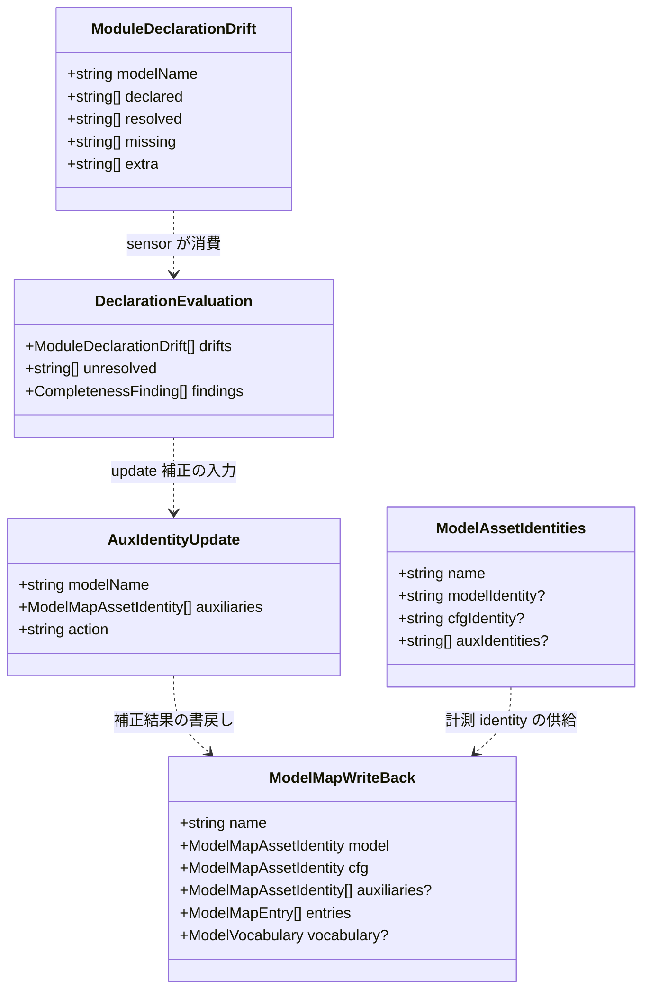

# Domain Entities — u4-mirror-declaration-drift

**Intent**: 260801-tla-multi-model / **Stage**: functional-design / **Unit**: u4-mirror-declaration-drift(C7+C8-MirrorLifecycle 面)

上流入力(consumes 全数): unit-of-work(u4 節・AC1〜4), unit-of-work-story-map(FR→Unit 写像 — stories 未生成の代替), requirements(FR-2 / FR-3, NFR-1/2), components(C7 / C8), component-methods(C7 節), services(S1 / S3), decisions(ADR-1 / ADR-2 / ADR-6 / ADR-7), u1 functional-design(domain-entities §1 ModelMapModel / §2 ModelVocabulary / §5 ResolvedDeps / §6 ModuleDeclarationDrift), u2 functional-design(domain-entities §1〜§3, business-logic-model §2), 実測ソース(`packages/framework/core/tools/amadeus-sensor-model-completeness.ts` 全文 — 型面 :37-186, `packages/framework/core/tools/amadeus-formal-verif-model-map.ts` ModelMapModel / diffModelMap :253-264, `specs/tla/model-map.json`)

unit-of-work-story-map は FR 写像表(stories なし)であり、u4 帰属は FR-2 / FR-3 で本書のエンティティ設計の由来と一致する。型の命名・修飾は既存コード流儀(`readonly` 全フィールド、plain object、判別共用体の `ok` タグ、named export)に厳密一致させる(component-methods 冒頭、team-practices Code Style)。sensor ファイルの既存型は **export されているもの**(CompletenessFinding / CompletenessVerdict / UpdateModelMapResult / ImplOnlyChange)と **ファイルローカルのもの**(ModelAssetIdentities / AssetEvaluation / CanonicalModelMapModule)に分かれる — 本 Unit の新規概念は公開契約を増やさない範囲でファイルローカルに置く。

## 1. SensorDriftReport(宣言-解決差分の sensor 側消費形 — 新規、ファイルローカル)

u1 の `ModuleDeclarationDrift`(u1 domain-entities §6)を sensor check / updateModelMap が消費する際の結合形。u1 型をそのまま再export・再定義はせず、sensor 側では「u1 比較結果 + finding 変換」として扱う:

```ts
// u1 供給(再定義しない — import して使う。D-U4-1 の core コピー経由)
// export interface ModuleDeclarationDrift {
//   readonly modelName: string;
//   readonly declared: readonly string[];
//   readonly resolved: readonly string[];
//   readonly missing: readonly string[];   // resolved − declared(宣言漏れ)
//   readonly extra: readonly string[];     // declared − resolved(過剰宣言)
// }

// sensor 側の消費結果(ファイルローカル、新規)
interface DeclarationEvaluation {
  readonly drifts: readonly ModuleDeclarationDrift[];   // 不一致モデルのみ(missing/extra 非空)
  readonly unresolved: readonly string[];               // リゾルバ失敗モデルの model path
  readonly findings: readonly CompletenessFinding[];    // check 経路へ畳み込む finding 列
}
```

- 判定: `drifts`・`unresolved` がともに空のときのみ宣言面は緑(BR-SC2/SC3)。`findings` は drifts から `{ path: tlaModelPath(modelName), reason: "declaration-drift" }`、unresolved から `{ path, reason: "declaration-unresolved" }` を機械生成する。
- updateModelMap 経路では `drifts` が補正対象モデルの列挙としてそのまま使われる(§2 AuxIdentityUpdate の入力)。
- ライフサイクル: 評価は1回の check / update 呼出し内で完結する ephemeral な値。永続化・公開 export はしない。

## 2. AuxIdentityUpdate(宣言補正レコード — 新規、ファイルローカル)

updateModelMap(flagless)が宣言不一致モデルに対して組み立てる補正後の auxiliaries 宣言。

```ts
interface AuxIdentityUpdate {
  readonly modelName: string;
  readonly auxiliaries: readonly ModelMapAssetIdentity[]; // 解決集合由来、path 昇順、
                                                          // identity = canonicalIdentity(source,
                                                          //   "amadeus.formal-verif.tla.module.v1")
  readonly action: "corrected" | "added" | "removed";
  // corrected: 宣言あり・集合がズレた → 解決集合へ置換
  // added:     宣言なし・解決集合が非空 → 新規宣言
  // removed:   宣言あり・解決集合が空 → auxiliaries キー除去(空配列は出さない — u1 §1.3)
}
```

- `auxiliaries` の各要素は u1 スキーマ規格(path `specs/tla/<Name>.tla`、小文字 sha256、path 一意昇順 — u1 BR-S3〜S6)を機械的に満たす。identity の計算は updateModelMap 補正経路に限定し、手編集の経路を作らない(BR-SU2 / D-U4-5)。
- updateModelMap 成功結果(`UpdateModelMapResult`)の公開形状には載せない(形状不変 — BR-I2)。補正内容は publish 後の map 自体が証跡であり、冪等性(BR-SU3)が再現性を保証する。

## 3. ModelMapWriteBack(canonicalRecord の書戻しレコード — 拡張)

`canonicalRecord`(:558-590)が publish 用に組み立てる1モデル分のレコード。現行の4キー(name/model/cfg/entries)を拡張し、**optional フィールドを落とさない**形へ修正する(D-U4-3 / BR-SU4):

```ts
// JSON シリアライズ直前の中間形(概念的。実装は canonicalRecord 内のオブジェクトリテラル)
{
  readonly name: string;
  readonly model: ModelMapAssetIdentity;                    // 計測値 or 宣言値(不変時)
  readonly cfg: ModelMapAssetIdentity;                      // 同上
  readonly auxiliaries?: readonly ModelMapAssetIdentity[];  // 宣言 or AuxIdentityUpdate 補正結果。
                                                            // 持たないモデルはキー自体を出さない
  readonly entries: readonly ModelMapEntry[];               // 再計測値(現行どおり)
  readonly vocabulary?: ModelVocabulary;                    // パススルー(再計算しない — ADR-6)
}
```

- キー挿入順は `name → model → cfg → auxiliaries → entries → vocabulary` に固定し、u3 が FormalElection に追記した実配置(vocabulary は entries の後)と一致させる(business-logic-model §3.1。実配置は code-generation 冒頭に実 map で確認)。
- --impl-only 経路では latch 通過により計測値 = 宣言値が保証されるため、auxiliaries / vocabulary / model / cfg は**宣言値そのまま**が書かれる(entries-only の純粋性 — BR-IO3)。
- FormalElection(aux・vocabulary 補正対象外)は従来どおり4キーで出力され、byte レベルの出力不変が保たれる(BR-I1)。

## 4. ModelAssetIdentities(拡張 — 既存ファイルローカル型 :176-180)

evaluateAssets の計測結果。aux を保持できるよう拡張する:

```ts
interface ModelAssetIdentities {
  readonly name: string;
  readonly modelIdentity?: string;
  readonly cfgIdentity?: string;
  readonly auxIdentities?: readonly (string | undefined)[]; // 宣言 auxiliaries と同順対応。
                                                            // 読込失敗要素は undefined
}
```

- `auxIdentities` は宣言配列 `model.auxiliaries ?? []` と**同じ長さ・同じ順序**(宣言順対応)。`assetsUnchanged`(BR-IO1)はこの配列と宣言 identity の要素一致で aux 面を判定する。
- 宣言のないモデルでは `undefined`(空配列ではなく省略)のままとし、「aux なしモデル」と「aux 読込失敗」を区別する。

## 5. FindingReason(拡張 — 既存 union :37-47)

```ts
type FindingReason =
  | "changed" | "missing" | "unreadable" | "outside-root" | "symlink"
  | "not-regular" | "identity-changed" | "file-too-large" | "total-too-large"
  | "timeout"
  | "declaration-drift"        // 新規: 宣言漏れ・過剰宣言(双方向不一致)
  | "declaration-unresolved";  // 新規: リゾルバ失敗(未解決・循環・境界外)
```

- union メンバの**追加のみ**で既存メンバ・判定ロジックは不変(BR-I2)。`UpdateFailureReason` は FindingReason を含むため自動的に追随する。
- verdict の `reason` 列挙(`"drift" | "map-missing" | "map-malformed" | "timeout"`)は**変更しない** — 宣言系 finding は `"drift"` verdict に畳み込まれる。

## 6. 上流エンティティの消費(再定義なし)

- **`ModuleDeclarationDrift`**(u1 §6): §1 のとおり import して消費。集合計算・命名・順序の規則は u1 が単一で保持する(BR-SC5)。
- **`ModelMapModel` / `ModelVocabulary` / `ModelMapAssetIdentity`**(u1 §1/§2、canonical モジュール): sensor は `CanonicalModelMapModule` 経由で parse 済みの値として受け取る。MirrorLifecycle 宣言追記後の実 map では `auxiliaries`・`vocabulary` が両方立つ初めての実モデルになる。
- **`ModuleDepsError`**(u1 §5): sensor では `ModuleDepsError` を finding へ変換して消費し、公開エラー union には出さない(loader とは消費形が異なる — u2 は error union に含めて伝播、sensor は finding 化。これは両検出点の既存エラー体系の差異であり、統一しない)。
- **`diffModelMap`**(canonical :253-264): entries 照合に従来どおり使用。aux 宣言照合は diffModelMap を**拡張しない**(entries drift と宣言 drift は別の欠陥クラス — diffModelMap のシグネチャ不変、BR-I2)。

## エンティティ関係



テキストフォールバック: u1 の `ModuleDeclarationDrift` を sensor が `DeclarationEvaluation` として消費し(findings 生成)、update 経路では `AuxIdentityUpdate` の補正レコードへ変換、`ModelMapWriteBack`(canonicalRecord 出力形)へ畳み込んで atomic publish する。`ModelAssetIdentities` は計測 identity を WriteBack と latch 判定へ供給する。全エンティティは呼出し内 ephemeral で、公開 export は増やさない。
