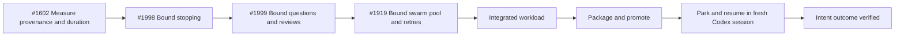

# Scope Document — 長時間実行の統一的な有界化

## Executive Scope

本 Intent は、Amadeus の長時間実行を測定可能かつ有界にする4件の Must capability を、1 Issue = 1 Bolt／PR で直列に届ける。Codex は問題の一次観測面および性能 dogfood 面だが、停止性、対話予算、並列上限、終了理由は共有 prompt／core の契約として全 supported harness を対象にする。

実行順は `#1602 → #1998 → #1999 → #1919` とする。各 Bolt の着地後に後続 worktree を最新 base へ rebase し、前段の計測・停止・予算改善を後段作業そのものへ波及させる。4 Bolt の個別受入後、統合 workload と fresh-session dogfood を通過して Intent 完了とする。

## Upstream Inputs

- `intent-statement`: 問題、対象者、成功指標、4 Issue の依存順、Issue hygiene を正本として参照した。
- `feasibility-assessment`: 条件付き GO、共有 conformance／adapter／live journey の三層検証、Codex 専用 gate を作らない条件を参照した。
- `constraint-register`: C-01〜C-14 の品質、配布、セッション、privacy、検証 runtime の制約を scope boundary に反映した。

## Objectives

1. stage・agent・tool・harness・model／version・duration・終了理由を相関できる共有計測 schema と Codex 一次 baseline を確立する。
2. 非遷移イベントで停止 budget を巻き戻せない単調な停止契約を確立する。
3. 質問・follow-up・review iteration を明示予算内で終端し、共有 termination reason を記録する。
4. swarm の同時実行数と同一 Unit retry をハード上限内に収める。
5. 影響 adapter と全 distribution 投影で共有契約が保たれることを blocking 検証する。
6. 各 Bolt の改善効果を同一 workload で比較し、最終統合時に fresh Codex session で dogfood する。

## In Scope

### Must capabilities

| Scope ID | Capability | Source | Completion evidence |
|---|---|---|---|
| S-01 | 実行由来情報と処理時間の共有 schema／Codex baseline | [#1602](https://github.com/amadeus-dlc/amadeus/issues/1602) | state・audit・runtime graph の相関、取得不能 semantics、同一 workload baseline |
| S-02 | 単調な停止 budget と上限回避の閉鎖 | [#1998](https://github.com/amadeus-dlc/amadeus/issues/1998) | 起票時回避再現が全て所定の終了理由で終端 |
| S-03 | 質問・follow-up・review の明示予算 | [#1999](https://github.com/amadeus-dlc/amadeus/issues/1999) | 予算ちょうど／超過／再開の決定的検証 |
| S-04 | 有界な swarm Unit pool と durable retry count | [#1919](https://github.com/amadeus-dlc/amadeus/issues/1919) | 同時実行・同一 Unit retry の境界値検証 |
| S-05 | 共有 conformance と harness 投影整合 | Feasibility C-01〜C-08 | 影響 adapter conformance、全 distribution drift green |
| S-06 | Bolt 間波及と最終統合 dogfood | ユーザー決定 | rebase receipt、統合 workload、fresh-session 結果 |

### Harness scope

- 共有 prompt／core の不変条件は全 supported harness を契約スコープに含める。
- 影響を受ける harness adapter の conformance は blocking とする。
- package／self-install／distribution drift は全 supported harness で blocking とする。
- live journey は Codex を一次対象とし、他 harness は driver／provider／native lifecycle の capability がある場合に実証する。
- Reverse Engineering で Codex overlay 固有と確認された部分だけを Codex adapter の責任に残す。観測が Codex で顕著だったこと自体は専用 scope の根拠にしない。

## Out of Scope

- 全 supported harness で同一の時間短縮率を達成すること。
- 全 supported harness の live model journey を blocking にすること。
- Codex 製品本体、model provider、ネットワーク性能を変更すること。
- 4 Issue と無関係な runtime 最適化、prompt 改稿、swarm 機能追加。
- 常駐サービス、AWS account、データストア、IaC の新設。
- prompt 本文、secret、credential を telemetry へ保存すること。
- #1602 baseline 前に根拠のない時間、反復、並列上限値を固定すること。
- 再現可能な例外証拠なしに Codex 専用の安全ポリシー／blocking gate を作ること。

## Minimum Viable Scope

4 capability はすべて Must であり、どれかを Should へ落とした状態を Intent 完了とはみなさない。ただし、価値は Bolt ごとに独立して受け入れる。

| Increment | Minimum value delivered | Why independently useful |
|---|---|---|
| Bolt 1 — #1602 | 長時間化の由来と baseline を測定可能にする | 後続改善の比較不能を解消する |
| Bolt 2 — #1998 | 停止上限の回避を閉じる | 異常実行を決定的に終端できる |
| Bolt 3 — #1999 | 対話反復を予算内に収める | 質問・review の非終端を防ぐ |
| Bolt 4 — #1919 | swarm 資源と retry を有界化する | 並列実行の時間・資源上限を保証する |

最小の最終成果は、4 Increment が個別に受け入れられ、統合 workload で同時に成立することである。

## Prioritization and Sequence

優先度は4件とも MoSCoW の **Must**。Must 内の順序は価値点数の推測ではなく、証拠と安全性の依存関係で決める。

1. #1602 — 比較 schema と baseline を先に作る。
2. #1998 — 後続の長い対話／swarm dogfood を守る停止性を確立する。
3. #1999 — 後続 review と質問反復を有界化する。
4. #1919 — 前段の観測と停止契約を使って並列 pool／retry を有界化する。

固定納期は置かない。各 Bolt は前段の受入・配布・rebase が完了するまで開始しない。

## Value Stream

<!-- Text fallback: #1602 の計測、#1998 の停止性、#1999 の対話予算、#1919 の有界 swarm を順に着地し、統合 workload、package/promote、park、fresh-session resume を経て Intent 成果を検証する。 -->

## Delivery and Issue Boundaries

- 1 Issue = 1 Bolt = 1独立PRを基本単位とする。
- 実着手する Issue だけへ `in-progress` を付与し、完了時に除去する。現在は #1602 のみ着手中。
- 各 Bolt は独立した受入条件、対照／処置結果、残余リスクを持つ。
- Bolt 着地後、後続 worktree を最新 base へ rebase し、共有 conformance を再実行する。
- package／promote 後は Intent を park し、新しい Codex session で resume する。
- 後続 Issue の既存 PR が判明した場合は再実装せず、当該 PR の収束へ Bolt を編成し直す。

## Acceptance Boundary

### Per-Bolt acceptance

1. 対象 Issue の主張と受入条件が observed SHA の一次ソースへ trace されている。
2. baseline／control と treatment を同一 workload で比較できる。
3. shared core conformance、影響 adapter、全 distribution drift が green である。
4. live journey の未実行は capability 不在として明示され、決定的検証の成功へ混同されない。
5. 対象 Issue の `in-progress` を完了時に除去し、次の Issue だけを着手状態へ移す。

### Intent completion

1. 4 Bolt がすべて個別受入済みである。
2. 統合 workload で計測、停止、対話予算、swarm 上限が同時に成立する。
3. 全 distribution drift と影響 adapter conformance が green である。
4. package／promote 後の fresh Codex session で統合 dogfood を完了する。
5. #1602 baseline と各 treatment の時間、反復回数、終了理由を比較報告する。

## Deferred Decisions

次は Scope 外ではなく、後続ステージへ意図的に延期する決定である。

- stage／agent／tool の具体的な時間目標と許容分位点。
- Stop budget、質問／follow-up／review budget の具体値。
- swarm 最大同時実行数と同一 Unit 最大 retry 数。
- capability がある非 Codex harness の live journey 対象集合。
- core／harness overlay の正確な所有ファイル。

これらは #1602 baseline と Reverse Engineering の証拠なしに確定しない。

## Scope Change Control

次のいずれかが起きた場合だけ再スコープする。

- Reverse Engineering で4 Issue間の依存関係が成立しない証拠が出た。
- 共有 prompt／core ではなく特定 harness に完全限定された原因が確認された。
- #1602 baseline で、後続 Bolt の比較 workload が成立しないことが判明した。
- 既存 PR や main 前進によって、Bolt の実装主体または交差関係が変わった。

再スコープは Issue を黙って除外せず、影響、代替完了条件、残余リスクを承認ゲートへ提示する。
