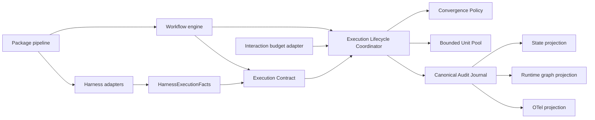
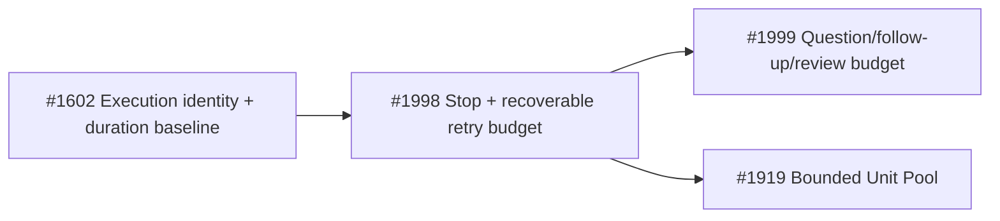

# コンポーネント依存設計 — Codex Duration Bounds

## Upstream Inputs

`requirements.md` の共有core制約、`architecture.md` のmodular monolith、`component-inventory.md` の既存owner、`team-practices.md` の生成物同期・surgical changeを入力とする。

## Dependency Direction

Text fallback: harness adapterはfactだけを供給し、Workflow EngineとInteraction Budget AdapterはExecution Lifecycle Coordinatorへtyped requestを送る。Lifecycleが単一writerとしてpure Convergence Policy/Bounded Unit Poolを評価し、typed transitionをcommitする。Policy/PoolからLifecycleへのI/O呼出しはない。canonical auditから3つのprojectionが派生する。

## Dependency Matrix

`R`=read/use、`W`=canonical write、`P`=projection、`-`=依存なし。

| From / To | Contract | Lifecycle | Policy | Pool | Audit | State | Runtime | OTel | Adapter |
|---|---:|---:|---:|---:|---:|---:|---:|---:|---:|
| Workflow engine | R | R | - | - | - | R | - | - | R |
| Interaction budget adapter | R | R | - | - | - | - | - | - | - |
| Execution lifecycle | R | - | R | R | W | - | - | - | - |
| Convergence policy | R | - | - | - | - | - | - | - | - |
| Bounded unit pool | R | - | - | - | - | - | - | - | - |
| State projection | R | - | - | - | R | P | - | - | - |
| Runtime projection | R | - | - | - | R | - | P | - | - |
| OTel projection | R | - | - | - | R | - | - | P | - |
| Harness adapter | R(typeのみ) | - | - | - | - | - | - | - | - |

Workflow Engine、Interaction Budget Adapter、harness adapterからPolicy/Pool/Auditへの直接依存を禁止する。C3/C4/C5からAuditへのwrite依存も禁止し、canonical mutationはC2だけが所有する。native adapterがpolicyを実装するとharness別semanticsが生まれるためである。

## Data Flow

| Data | Owner | Producers | Consumers | Persistence |
|---|---|---|---|---|
| operation/attempt identity | Execution Contract | core lifecycle | audit、state、runtime、OTel | audit canonical |
| clock/measurement quality | Execution Contract | core/native facts | duration projection、baseline | audit canonical |
| budget reserve | Lifecycle commit + Policy semantics | engine/interactions/poolのtyped request | termination、UX | audit canonical |
| queue-entry/slot/Unit attempt | Lifecycle canonical identity + Pool semantics | swarmのtyped request | referee、runtime、baseline | audit canonical |
| harness capability | Adapter inventory | harness adapter | shared conformance、telemetry | event/fixture |
| package surface | Package pipeline | manifest+core+harness sources | dist/self-install | generated projection |

## Existing Owner Integration

| Existing owner | Current size | Change boundary |
|---|---:|---|
| `packages/framework/core/hooks/amadeus-stop.ts` | 1,095行 | progress signature/counterの直書きをC3呼出へ置換。hook renderingは残す |
| `packages/framework/core/tools/amadeus-orchestrate.ts` | 5,444行 | question/review/swarm dispatch前reserveとtyped result処理のみ |
| `packages/framework/core/tools/amadeus-reviewer-runtime.ts` | 642行 | reviewer identity/scope validationを維持し、iteration reserveはC4から受ける |
| `packages/framework/core/tools/amadeus-swarm.ts` | 914行 | referee/merge責務を維持し、queue/slot/attemptはC5へ委譲 |
| `packages/framework/core/tools/amadeus-audit.ts` | 1,279行 | canonical event append/lockを再利用。budget predicateは持たない |
| `packages/framework/core/tools/amadeus-runtime.ts` | 1,525行 | event reader/projectionを拡張。正本化しない |
| `packages/framework/core/otel/event-registry.ts` | 936行 |共有event vocabularyと属性schemaを登録 |
| `packages/framework/core/otel/span-context.ts` | 151行 | operation/root/attempt相関をspan contextへ追加 |

## Unit Technical Dependency DAG

Text fallback: #1602のID・計測契約を#1998が利用し、#1999と#1919はどちらも#1998の共有reserve/policyに直接依存する。#1919は#1999のInteraction Budget Adapterには依存しない。

これは技術topologyであり、delivery順は別契約とする。実着手は承認済みの `#1602 → #1998 → #1999 → #1919` を守る。各Bolt着地後は、存在する後続branchを最新mainへ `rebase --onto` を含む適切な方法で更新し、共有conformanceを再実行する。前段未着地の状態で後段Issueへ `in-progress` を付けない。

## Distribution Dependency

正本変更は `packages/framework/core/` または `packages/framework/harness/<name>/` に限定し、`scripts/package.ts` で7 package面へ投影する。self-installはClaude、Codex、Cursor、OpenCode、Kimiの5面。Kiro CLI/IDEはpackage driftのみでもblocking。`dist/` とroot self-install treeを直接編集しない。

## Conformance Gates

1. shared coreのcap-1/cap/cap+1、resume、compact、duplicate replay。
2. 7 package面のcapability matrix全行。unavailableも期待値として検証する。
3. 影響adapter fixtureのdeterministic conformance。
4. `bun scripts/package.ts --check` と `bun run promote:self:check`。
5. live provider journeyはcapability依存。skipをdeterministic passへ数えない。

未分類adapter、未生成package面、self-install driftのどれかが1つでもあればIntent completionをblockingする。

## Circular Dependency Prohibitions

- Contractはengine、adapter、projectionをimportしない。
- PolicyはStop/reviewer/swarmの具象型をimportしない。
- LifecycleだけがPolicy/Poolのpure decisionとAudit writerを結合する。Poolのinitial enqueue、retry requeue、settle+release、dependency cancellation、batch terminationはすべてtyped `commitPoolTransition` を通る。Policy/Pool/Interaction adapterはAuditをimportしない。
- AdapterはPolicy predicateをimport/複製せず、fact typeだけをimportする。
- Projectionはcanonical writerを呼ばない。
- Distribution testは生成物を正本として修正しない。
