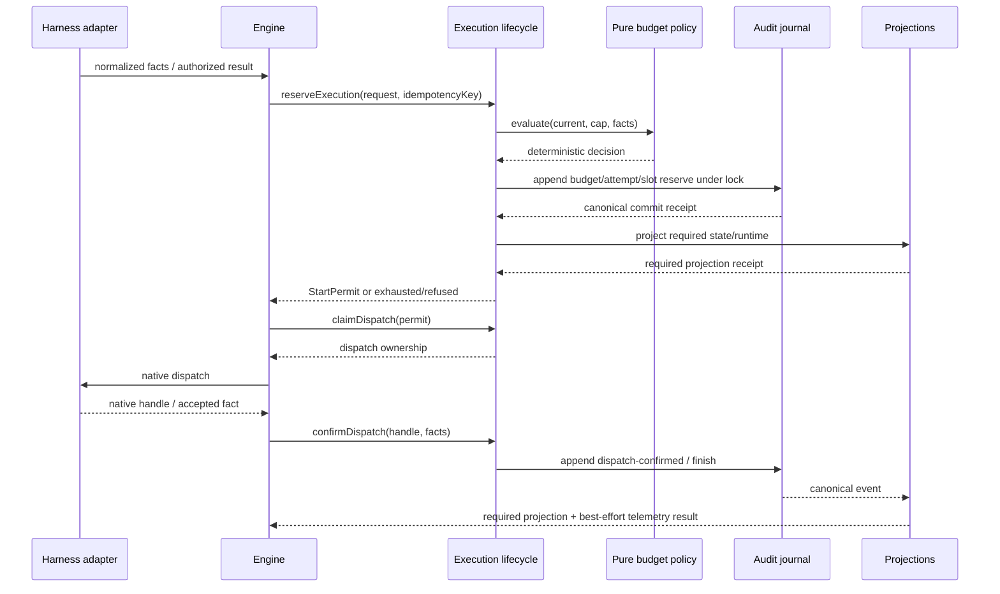

# サービス設計 — Codex Duration Bounds

## Upstream Inputs

本書のserviceはnetwork serviceではなく、`requirements.md`、`architecture.md`、`component-inventory.md`、`team-practices.md` に沿う短命CLI内のapplication serviceである。AWS mapping、database、UI componentは本Intentに非該当。

## Service Definitions

| Service | Lifecycle | Responsibility | Scaling |
|---|---|---|---|
| ExecutionLifecycleService | 1 CLI/hook invocation | ID、attempt、duration、finishをaudit-firstに処理 | process単位。per-intent lockで直列化 |
| ConvergenceBudgetService | reserve要求ごと | hard budgetとretry classification | process単位。共有audit fold |
| UnitPoolService | swarm batch中の短命呼出 | FIFO、slot、Unit attempt、settle | active hard cap内。daemonなし |
| ProjectionService | canonical event後 | state/runtime/OTelへのfan-out | 同期state/runtime、best-effort OTel |
| HarnessNormalizationService | native hook/CLIごと | native payload→shared facts | harness process内 |
| DistributionConformanceService | package/check時 | 7 package面と5 self-install面の同期検証 | CI/ローカルcommand |

## Orchestration Pattern

workflow engineがorchestratorであり、native hookやworkerはchoreographyの判断主体にならない。

Text fallback: adapterはfactだけを渡す。engineは単一writerのExecution Lifecycleへreserveを依頼し、Lifecycleがpure Policyを評価してbudget/attempt/slotをauditへ原子的に耐久化する。canonical receiptだけではnative開始できず、同じevent setに対するstate/runtime必須projection receiptをC2が検証して発行する`StartPermit`が必要である。permit後にclaimでdispatch所有権を取り、native受付後にconfirmする。OTelはbarrier外である。

## Communication Contracts

- 呼出はin-process TypeScriptまたは既存Bun CLI。REST、gRPC、queue serviceは導入しない。
- mutation responseはdiscriminated unionのJSON。prose rendererは同じ`TerminationReasonV1`とinteraction `summaryId`からreason、budget fact、last progress、next actionを出す。
- event schemaはcanonical registryへ追加し、audit/OTelの名前を別々に手書きしない。
- projectionはevent identityでidempotentにし、同じeventのreplayでcounterやslotを二重消費しない。

## Runtime Flows

### Normal execution

1. Engineがroot/child operationをcanonical auditへ開始する。
2. attempt開始前に該当budgetをreserveし、attempt/slotを同じtransactionで確定する。
3. C6がcanonical event setをstate/runtimeへ同期投影し、C2がrequired receiptから`StartPermit`を発行する。失敗時はnative開始を禁止し、auditへ直接`projection-blocked`を記録してrebuild待ちにする。
4. permit取得後にclaimし、C7がnative executorを呼ぶ。native handle受付直後にC2の`confirmDispatch`で`nativeAcceptedAt`と利用可能な`startedAt`をcommitする。
5. outcomeとtermination reasonをauditへ記録し、state/runtimeを同期更新、OTelをbest-effort更新する。

### Recoverable failure

1. adapter/executorが `retryClass`、`effectStatus`、`causeCode`、`sourceSurface` の4fieldを返す。
2. core classifierがallowlistと照合する。
3. Lifecycleのatomic reserveでretry budgetと新attemptを同時確定できれば、required projectionとStartPermitを通して開始し、attempt/remainingを通知する。
4. exhaustedまたは非対象なら新attemptをmintせず安全停止する。

### Bounded swarm

1. C2がauditからimmutable pool projectionをfoldし、cap/DAGとともにC5へ渡す。C5はKahn法のlayer順、同一layerは`unitId` UTF-8 bytewise昇順でinitial enqueue proposalを返し、C2がqueue-entry ID/sequenceをmintしてcommitする。
2. C2はactive < capの間だけC5の `decideAcquire` を評価し、slot/attempt/budgetを1 transactionでreserveする。
3. required projectionとStartPermitを確認後にclaimし、native workerをdispatchする。native handleをattempt IDへ相関して`confirmDispatch`し、claim後crashはC7のeffect照会で`dispatch-not-started`または`dispatch-effect-unknown`へ閉じる。
4. C5がsettle+slot releaseとretry entry要求を含むID非保有proposalを作り、C2が必要なqueue-entry ID/sequenceをmintして1 transactionでcommitする。retry可能なら同じUnitをFIFO末尾へ戻す。
5. terminal failureなら、依存Unitを`dependency-unsatisfied`で取消し、独立Unitは継続する。state不整合・unknown effect・canonical write・auth/configのsystemic failureでは新規dispatchを停止する。
6. reconciliation、dependency cancellation、synthetic outcome、late result、batch terminationも同じC2 `commitPoolTransition` で原子的に記録し、batchは `completed | partial-failure | terminated | cancelled` のtyped resultを返す。照会回数の具体値はNFR Requirementsで決めるversioned capに従う。

## Harness Lifecycle Mapping

| Harness | Session boundary | Stop/continuation | Worker/tool lifecycle | Design handling |
|---|---|---|---|---|
| Claude | native start/end | blocking hook factsあり | native hook factsあり | direct core mapping |
| Codex | start、compact、endはinferred | native stop factsあり | tool/subagent payloadをadapter正規化 | end capabilityをinferredと表示 |
| Cursor | start/end | advisory | documented eventだけ | unknown toolを推測しない |
| Kiro CLI | start、resume source制約 | recursion flag/transcriptなし | adapter alias mapping | unavailableを明示 |
| Kiro IDE | IDE hook wiring | Kiro shared semantics | `.kiro.hook` payload | wiring conformanceを別検証 |
| OpenCode | prompt plugin/CLI中心 | native fact非提供部分あり | stdin adapterなし | unavailableでもshared CLI budgetは適用 |
| Kimi | start/end、role state | trusted main stopだけ | content/path/tool別名を正規化 | ambiguityはno-op capability |

## Configuration

layered configは既存 `global → space → intent` を再利用する。具体default/hard capは#1602 baseline後のNFR Requirementsで確定する。runtimeでLLMがcapを決めず、設定parserが `1..hardCap` だけを受理する。未指定はversioned defaultを使う。

## Reliability and Operations

- lock contentionは既存のbounded lock acquisitionに従い、失敗時はcanonical mutationを行わない。
- projection failure後はnative開始を禁止し、auditへ直接記録したpending rebuildからstate/runtimeを修復してStartPermitを再評価できる。
- OTel unavailableはworkflowを止めないが、telemetry成功へ偽装しない。
- service SLOは設定しない。短命CLIのperformance requirementは固定workloadとcounter assertionで評価する。

## User Experience

budget超過や安全停止は、`reason`、`consumed/cap`、`last durable progress`、`recommended next action`を同じ順で表示する。自動retryは各attemptの開始時に残budgetを短く通知し、成功後は通常flowへ戻る。harnessごとに別名を作らない。
