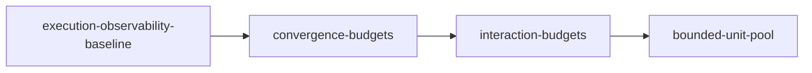

# Unit of Work Dependency — Codex Duration Bounds

## Upstream Inputs

本topologyは `components.md`、`component-methods.md`、`services.md`、`component-dependency.md`、`decisions.md`、`requirements.md` の所有境界とトレーサビリティを入力とする。実装contractに加え、前段改善を後段Unitの実行自体で検証するintegration dependencyも表す。経済的なdelivery詳細はStage 2.8の所有とする。

## Dependency DAG



Text fallback: execution-observability-baselineをconvergence-budgetsが直接利用し、interaction-budgetsがその共通budget contractを利用する。bounded-unit-poolはinteraction-budgets着地後に開始し、最新baseへrebaseして前段の質問・review有界化を自身の実装実行でdogfoodする。

## Machine-Readable Edges

```yaml
units:
  - name: execution-observability-baseline
    depends_on: []
  - name: convergence-budgets
    depends_on: [execution-observability-baseline]
  - name: interaction-budgets
    depends_on: [convergence-budgets]
  - name: bounded-unit-pool
    depends_on: [interaction-budgets]
```

4 Unitはそれぞれ1回だけ宣言され、未宣言参照・自己依存・循環はない。入次数0のUnitは `execution-observability-baseline` だけである。

## Dependency Reasons

| Dependent | Dependency | 依存理由 | 受け取るcontract |
|---|---|---|---|
| `convergence-budgets` | `execution-observability-baseline` | budgetはstage/root/attempt identityとaudit-first reserveで永続化する | C1 identity/fact、C2 writer、C6 projection |
| `interaction-budgets` | `convergence-budgets` | question/follow-up/reviewが共通cap境界とterminationを使う | C3 budget decision、C2 reserve receipt |
| `bounded-unit-pool` | `interaction-budgets` | Unit attempt/retryは推移的に共通cap境界を使い、さらに#1999着地後の最新baseへrebaseして質問・review budgetをUnit実行自体で検証する | C3 budget/retry、C2 atomic reserve、C4 interaction budget適用済み実行環境 |

`bounded-unit-pool` の製品コードは `interaction-budgets` のC4 wrapperを直接importしない。この辺はコードimport依存ではなく、前段改善を後段のCode Generationで実利用して回帰を検出するintegration dependencyである。

## Integration Points

| Interface / resource | Provider Unit | Consumer Unit | 統合方式 |
|---|---|---|---|
| Execution identity / Fact / clock quality | `execution-observability-baseline` | 後続3 Unit | in-process TypeScript types |
| Audit-first lifecycle writer / receipt | `execution-observability-baseline` | 後続3 Unit | per-intent lock内typed API |
| Budget decision / termination / retry schema | `convergence-budgets` | `interaction-budgets`, `bounded-unit-pool` | pure decision + C2 commit |
| Harness capability facts | `execution-observability-baseline` | 後続3 Unit | adapter-normalized facts |
| Canonical audit journal | 既存core + Unit 1のevent拡張 | 全Unit | append-only durable event |
| package/self-install pipeline | 既存package tool | 全Unit | 各Unit内で生成・drift検証 |

共有mutable resourceはcounter、attempt、slot、queueの投影だが、canonical writeはC2に一本化する。C3/C4/C5はdecisionまたはtyped requestだけを作る。

## Serial Development Constraint

`interaction-budgets` と `bounded-unit-pool` を同じbatchでfan-outしない。#1999を着地させ、後続worktreeを最新baseへrebaseし、#1919の実装セッション自体でquestion／review budgetをdogfoodしてから進む。これにより計画上のserial順と監査上のSWARM batchが一致する。

## Delivery Planning Handoff

Stage 2.8は、この直列DAGを入力とし、`requirements.md` FR-07/FR-08が求めるIssue境界、着手制約、rebase波及、label運用、統合dogfoodを満たす受入checkpointを決める。

## Topology Verification

- サイクル: なし。`execution-observability-baseline → convergence-budgets → interaction-budgets → bounded-unit-pool` で終端へ到達する。
- 未宣言依存: なし。YAML内の全 `depends_on` は同じblock内で宣言済み。
- 孤立Unit: なし。全Unitがrootまたはrootからの経路を持つ。
- 複数の有効topological order: なし。全4 Unitの順序はintegration dependencyを含め一意である。
