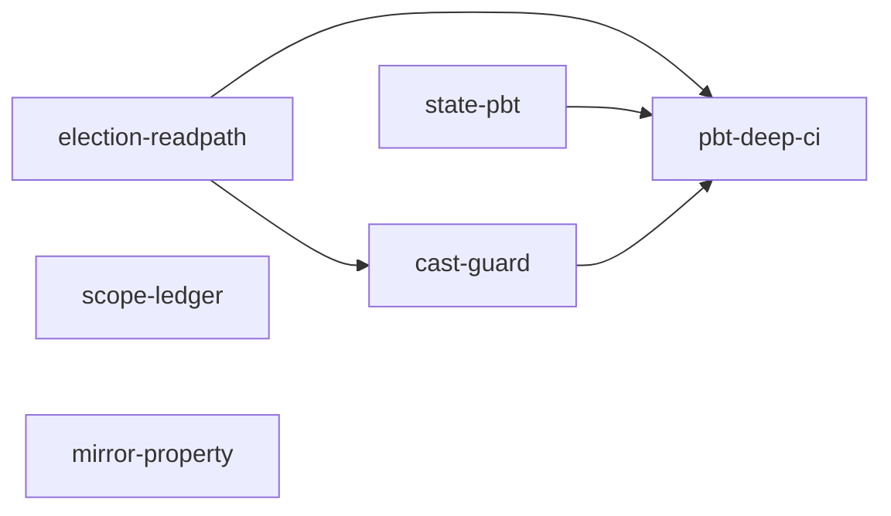

# Unit Dependency — record-roundtrip-pbt (#1980)

上流入力(consumes 全数): component-dependency.md(U4→U1 弱順序・U5→U2/U3 の根拠をそのまま Unit 粒度へ持ち上げ)、components.md(各 Unit の所在ファイルによる非交差判定)、requirements.md(C-3 walking skeleton = election-readpath 先行)、component-methods.md(fail-closed プロパティが U1 改修後でなければ緑にならない構造 — election-readpath 統合の根拠)、services.md(S2 は S1/PBT の存在に依存 — pbt-deep-ci のエッジ)、decisions.md(ADR-2 の初期 allowlist 採取タイミング — cast-guard→election-readpath エッジ)

## YAML edge block(parseBoltDag 消費の正準)

```yaml
units:
  - name: election-readpath
    depends_on: []
  - name: state-pbt
    depends_on: []
  - name: scope-ledger
    depends_on: []
  - name: cast-guard
    depends_on: [election-readpath]
  - name: mirror-property
    depends_on: []
  - name: pbt-deep-ci
    depends_on: [election-readpath, state-pbt, cast-guard]
```

## グラフ



テキストフォールバック: election-readpath→{cast-guard, pbt-deep-ci}、state-pbt→pbt-deep-ci、cast-guard→pbt-deep-ci(共有資源の直列化)。scope-ledger / mirror-property は独立(エッジなし)。循環なし。

## 並行編成の含意

- **Bolt 1(単独・ゲート付き)**: election-readpath — walking skeleton(requirements.md C-3、self-feature の必須ゲート)。実害最大の穴(#1459 修正の素通り)を最初に閉じ、コア改修→dist 7面→PBT の全配線を貫通。ユーザー承認後に残り Bolt へ。
- **batch 2(並行可)**: state-pbt / scope-ledger / mirror-property(Could) — 相互にファイル非交差(state-pbt は tests/unit+helpers、scope-ledger は record 直下、mirror-property は t274+helpers。helpers 内は別ファイル)。
- **batch 3**: cast-guard(election-readpath 着地後の allowlist 初期採取。services.md S1 の CI 実行位置 = ci.yml lint ジョブへ1ステップ追加を含む)。
- **batch 4**: pbt-deep-ci(PBT 2系統の常駐後、かつ cast-guard 着地後)。
- **共有資源による直列化**: cast-guard(S1 = lint ジョブへ1ステップ)と pbt-deep-ci(S2 = ジョブ1本)は**ともに `.github/workflows/ci.yml` と `tests/fixtures/formal-verif-ci-baseline.sha256`(再 baseline)+ t-formal-verif-ci-workflow の再 baseline 注記へ書く**(component-dependency.md「共有資源と交差判定」表のとおり — 並行させると textual conflict + baseline 再計算の二重発生)。よって cast-guard→pbt-deep-ci の順序依存をエッジに含め直列化する(YAML edge block に反映済み)。
