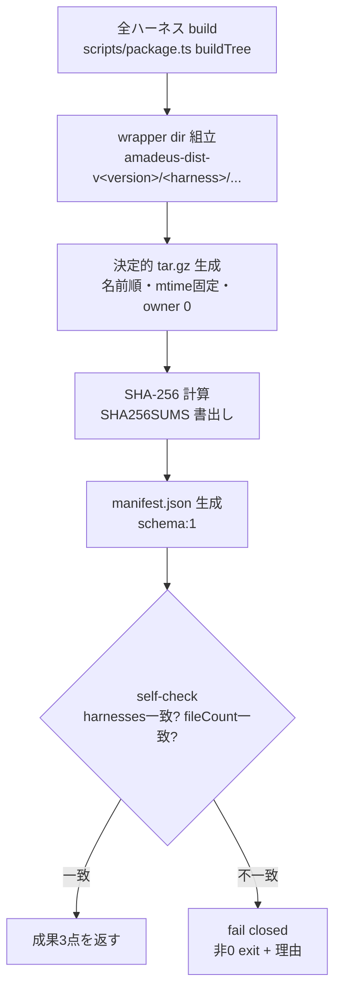

# Business Logic Model — u1-asset-build

上流入力(consumes 全数): unit-of-work(u1 の境界と規模 500)、unit-of-work-story-map(Slice 1 の出荷判定 = draft release E2E)、requirements(FR-1 / NFR-1 / NFR-5)、components(C1 の Reuse Inventory — buildTree 流用)、component-methods(C1 契約 — 本書が詳細化)、services(GitHub Releases 境界と App トークン)。

測定 ref: file:line は observed `63e69d922`。

## 処理フロー: buildDistAssets(version)

テキストフォールバック: 全ハーネス build → wrapper dir 組立(`amadeus-dist-v<version>/<harness>/…` — dist/ 階層は挟まない、ADR-A2)→ 決定的 tar.gz → SHA256SUMS → manifest.json → self-check(manifest.harnesses ⇔ tar 実体ディレクトリ集合、manifest.fileCount ⇔ tar エントリ数)→ 一致で成果3点、不一致で fail closed。

- ハーネス集合はハードコードせず `discoverHarnessNames`(package.ts:92-97 — manifest.ts 存在で発見)を流用(canonical 1定義から導出)
- **plugins ツリー同梱(申告付き設計判断)**: 現行 codeload 経路は tar 内にリポ全体(dist/plugins 含む)を持ち、installer はそこから harness 名で選択する(payload-factory.ts:57)。asset 経路でも同一の選択空間を保つため dist 実体の8ディレクトリ(7ハーネス+plugins — code-structure.md B1 の実測)を全て同梱する。上流に明示 FR はなく「codeload 経路との出力パリティ維持」を根拠とする設計判断としてここに申告(u8 境界ガードの期待集合にも同範囲を使う)
- 実装配置: `scripts/release-dist.ts`(新規、repo-only)。`packages/framework` には置かない(t258 境界契約 — 出荷 core は scripts/ を参照しない)

## 処理フロー: release.yml `build-dist` ジョブ(ADR-A3)

1. checkout(`ref: needs.prepare.outputs.sha` — publish ジョブ :169-172 の既習形)
2. bun 1.3.13(:174-177 と同一 pin — NFR-1 の toolchain 前提)
3. **build 前置(reviewer iteration 1 Major の是正)**: `bun scripts/package.ts` で全ハーネス dist を生成 — 以降の全手順(フルテストの run-tests 入口ガード = u7 の FR-4.1 dist 不在 loud fail を含む)は生成済み dist を前提に走る。source-only 化後の clean checkout でもこの手順で成立する
4. フルテスト(`bash tests/run-tests.sh --ci` 相当の既存ブロッキング集合 — 手順3の dist を検証)
5. 再現性検査: 比較対象は A = 手順3の生成済み dist、B = 隔離 temp dir での追加1回 build — byte 比較で不一致なら fail(出荷物そのものが検証対象に入る形。reviewer iteration 2 Minor の明記)
6. `bun scripts/release-dist.ts --version <ver>` — 手順3の生成済み dist から wrapper を組立てて tar + SHA256SUMS + manifest(再 build しない — 検証した bytes と同一物を出荷)
7. actions artifact へ upload
8. `github-release` ジョブは `needs: [prepare, build-dist]` で artifact を download し softprops の `files:` に3点を列挙。dry-run スキップ(:139-141)は build-dist にも同条件で置く

この手順列の出荷判定は unit-of-work-story-map の Slice 1(draft release への asset 付与 → installer が asset 経路で実インストールする E2E)で行う — 本フローの成果3点が E2E の入力になる

## 異常系

| 異常 | 挙動 |
|---|---|
| ハーネス build 失敗 | 即 fail(既存 buildTree のエラー伝播) |
| self-check 不一致 | fail closed + 不一致内容を stderr(NFR-5) |
| 再現性比較の byte 差 | fail closed + 差分ファイル一覧(NFR-1) |
| dry-run | asset 生成・添付をスキップ(既存 :139-141 と同形の明示スキップ行) |

## Review — Iteration 1

- **Verdict:** NOT-READY
- **Reviewer:** amadeus-architecture-reviewer-agent
- **Date:** 2026-08-02T18:26:33Z
- **Iteration:** 1
- **Scope decision:** none

build-dist ジョブに build 前置ステップが欠落(run-tests 入口ガードと矛盾 — Major)。decorative citation 2件・BR-U1-7 対応表欠落・plugins 同梱の無申告・companion namespace 不在(Minor 4)

### Findings

- Major: 手順3 フルテスト前に build ステップがなく source-only 化後に恒久 fail
- Minor: story-map 参照が本文実体を欠く decorative citation(2ファイル)
- Minor: BR-U1-7 が受け入れ対応表に不在
- Minor: plugins 同梱が無申告の設計追加
- Minor: DistAssetVersion の companion namespace シグネチャ不在

## Review — Iteration 2

- **Verdict:** READY
- **Reviewer:** amadeus-architecture-reviewer-agent
- **Date:** 2026-08-02T18:26:33Z
- **Iteration:** 2
- **Scope decision:** none

iteration 1 の5指摘すべての着地を実読確認、新規 Critical/Major なし。再現性検査の比較対象明記(A=出荷 dist)の非ブロッキング推奨は conductor が反映済み

### Findings

- 閉包確認: Major(build 前置)+Minor 4 の是正着地を確認
- Minor(PLAUSIBLE・非ブロッキング): 再現性検査の比較対象に手順3 dist を含める明記を推奨 — 反映済み
